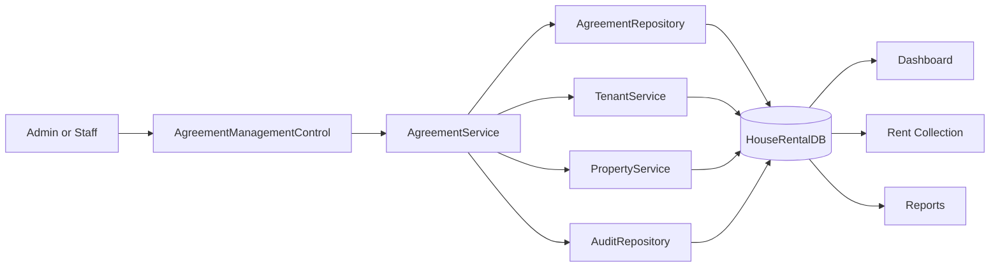
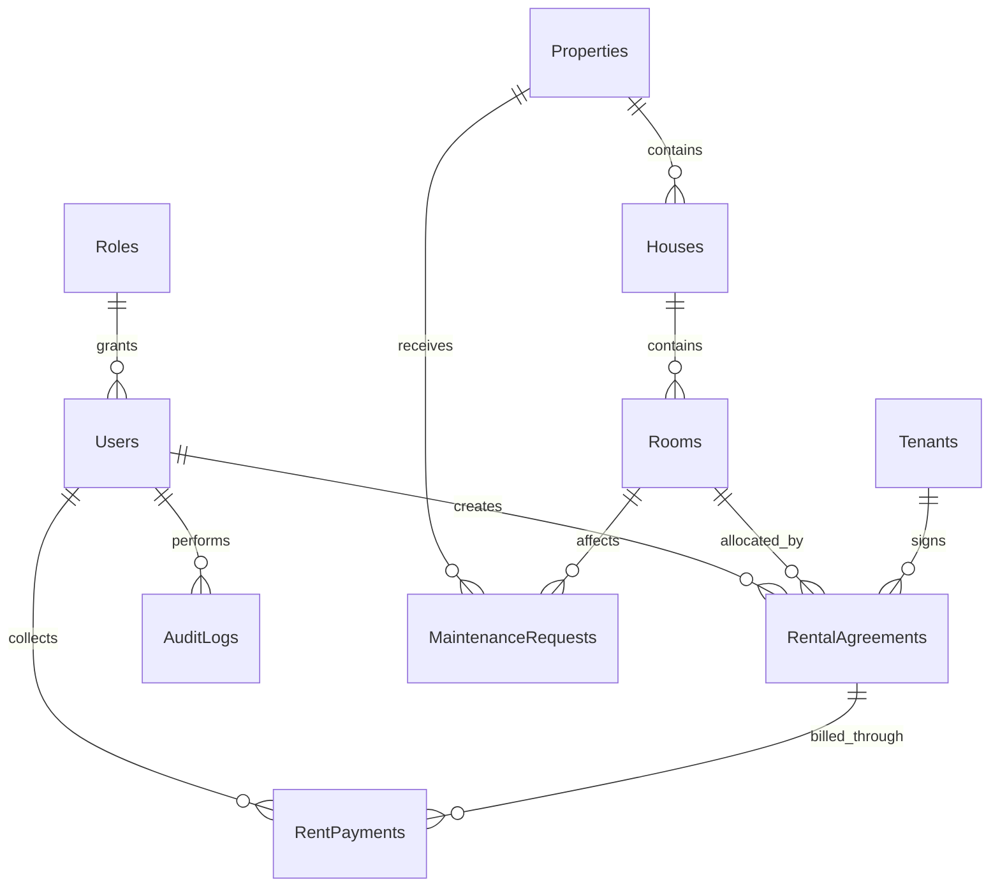
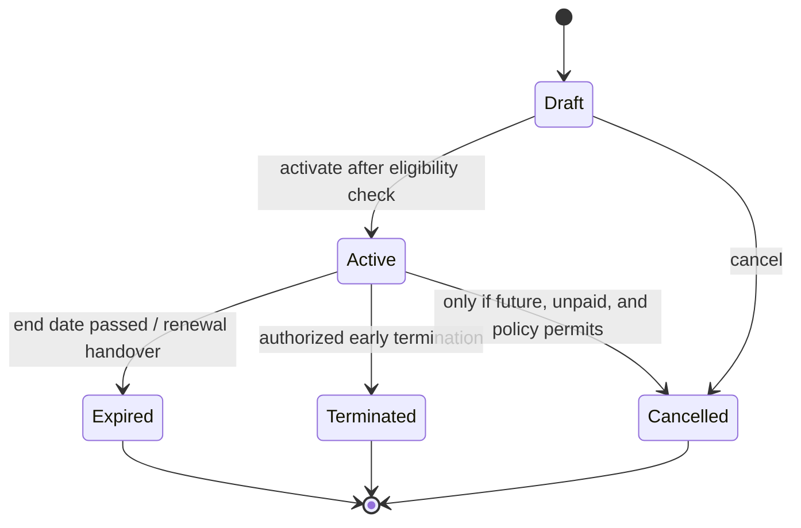

# Agreements Module — Industrial Implementation Plan

## Document control

| Item | Value |
| --- | --- |
| Project | House Rental Management System |
| Module | Rental Agreements |
| Document type | Architecture-aligned implementation and hardening plan |
| Baseline reviewed | Git commit `718f169` (`feat: implement agreements module...`) |
| Review date | 2026-07-11 |
| Application | C# Windows Forms, .NET Framework 4.7.2 |
| Architecture | Single-project, three-layer architecture: UI → BLL → DAL → SQL Server |
| Database | SQL Server Express, `HouseRentalDB` |
| Primary owners | Application developer, database developer, QA/reviewer |
| Status | Ready for implementation |

## 1. Executive summary

The Agreements module is already implemented as a functional vertical slice. It has a WinForms management control, a business service, a repository, a SQL table and views, dashboard navigation, audit calls, and transactional room-occupancy changes for most lifecycle operations.

The correct next step is therefore not a greenfield build. It is a controlled hardening and completion program that preserves the current three-layer structure while addressing production-critical gaps:

1. Make create-and-activate, renewal, expiry, cancellation, and room occupancy fully atomic and concurrency-safe.
2. define lifecycle semantics for current, scheduled, expired, terminated, cancelled, and renewed agreements;
3. move critical invariants into the database as well as the BLL;
4. preserve traceable agreement history, reasons, actors, and timestamps;
5. add authorization at the service boundary;
6. replace destructive database recreation with forward-only migrations;
7. prepare a stable contract for Rent Collection, Reports, Dashboard, Tenants, and Properties;
8. add repeatable automated and manual verification.

This plan deliberately separates mandatory correctness work from optional enterprise enhancements so the project can remain appropriate for its current size.

## 2. Evidence and analysis scope

### 2.1 Source areas reviewed

The plan is based on direct review of:

- project and runtime configuration: `Housing rental.csproj`, `Program.cs`, `ApplicationSessionContext.cs`, `App.config`;
- agreement implementation: `Models/RentalAgreement.cs`, `BLL/AgreementService.cs`, `DAL/AgreementRepository.cs`, and `Forms/Agreements/*`;
- related modules: Properties, Houses, Rooms, Tenants, Rent Payments, Dashboard, Users, Roles, Audit Logs, and shared `ServiceResult`/SQL helpers;
- database scripts: table creation, indexes, views, stored procedures, and seed data;
- existing project and module planning documents;
- the current Git history and a clean MSBuild compilation.

### 2.2 Verification result

| Check | Result |
| --- | --- |
| Working tree before documentation change | Clean |
| .NET Framework build | Passed with MSBuild 18.7.8 |
| Agreement UI wired into Dashboard | Yes |
| Agreement DAL/BLL compiled | Yes |
| Database design reviewed from scripts | Yes |
| Live database inspected | No — local SQL authentication failed with an SSPI context error |

The SQL analysis in this plan is therefore authoritative for the version-controlled schema, but row counts, data quality, drift, and deployed object versions must be checked in the target SQL Server during Phase 0.

## 3. Current architecture and module map

### 3.1 Repository structure relevant to Agreements

```text
housing_rental/
├── App.config
├── ApplicationSessionContext.cs
├── Program.cs
├── Housing rental.csproj
├── Models/
│   ├── RentalAgreement.cs
│   ├── RentPayment.cs
│   ├── Tenant.cs
│   ├── Room.cs
│   ├── House.cs
│   ├── Property.cs
│   ├── User.cs
│   └── ServiceResult.cs
├── BLL/
│   ├── AgreementService.cs
│   ├── RentPaymentService.cs
│   ├── TenantService.cs
│   ├── PropertyService.cs
│   ├── DashboardService.cs
│   └── CurrentSession.cs
├── DAL/
│   ├── AgreementRepository.cs
│   ├── TenantRepository.cs
│   ├── PropertyRepository.cs
│   ├── DashboardRepository.cs
│   ├── AuditRepository.cs
│   ├── DbConnectionFactory.cs
│   └── SqlHelper.cs
├── Forms/
│   ├── Agreements/
│   │   ├── AgreementManagementControl.cs
│   │   └── AgreementManagementControl.Designer.cs
│   └── Dashboard/FrmDashboard.cs
├── Database/
│   ├── 01_CreateDatabase.sql
│   ├── 02_CreateTables.sql
│   ├── 03_CreateViews.sql
│   ├── 04_CreateStoredProcedures.sql
│   └── 05_SeedData.sql
└── docs/
```

### 3.2 Runtime dependency flow



The existing direction is appropriate. UI code must continue to call services only; services own workflow rules; repositories own SQL and transactions; SQL Server owns persistence constraints.

### 3.3 Current implementation inventory

| Area | Current state | Decision |
| --- | --- | --- |
| `RentalAgreement` entity | Core table fields only | Extend with lifecycle/audit fields or introduce read DTOs |
| Agreements UI | Implemented, single large UserControl with list, editor, details, payments, expiry | Retain behavior; refactor responsibilities incrementally |
| Agreement service | Implemented with validation and lifecycle methods | Retain public façade; harden authorization, errors, and transactional boundaries |
| Agreement repository | Implemented with queries and transactions | Refactor atomic workflows and typed parameters |
| Agreement table | Core fields, foreign keys, status/date/rent checks | Migrate forward with lifecycle and concurrency columns |
| Active room uniqueness | Enforced by filtered unique index | Retain |
| Active tenant uniqueness | Enforced only by BLL | Decide policy and, if one tenancy is required, add filtered unique index |
| Agreement number | Generated by `MAX(...) + 1` | Replace; current approach races under concurrency |
| Create and activate | Two separate repository calls | Replace with one transaction |
| Renewal | Transactional, but immediately expires source and activates successor | Redesign around scheduled renewal/effective dates |
| Room synchronization | Updated during activation/end | Retain but strengthen as a derived invariant |
| Audit | Best-effort, outside lifecycle transaction | Keep operational audit; add durable lifecycle fields/events |
| Authorization | No Agreement-specific service checks | Add service-boundary permission checks |
| Payments integration | Read-only history; payment service is validation-only | Define stable Agreement contract; implement payment module separately |
| Automated tests | No test project | Add focused tests before behavior changes |
| Database deployment | Destructive table recreation scripts | Keep bootstrap scripts; add numbered, idempotent migrations |

## 4. Domain model and relationships

### 4.1 Physical relationships



### 4.2 Agreement as the operational aggregate

An agreement connects four independently managed concerns:

| Concern | Source of truth | Agreement dependency |
| --- | --- | --- |
| Tenant eligibility | `Tenants.Status` | Only an eligible tenant may activate |
| Inventory eligibility | Property/House active flags and `Rooms.Status` | Only an operational, available room may activate |
| Contract terms | `RentalAgreements` | Dates and financial terms must be immutable after activation except through explicit correction |
| Financial history | `RentPayments` | Payments must retain their agreement reference permanently |
| User accountability | `Users`, `AuditLogs` | Every material transition needs actor and time |
| Dashboard/reporting | views and stored procedures | Counts must use effective lifecycle rules, not status alone |

### 4.3 Data ownership rules

- Agreements reference tenants and rooms; they do not copy tenant contact or room hierarchy data as the primary source.
- Contractual rent and deposit are snapshots stored on the agreement. Later room-price changes must not change an existing contract.
- A payment belongs to exactly one agreement and must never be reassigned after posting.
- Agreement records are never physically deleted through normal application workflows.
- Room `Status` is an operational cache/invariant. Agreement activation and closure must update it in the same transaction.
- Historical contract facts must remain reportable after tenant, property, house, room, or user records become inactive.

## 5. Target lifecycle model

### 5.1 Status definitions

| Status | Meaning | Contract fields editable? | Room impact | Allowed next states |
| --- | --- | --- | --- | --- |
| Draft | In preparation; not legally/operationally active | Yes | None | Active, Cancelled |
| Active | Current effective contract | Notes only; corrections via controlled command | Occupied | Expired, Terminated |
| Expired | Completed normally at end date | No | Release if no active successor | None |
| Terminated | Ended early by authorized user | No | Release | None |
| Cancelled | Draft or eligible future contract voided | No | None/release if reserved later | None |

### 5.2 State machine



### 5.3 Mandatory transition invariants

Activation must atomically:

1. lock and reload the agreement, tenant, room, house, and property;
2. confirm the agreement is Draft;
3. confirm tenant is Active;
4. confirm property and house are active;
5. confirm room is Available and has no active agreement;
6. confirm the tenant policy (single active agreement or explicitly allowed multiple tenancy);
7. set agreement to Active with `ActivatedAt`/`ActivatedByUserId`;
8. set the room to Occupied;
9. commit once.

Termination/expiry must atomically update the agreement, store reason/actor/time, and release the room only when no other effective active agreement uses it.

### 5.4 Renewal decision

The current implementation expires the source immediately and creates the successor as Active, even when the source end date is in the future. That distorts current-active queries and dashboard rent.

Adopt one of these designs before implementing Phase 3:

- **Recommended for this project:** create the successor as Draft with `RenewedFromAgreementId`, then activate it during a scheduled/manual handover after the source expires.
- Enterprise alternative: add `Scheduled` status and calculate effective occupancy from status plus dates.

Do not keep two agreements marked Active for the same room, and do not expire the current agreement early merely to save a renewal.

## 6. Functional scope

### 6.1 In scope

- Search/filter agreement directory by number, tenant, property, room, status, and date.
- Create, edit, cancel, and activate drafts.
- View immutable contract and hierarchy details.
- Update non-contractual notes with audit.
- Expire due agreements, terminate active agreements, and renew via controlled handover.
- View agreement-specific payment history and balance summary.
- Produce eligibility lookups for tenants and rooms.
- Maintain room occupancy, dashboard metrics, auditability, and report-ready history.
- Apply role-based authorization and concurrency control.

### 6.2 Out of scope for the Agreements delivery

- Posting or reversing rent payments.
- General ledger accounting.
- E-signatures, scanned document storage, email/SMS delivery.
- Legal jurisdiction templates.
- Multi-property-group or multi-company tenancy.
- Online tenant self-service.

These may consume Agreements data later but should not be embedded in `AgreementManagementControl`.

## 7. Business rules catalogue

| ID | Rule | Enforcement |
| --- | --- | --- |
| AGR-001 | Agreement number is required and unique | BLL + unique DB constraint |
| AGR-002 | Tenant, room, start date, end date, rent, creator are required | BLL + DB |
| AGR-003 | `EndDate > StartDate` | BLL + DB check |
| AGR-004 | Monthly rent is greater than zero | BLL + DB check |
| AGR-005 | Security deposit is zero or greater | BLL + new DB check |
| AGR-006 | Status is a recognized lifecycle value | BLL + DB check |
| AGR-007 | Only active tenants may activate an agreement | Transactional DAL check |
| AGR-008 | Only active property/house and available room may activate | Transactional DAL check |
| AGR-009 | A room has at most one Active agreement | BLL + filtered unique index |
| AGR-010 | Tenant active-agreement cardinality follows one explicit policy | BLL + optional filtered unique index |
| AGR-011 | Only Draft contract terms can be edited | BLL + conditional update |
| AGR-012 | Active/closed agreements cannot be deleted | UI/BLL; no delete repository method |
| AGR-013 | Active agreements with payments cannot be cancelled | BLL + transactional recheck |
| AGR-014 | Normal expiry is allowed only after `EndDate` | BLL + transactional recheck |
| AGR-015 | Termination requires a non-empty reason and authorization | BLL + DB lifecycle fields |
| AGR-016 | Renewal preserves a link to its source agreement | DB self-FK + BLL |
| AGR-017 | Every transition records actor and timestamp | DB columns/event record |
| AGR-018 | Stale UI updates are rejected | `rowversion` optimistic concurrency |
| AGR-019 | Contract dates use one documented inclusive/exclusive convention | BLL, reports, tests |
| AGR-020 | Raw SQL exception text is not displayed to end users | BLL error mapping + diagnostic logging |

## 8. Database implementation plan

### 8.1 Preserve existing strengths

Retain:

- foreign keys from Agreements to Tenants, Rooms, and Users;
- check constraints for date order, positive rent, and status values;
- unique Agreement number;
- filtered unique index `UX_RentalAgreements_OneActiveRoom`;
- lookup indexes on status/end date, tenant/status, and room/status;
- joined agreement directory concept;
- payment history linked by `AgreementId`.

### 8.2 Required schema additions

Add through a new migration, not by editing a deployed database manually:

| Column/constraint | Type | Purpose |
| --- | --- | --- |
| `ActivatedAt` | `DATETIME2(0) NULL` | Activation trace |
| `ActivatedByUserId` | `INT NULL` FK Users | Activation actor |
| `ClosedAt` | `DATETIME2(0) NULL` | Expiry/termination/cancellation time |
| `ClosedByUserId` | `INT NULL` FK Users | Closing actor |
| `ClosureReason` | `NVARCHAR(500) NULL` | Required for manual termination/cancellation |
| `RenewedFromAgreementId` | `INT NULL` self-FK | Renewal chain |
| `UpdatedAt` | `DATETIME2(0) NOT NULL` | Last material update |
| `UpdatedByUserId` | `INT NULL` FK Users | Last editor |
| `RowVersion` | `ROWVERSION NOT NULL` | Optimistic concurrency |
| `CK_RentalAgreements_SecurityDeposit` | Check | `SecurityDeposit >= 0` |

Optional if the business confirms one active agreement per tenant:

```sql
CREATE UNIQUE INDEX UX_RentalAgreements_OneActiveTenant
ON dbo.RentalAgreements(TenantId)
WHERE Status = 'Active';
```

Before adding it, run a duplicate-active-tenant data check and resolve conflicts.

### 8.3 Agreement number generation

Replace `MAX(RIGHT(AgreementNo, 4)) + 1`. Two simultaneous sessions can generate the same value.

Recommended implementation:

- create a SQL `SEQUENCE`, for example `dbo.AgreementNumberSequence`;
- generate `AGR-yyyyMM-########` inside the same transaction that inserts the agreement;
- retain the unique constraint as the final safeguard;
- allow a caller-supplied number only for authorized migration/import cases.

### 8.4 Migration layout

Keep `01`–`05` as clean-install/bootstrap scripts, and add:

```text
Database/Migrations/
├── 20260711_001_AgreementLifecycleMetadata.sql
├── 20260711_002_AgreementNumberSequence.sql
├── 20260711_003_AgreementConcurrencyAndIndexes.sql
└── 20260711_004_AgreementViewsAndProcedures.sql
```

Each migration must:

- be forward-only and idempotent where practical;
- use `XACT_ABORT ON` and a transaction for related DDL/data backfill;
- check existing data before adding constraints;
- include validation queries and a documented rollback strategy;
- avoid dropping tables or data;
- record deployment in a `SchemaVersions` table.

### 8.5 Query/view changes

Update `vw_AgreementDirectory` to expose lifecycle fields and renewal source. Make dashboard and reports use a shared definition of an effective agreement.

Add or update procedures for:

| Procedure | Responsibility |
| --- | --- |
| `sp_Agreement_CreateDraft` | Atomic number allocation and insert |
| `sp_Agreement_Activate` | Locked eligibility recheck, state update, room update |
| `sp_Agreement_Close` | Expire/terminate/cancel with actor/reason and room release |
| `sp_Agreement_CreateRenewalDraft` | Linked successor draft without closing source early |
| `sp_Agreement_HandoverRenewal` | Atomic source expiry and successor activation |
| `sp_Agreement_ExpireDue` | Set-based expiry plus room reconciliation |

Stored procedures are recommended for multi-table state transitions. Read-only directory queries may remain in the repository or use views.

### 8.6 Locking and isolation

For transitions, lock the agreement and room rows using an appropriate SQL Server strategy such as `UPDLOCK, HOLDLOCK` inside a short transaction. The filtered unique index remains the final concurrency guard. Catch duplicate-key errors and return a domain message such as “The room was allocated by another user; refresh and try again.”

### 8.7 Payment integrity dependencies

The Payments module should later add:

- unique billing-period constraint on `(AgreementId, PaymentYear, PaymentMonth)` if one row per month is the policy;
- `PaidAmount <= DueAmount` and `BalanceAmount = DueAmount - PaidAmount`, or calculate balance instead of trusting input;
- reversal metadata rather than deletion;
- payment-period validation against contract dates.

Agreements implementation must not assume those controls already exist.

## 9. Model and contract plan

### 9.1 Separate entities from read models

Keep `RentalAgreement` as the persistence/write entity. Add purpose-specific models so the UI no longer relies on weakly typed `DataTable` columns for core workflows:

```text
Models/Agreements/
├── AgreementListItem.cs
├── AgreementDetails.cs
├── AgreementBalanceSummary.cs
├── AgreementPaymentItem.cs
├── AgreementCreateRequest.cs
├── AgreementUpdateDraftRequest.cs
├── AgreementCloseRequest.cs
└── AgreementRenewalRequest.cs
```

The existing project style can continue using `ServiceResult<T>`, but new service methods should return typed models for compile-time safety. `DataTable` can remain at reporting boundaries.

### 9.2 Constants

Centralize status and action strings to prevent UI/BLL/SQL drift:

```text
Domain/AgreementStatuses.cs
Domain/RoomStatuses.cs
Domain/AgreementPermissions.cs
```

Because the project targets .NET Framework 4.7.2, simple static string constants are sufficient; avoid introducing a large framework only for this purpose.

## 10. DAL plan

### 10.1 Repository responsibilities

`AgreementRepository` should:

- execute typed, parameterized reads;
- own connections, commands, readers, and transactions;
- expose atomic workflow commands rather than low-level sequences the service can split;
- translate affected-row and SQL constraint results into repository/domain exceptions;
- never contain UI messaging or role decisions.

### 10.2 Target interface

Introduce an interface to make BLL tests possible:

```csharp
public interface IAgreementRepository
{
    IReadOnlyList<AgreementListItem> Search(AgreementSearchCriteria criteria);
    AgreementDetails GetDetails(int agreementId);
    RentalAgreement GetById(int agreementId);
    int CreateDraft(AgreementCreateRequest request, int userId);
    void UpdateDraft(AgreementUpdateDraftRequest request, int userId, byte[] rowVersion);
    void Activate(int agreementId, int userId, byte[] rowVersion);
    void Close(AgreementCloseRequest request, int userId, byte[] rowVersion);
    int CreateRenewalDraft(AgreementRenewalRequest request, int userId);
    void HandoverRenewal(int sourceId, int successorId, int userId);
    int ExpireDue(DateTime businessDate, int userId);
}
```

### 10.3 Immediate DAL corrections

- Replace `AddWithValue` with explicit `SqlDbType`, size, precision, and scale.
- Combine draft insert and activation in one repository transaction/procedure.
- Make `UpdateAgreementNotes` verify one affected row and use `RowVersion`.
- Replace per-agreement expiry loops with a set-based, transactional operation.
- Remove duplicated directory aggregation SQL where the view provides the same contract.
- Use `CommandType.StoredProcedure` for lifecycle procedures.
- Set a documented command timeout.
- Do not expose connection strings or SQL text in user-facing errors.

## 11. BLL plan

### 11.1 Service responsibilities

`AgreementService` remains the application façade and must own:

- input normalization and validation;
- permission checks;
- business-date and lifecycle policy;
- orchestration of one atomic repository command per workflow;
- domain-focused result messages;
- durable audit/event requirements;
- read-model delivery to the UI.

### 11.2 Authorization matrix

| Capability | Admin | Staff |
| --- | --- | --- |
| View/search/details/payments | Yes | Yes |
| Create/edit draft | Yes | Yes |
| Activate | Yes | Yes, if operational policy allows |
| Update notes | Yes | Yes |
| Cancel draft | Yes | Yes |
| Cancel future Active | Yes | No |
| Terminate Active | Yes | No or supervisor approval |
| Force expiry / bulk expiry | Yes | Scheduled system action only for Staff |
| Create renewal draft | Yes | Yes |
| Correct activated contract terms | Explicit admin workflow only | No |

Enforce permissions inside the service, not only by hiding buttons.

### 11.3 Error policy

Return safe messages for expected failures:

- not found;
- invalid transition;
- tenant/room no longer eligible;
- duplicate agreement number;
- concurrency conflict;
- unauthorized action;
- dependent payments prevent cancellation.

Log the technical exception separately with a correlation identifier. Current patterns append `ex.Message` directly; replace this before release.

### 11.4 Session handling

Remove the fallback that attributes writes to user ID `1`. A lifecycle-changing operation must fail if `CurrentSession.User` is missing. This prevents incorrect audit ownership and foreign-key surprises.

## 12. UI/UX plan

### 12.1 Retain the current screen concept

The current dashboard-loaded `AgreementManagementControl` matches the rest of the project. Retain:

- searchable/filterable agreement grid;
- editor panel;
- details and payments tabs;
- expiring-agreements view;
- New, Save Draft, Save & Activate, Activate, Renew, Terminate, Cancel, and Expire actions.

### 12.2 Refactor for maintainability

The code-behind and Designer files are large. Split behavior without changing navigation:

```text
Forms/Agreements/
├── AgreementManagementControl.cs
├── AgreementManagementControl.Designer.cs
├── AgreementEditorControl.cs
├── AgreementDetailsControl.cs
├── AgreementPaymentHistoryControl.cs
└── AgreementUiMapper.cs
```

If that is too large for the current delivery, first extract mapping, lookup binding, and grid-formatting helpers.

### 12.3 Required user experience behavior

- Disable actions based on status and permission, while still enforcing in BLL.
- Show a visible status badge and renewal/source link.
- Require a reason dialog for termination and eligible cancellation.
- Show a confirmation summary before activation: tenant, room path, date range, rent, deposit.
- On concurrency conflict, preserve user input where safe, reload server data, and explain what changed.
- Debounce search/filter changes rather than querying on every keystroke.
- Use async loading only if introduced consistently; never access WinForms controls off the UI thread.
- Format money using the configured currency and dates using one application culture.
- Provide empty, loading, success, validation, and failure states.
- Do not display raw exception or SQL Server text.

### 12.4 Accessibility and consistency

- Preserve keyboard tab order and visible focus.
- Add access keys for primary commands.
- Do not communicate status by color alone.
- Use consistent confirmation wording and button order.
- Ensure grids have explicit columns, friendly headers, and stable sorting.

## 13. Cross-module integration contracts

### 13.1 Properties, Houses, and Rooms

- Agreement activation is the authoritative operation that changes Available → Occupied.
- Agreement closure changes Occupied → Available only if no other effective agreement remains.
- Property/House deactivation and room Maintenance/Inactive transitions remain blocked while an effective active agreement exists.
- Add a reconciliation query/report that flags disagreement between room status and active agreement state.

### 13.2 Tenants

- Only Active tenants appear in activation lookup.
- Tenant deactivation/blacklisting remains blocked while an effective active agreement exists.
- Agreement history must include closed and renewed contracts.
- Tenant balance reads must not omit tenants with zero payments; use left joins where required.

### 13.3 Rent Collection

Expose a typed, read-only agreement selection contract containing Agreement ID/no, tenant, room path, contract dates, monthly rent, and status. Payments must independently recheck that the billing period belongs to the agreement.

Closing an agreement does not delete or rewrite payments. Outstanding balances remain visible after closure.

### 13.4 Dashboard

Define metrics precisely:

- `ActiveAgreements`: agreements effective on the business date;
- `MonthlyExpectedRent`: contract rent for agreements effective in the selected month, with a documented proration policy;
- `OccupiedRooms`: operational occupancy reconciled with effective agreements;
- `ExpiringSoon`: active agreements ending within the configured window;
- `OverduePayments`: payment responsibility, not inferred only from agreement status.

### 13.5 Reports

Minimum agreement reports:

- agreement register by status/date/property;
- active occupancy register;
- expiry forecast (30/60/90 days);
- agreement payment ledger;
- termination/cancellation audit report;
- renewal chain report;
- room/agreement reconciliation exception report.

### 13.6 Audit

Record create draft, update draft, activation, note update, cancellation, expiry, termination, renewal draft, handover, and rejected privileged attempts where appropriate. Audit failure for a legally meaningful transition should be reconsidered: lifecycle metadata must be in the main transaction even if the general audit log remains best-effort.

## 14. Security and operational quality

### 14.1 Security requirements

- Integrated SQL authentication remains acceptable for local deployment, using least-privilege database rights.
- No hard-coded fallback user for writes.
- Parameterized commands only.
- National ID and other tenant-sensitive data should not appear in broad agreement grids or audit descriptions.
- Connection and technical error details are logged locally with controlled access.
- Admin-only actions are checked in BLL.

### 14.2 Observability

Add a small application logging abstraction supporting:

- timestamp, severity, module, operation, user ID, agreement ID, and correlation ID;
- exception details for diagnostics;
- lifecycle duration and failure reason;
- a rolling local file or Windows Event Log appropriate to desktop deployment.

Do not log passwords, connection strings, national IDs, or full sensitive payloads.

### 14.3 Performance targets

For a local SQL Express deployment with up to 100,000 agreements:

- initial filtered directory load: under 2 seconds;
- search after debounce: under 1 second for indexed filters;
- lifecycle command: under 2 seconds excluding user confirmation;
- directory queries use paging instead of loading all history;
- query plans show index seeks for status/date and tenant/room lookups where selective.

## 15. Implementation phases

### Phase 0 — Baseline and decisions (mandatory)

Tasks:

- Restore/fix local SQL Server connectivity and compare deployed schema with scripts.
- Back up the target database.
- Capture table row counts, active-state conflicts, duplicate Agreement numbers, and room/status mismatches.
- Decide single-active-agreement-per-tenant policy.
- Decide renewal model and date inclusivity/proration rules.
- Record current manual smoke-test results.

Deliverables:

- signed decision record;
- schema-drift/data-quality report;
- rollback-ready database backup.

Exit gate: no unresolved business decision that changes constraints or lifecycle behavior.

### Phase 1 — Test seam and safety net (mandatory)

Tasks:

- Add `IAgreementRepository` and constructor injection to `AgreementService` while keeping a default constructor for WinForms composition.
- Add a test project compatible with .NET Framework 4.7.2.
- Characterize current validation and lifecycle behavior.
- Create reusable SQL integration-test setup/cleanup scripts.

Exit gate: tests reproduce critical current behavior and the project still builds.

### Phase 2 — Database migrations and concurrency (mandatory)

Tasks:

- Add lifecycle metadata, renewal self-link, `UpdatedAt`, and `RowVersion`.
- Add the security-deposit constraint.
- Add the agreement number sequence.
- Add the tenant filtered unique index if approved.
- Update views/procedures and deploy through versioned migrations.
- Validate indexes and existing data.

Exit gate: migration succeeds on a database copy, is rerunnable safely where promised, and validation queries pass.

### Phase 3 — Atomic lifecycle workflows (mandatory)

Tasks:

- Implement atomic Create Draft and Create-and-Activate.
- Implement locked Activate and Close procedures/repository calls.
- Replace looped expiry with a set-based command.
- Implement renewal draft and atomic handover.
- Map duplicate key, stale row version, and invalid transition errors to domain results.
- Remove fallback user ID.

Exit gate: fault-injection tests prove no orphan Draft/Occupied split state and no double allocation.

### Phase 4 — Service authorization and error hardening (mandatory)

Tasks:

- Add permission checks for every command.
- Centralize status/action constants.
- Require termination/cancellation reasons.
- Stop returning raw exception messages.
- Add structured diagnostic logging and correlation IDs.

Exit gate: direct BLL calls cannot bypass authorization; sensitive technical details do not reach UI.

### Phase 5 — Typed reads and UI refinement (recommended)

Tasks:

- Add Agreement search/detail/payment DTOs.
- Migrate operational UI binding from `DataTable` to typed lists.
- Add paging and debounced search.
- Add lifecycle confirmation summaries, status badges, concurrency handling, and renewal-chain navigation.
- Extract helpers/subcontrols from the oversized code-behind.

Exit gate: core workflows are usable by keyboard, state-appropriate actions are clear, and large datasets remain responsive.

### Phase 6 — Cross-module integration (mandatory before module completion)

Tasks:

- Update Tenant and Property guards to use effective agreement logic.
- Update Dashboard metrics.
- Publish the typed Agreement contract for Payments.
- Implement agreement reports or stable report queries.
- Add room/agreement reconciliation.

Exit gate: a lifecycle transition is reflected consistently in Agreements, Rooms, Tenants, Dashboard, payment selection, and reports.

### Phase 7 — Release verification (mandatory)

Tasks:

- Run automated unit, integration, concurrency, migration, and smoke tests.
- Test upgrade against a production-like database copy.
- Review permissions and audit output.
- Run Release build and installer/deployment smoke test.
- Prepare operational runbook and rollback instructions.

Exit gate: all P0/P1 defects closed, acceptance criteria signed, backup/rollback tested.

## 16. Test strategy

### 16.1 Unit tests

Cover:

- validation boundaries and normalization;
- status transition matrix;
- authorization matrix;
- termination reason requirement;
- renewal date calculation;
- safe exception-to-result mapping;
- missing session rejection.

### 16.2 SQL/DAL integration tests

Cover:

- FK and check constraints;
- one active agreement per room;
- optional one active agreement per tenant;
- Agreement number sequence uniqueness;
- row-version stale update rejection;
- atomic activation/closure/renewal;
- room release behavior;
- historical joins after related records are inactive;
- migration from the current schema with representative data.

### 16.3 Concurrency tests

Run two connections simultaneously for:

- activating two drafts for one room;
- activating two agreements for one tenant if restricted;
- generating agreement numbers;
- closing and renewing the same agreement;
- editing the same Draft from two UI sessions.

Expected result: exactly one valid winner, a friendly conflict for the loser, and no inconsistent room state.

### 16.4 End-to-end/manual scenarios

| Scenario | Expected result |
| --- | --- |
| Create valid Draft | Saved, room remains Available, audit/lifecycle metadata correct |
| Edit Draft | Terms update and row version changes |
| Activate valid Draft | Agreement Active and room Occupied in one commit |
| Activate after another user takes room | Friendly conflict; no partial state |
| Activate inactive/blacklisted tenant | Blocked |
| Cancel Draft | Cancelled; no room change |
| Cancel future unpaid Active | Allowed only per role/policy; room reconciled |
| Cancel started or paid Active | Blocked; termination offered |
| Terminate Active with reason | Terminated, reason/actor/time stored, room released |
| Expire due agreements | Only overdue Active agreements expire; dashboard refreshes |
| Create renewal | Successor Draft linked; source stays Active |
| Handover renewal | Source Expired and successor Active atomically |
| View closed agreement payments | History remains available |
| Deactivate occupied room/property/tenant | Blocked by related-module guard |
| Missing SQL Server | Friendly operational message; diagnostic log contains details |

### 16.5 Non-functional tests

- Query performance at 10k and 100k agreements.
- UI responsiveness during directory reload.
- Keyboard navigation and high-DPI layout.
- Upgrade/rollback rehearsal.
- Failure during transaction before and after each write.

## 17. Acceptance criteria

The Agreements module is complete when:

- the current project builds in Debug and Release;
- all schema changes deploy through non-destructive migrations;
- agreement numbers are concurrency-safe;
- create-and-activate is one transaction;
- room occupancy and agreement state cannot diverge through supported workflows;
- renewal does not expire a current contract early;
- all lifecycle actions enforce both state and role at the BLL boundary;
- manual termination/cancellation stores actor, time, and reason;
- stale edits are rejected through optimistic concurrency;
- one-active-room and the approved tenant-cardinality rule are database-enforced;
- no normal workflow physically deletes an agreement or payment history;
- raw database exceptions are not shown to users;
- Dashboard, Tenant, Property/Room, Payments selection, and Reports use consistent agreement semantics;
- automated tests cover critical rules and concurrent allocation;
- migration, rollback, reconciliation, and operational runbooks exist.

## 18. Definition of done checklist

### Code

- [ ] UI calls BLL only; BLL calls repository abstractions.
- [ ] No `AddWithValue` in modified Agreement data access.
- [ ] One transaction owns each multi-table lifecycle command.
- [ ] Public commands validate session, permission, input, and row version.
- [ ] Status/action strings are centralized.
- [ ] New files are included in `Housing rental.csproj`.
- [ ] Debug and Release builds pass without warnings introduced by the work.

### Database

- [ ] Forward migration reviewed and tested against a populated copy.
- [ ] Data-quality prechecks pass.
- [ ] Constraints and filtered indexes match approved policy.
- [ ] Views/procedures return expected historical and effective records.
- [ ] Reconciliation query returns zero unexpected mismatches.

### Quality

- [ ] Unit, integration, concurrency, and smoke tests pass.
- [ ] Authorization tests call services directly.
- [ ] User messages are actionable and non-technical.
- [ ] Audit/lifecycle metadata identifies actor and time.
- [ ] Performance targets are met with representative data.
- [ ] Documentation and operational runbook are updated.

## 19. Risks and mitigations

| Risk | Impact | Mitigation |
| --- | --- | --- |
| Deployed database differs from scripts | Migration failure/data loss | Phase 0 drift audit and backup |
| Concurrent room allocation | Double booking | Locked transaction + filtered unique index |
| Split create/activate | Orphan Draft after failure | One atomic repository command |
| `MAX + 1` numbering race | Duplicate save failures | SQL sequence + unique constraint |
| Renewal closes source early | Wrong occupancy/dashboard/reporting | Successor Draft + handover workflow |
| UI-only permission control | Unauthorized direct service calls | BLL authorization |
| Best-effort audit loses legal history | Weak traceability | Lifecycle metadata in main transaction |
| `DataTable` column drift | Runtime binding failures | Typed operational DTOs |
| Destructive setup scripts used as upgrades | Data loss | Versioned migrations and runbook |
| Raw SQL errors shown to users | Security/usability issue | Error mapping + diagnostic logging |
| Large history loads freeze UI | Poor usability | Paging, indexes, debounce, measured queries |

## 20. Recommended delivery priority

| Priority | Work |
| --- | --- |
| P0 — correctness | Atomic create/activate, locking, number sequence, renewal semantics, lifecycle metadata, no fallback user |
| P1 — release readiness | Authorization, migrations, error policy, row version, tests, integration consistency |
| P2 — maintainability | Typed DTOs, UI extraction, paging, structured logging, report suite |
| P3 — future | Documents, e-signature, notifications, configurable approval workflows |

## 21. Required decisions before coding

1. Can one tenant hold more than one simultaneously active agreement?
2. Are agreement start/end dates inclusive, and is partial-month rent prorated?
3. Is future scheduling represented by Draft or a new Scheduled status?
4. Which roles may activate, terminate, cancel future Active agreements, and force expiry?
5. Is agreement number editable, or always system-generated?
6. Must lifecycle audit be legally durable, or is operational audit sufficient?
7. What is the business timezone and configurable business date policy?
8. Should renewal copy the deposit or record deposit carry-forward/refund separately?

The recommended default for this project is: one active agreement per tenant, inclusive dates, no proration in the first release, successor renewal stored as Draft, system-generated Agreement number, Admin-only termination, and lifecycle metadata committed with the agreement transaction.

## 22. Final implementation recommendation

Keep the current WinForms + BLL + repository architecture and evolve the existing module rather than replacing it. Begin with decisions and a deployed-database audit, add a test seam, then harden the database and transactional workflows before refining UI or reports.

The most important architectural principle is that an Agreement lifecycle command is a single business transaction. Agreement state, room occupancy, renewal linkage, actor/time metadata, and critical invariants must succeed or fail together. Once that boundary is reliable, the Dashboard, Tenants, Properties, Payments, Audit, and Reports modules can consume Agreements data safely and consistently.
