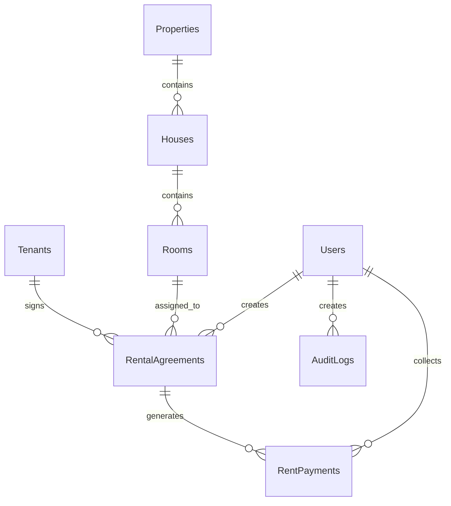

# Agreements Module Implementation Plan

## Document Control

| Item | Details |
| --- | --- |
| Project | House Rental Management System |
| Module | Rental Agreements |
| Application Type | C# Windows Forms Desktop Application |
| Framework | .NET Framework 4.7.2 |
| Architecture | Single-project 3-layer architecture |
| Database | SQL Server Express, `HouseRentalDB` |
| Data Access | ADO.NET with parameterized SQL |
| Target Location | `Forms/Agreements`, `BLL/AgreementService.cs`, `DAL/AgreementRepository.cs`, `Models/RentalAgreement.cs`, `Database` |
| Related Modules | Properties, Houses, Rooms, Tenants, Rent Payments, Dashboard, Reports, Audit Logs |

## 1. Purpose

The Agreements module will manage the contract lifecycle between active tenants and available rooms. It is the central workflow that connects tenant records, rental inventory, room occupancy, rent payment generation, dashboard metrics, and reporting.

The module must support:

- Creating draft and active rental agreements.
- Selecting only eligible tenants and available rooms.
- Assigning rent, deposit, start date, end date, and notes.
- Activating agreements with transactional room status updates.
- Renewing, expiring, terminating, and cancelling agreements safely.
- Viewing agreement history with tenant, room, property, and payment context.
- Preparing agreement data for reports and rent collection workflows.

This implementation should follow the current project style: dashboard-loaded Windows Forms `UserControl`, business rules in `BLL`, SQL Server access in `DAL`, models in `Models`, and database integrity in SQL scripts.

## 2. Current Project Analysis

### 2.1 Existing Project Structure

The project already uses a clean single-project 3-layer structure:

```text
housing_rental/
|-- App.config
|-- ApplicationSessionContext.cs
|-- Program.cs
|-- Housing rental.csproj
|-- Assets/
|-- BLL/
|-- DAL/
|-- Database/
|-- Forms/
|-- Models/
|-- Properties/
|-- Reports/
|-- docs/
```

| Layer | Existing Folder | Current Role |
| --- | --- | --- |
| UI | `Forms` | Login, dashboard, admin, property management, tenant management, placeholders |
| BLL | `BLL` | Authentication, users, dashboard, property workflows, tenant workflows, agreement/payment validation |
| DAL | `DAL` | SQL Server repositories, shared helpers, audit logging |
| Models | `Models` | Entity classes and `ServiceResult` wrappers |
| Database | `Database` | Tables, indexes, views, stored procedures, seed data |
| Docs | `docs` | Architecture and module implementation plans |

### 2.2 Existing Agreement-Related Files

| File | Current Status | Agreement Relevance |
| --- | --- | --- |
| `Models/RentalAgreement.cs` | Exists | Contains the agreement entity fields matching `RentalAgreements` |
| `BLL/AgreementService.cs` | Partial | Currently performs basic validation only |
| `DAL/AgreementRepository.cs` | Missing | Required for CRUD, lifecycle transitions, lookups, and joined grids |
| `Forms/Agreements/*` | Missing | Required for the dashboard Agreements screen |
| `Forms/Dashboard/FrmDashboard.cs` | Partial | Agreements button currently opens `ModulePlaceholderControl` |
| `Database/02_CreateTables.sql` | Exists | Defines `RentalAgreements`, relationships, constraints, and active-room uniqueness |
| `Database/03_CreateViews.sql` | Exists | Defines `vw_ActiveAgreements` and agreement data in `vw_RoomOccupancy` |
| `Database/04_CreateStoredProcedures.sql` | Partial | Dashboard and payment reports depend on agreements |
| `BLL/PropertyService.cs` | Implemented | Provides `GetAvailableRooms()` and room status protection |
| `BLL/TenantService.cs` | Implemented | Provides `GetActiveTenants()` and agreement/payment history support |
| `DAL/AuditRepository.cs` | Implemented | Should log agreement create, update, activation, renewal, termination, and cancellation |

### 2.3 Current Implementation Status

| Area | Current Status |
| --- | --- |
| Agreement model | Implemented |
| Agreement table | Implemented |
| Agreement status constraint | Implemented |
| Agreement date and rent constraints | Implemented |
| Unique active agreement per room | Implemented through filtered unique index |
| Agreement BLL validation | Minimal |
| Agreement repository | Not implemented |
| Agreement UI | Not implemented |
| Dashboard navigation | Placeholder only |
| Tenant selection source | Available through `TenantService.GetActiveTenants()` |
| Room selection source | Available through `PropertyService.GetAvailableRooms()` |
| Payment integration | Planned, `RentPaymentService` currently validation-only |
| Audit integration | Available, not wired to agreements |

### 2.4 Architecture Pattern To Follow

Existing implemented modules use this pattern:

```text
FrmDashboard
    |
    v
PropertyManagementControl / TenantManagementControl
    |
    v
PropertyService / TenantService
    |
    v
PropertyRepository / TenantRepository
    |
    v
SQL Server
```

The Agreements module should follow the same shape:

```text
FrmDashboard
    |
    v
AgreementManagementControl
    |
    v
AgreementService
    |
    v
AgreementRepository
    |
    v
SQL Server: RentalAgreements, Tenants, Rooms, Houses, Properties, RentPayments, AuditLogs
```

## 3. Domain and Relationship Analysis

### 3.1 Core Relationship



### 3.2 Agreement-Centered Data Flow

```text
RentalAgreement
  -> Tenant
  -> Room
      -> House
          -> Property
  -> RentPayments
  -> CreatedBy User
  -> AuditLogs
```

The agreement screen should not show agreement fields only. It should give operational context:

- Tenant name, phone, status, and identity reference.
- Property, house, room, room type, and current room status.
- Agreement status, date range, rent, deposit, and notes.
- Payment summary for the agreement.
- Payment history if rent records already exist.
- Renewal and termination history.

### 3.3 Existing Model

```csharp
public class RentalAgreement
{
    public int AgreementId { get; set; }
    public string AgreementNo { get; set; }
    public int TenantId { get; set; }
    public int RoomId { get; set; }
    public DateTime StartDate { get; set; }
    public DateTime EndDate { get; set; }
    public decimal MonthlyRent { get; set; }
    public decimal SecurityDeposit { get; set; }
    public string Status { get; set; }
    public string Notes { get; set; }
    public int CreatedByUserId { get; set; }
    public DateTime CreatedAt { get; set; }
}
```

### 3.4 Agreement Statuses

| Status | Meaning | Editable | Room Status Impact |
| --- | --- | --- | --- |
| Draft | Agreement is prepared but not active | Yes | Room remains `Available` |
| Active | Agreement is currently valid | Limited | Room becomes `Occupied` |
| Expired | Agreement ended because end date passed | No, except notes/admin correction | Room becomes `Available` if no other active agreement exists |
| Terminated | Agreement ended manually before planned end date | No, except notes/admin correction | Room becomes `Available` if no other active agreement exists |
| Cancelled | Draft or future agreement was cancelled | No | Room remains or becomes `Available` if no active agreement exists |

### 3.5 Required Business Rules

- Tenant is required.
- Tenant must exist and have `Status = 'Active'` when creating or activating an agreement.
- Room is required.
- Room must exist and have `Status = 'Available'` when creating an active agreement.
- Draft agreements can be created for available rooms but must not mark the room occupied.
- Start date must be before end date.
- Monthly rent must be greater than zero.
- Security deposit cannot be negative.
- Agreement number must be unique.
- A room cannot have more than one active agreement.
- A tenant should normally have only one active agreement unless the final business rule explicitly allows multi-room tenancy.
- Active agreements should not allow tenant, room, start date, or rent changes without a controlled correction workflow.
- Terminating or expiring an agreement must release the room only when no active agreement remains for that room.
- Cancellation should be allowed for `Draft` agreements and optionally future-dated `Active` agreements before payment records exist.
- Agreements should not be physically deleted because payments, reports, and audit history depend on stable records.

## 4. Database Implementation Plan

### 4.1 Existing Table

`Database/02_CreateTables.sql` already defines:

```sql
CREATE TABLE dbo.RentalAgreements
(
    AgreementId INT IDENTITY(1,1) NOT NULL CONSTRAINT PK_RentalAgreements PRIMARY KEY,
    AgreementNo NVARCHAR(50) NOT NULL CONSTRAINT UQ_RentalAgreements_AgreementNo UNIQUE,
    TenantId INT NOT NULL,
    RoomId INT NOT NULL,
    StartDate DATE NOT NULL,
    EndDate DATE NOT NULL,
    MonthlyRent DECIMAL(18,2) NOT NULL,
    SecurityDeposit DECIMAL(18,2) NOT NULL CONSTRAINT DF_RentalAgreements_SecurityDeposit DEFAULT (0),
    Status NVARCHAR(30) NOT NULL CONSTRAINT DF_RentalAgreements_Status DEFAULT ('Draft'),
    Notes NVARCHAR(500) NULL,
    CreatedByUserId INT NOT NULL,
    CreatedAt DATETIME NOT NULL CONSTRAINT DF_RentalAgreements_CreatedAt DEFAULT (GETDATE()),
    CONSTRAINT FK_RentalAgreements_Tenants FOREIGN KEY (TenantId) REFERENCES dbo.Tenants(TenantId),
    CONSTRAINT FK_RentalAgreements_Rooms FOREIGN KEY (RoomId) REFERENCES dbo.Rooms(RoomId),
    CONSTRAINT FK_RentalAgreements_Users FOREIGN KEY (CreatedByUserId) REFERENCES dbo.Users(UserId),
    CONSTRAINT CK_RentalAgreements_Dates CHECK (EndDate > StartDate),
    CONSTRAINT CK_RentalAgreements_MonthlyRent CHECK (MonthlyRent > 0),
    CONSTRAINT CK_RentalAgreements_Status CHECK (Status IN ('Draft', 'Active', 'Expired', 'Terminated', 'Cancelled'))
);
```

Existing active-room protection:

```sql
CREATE UNIQUE INDEX UX_RentalAgreements_OneActiveRoom
ON dbo.RentalAgreements(RoomId)
WHERE Status = 'Active';
```

### 4.2 Existing Views

The project already has:

| View | Usage |
| --- | --- |
| `vw_ActiveAgreements` | Active agreement grid and report data |
| `vw_RoomOccupancy` | Property/house/room occupancy visibility |
| `vw_TenantBalances` | Tenant balance summaries when payments exist |

`vw_ActiveAgreements` includes:

- Agreement ID and number.
- Tenant name and phone.
- Property, house, and room.
- Start date, end date, rent, deposit, and status.

### 4.3 Recommended Database Improvements

Add these indexes after checking existing data:

```sql
CREATE INDEX IX_RentalAgreements_Status_EndDate
ON dbo.RentalAgreements(Status, EndDate);

CREATE INDEX IX_RentalAgreements_TenantId_Status
ON dbo.RentalAgreements(TenantId, Status);

CREATE INDEX IX_RentalAgreements_RoomId_Status
ON dbo.RentalAgreements(RoomId, Status);
```

If the project rule is one active room per tenant, add:

```sql
CREATE UNIQUE INDEX UX_RentalAgreements_OneActiveTenant
ON dbo.RentalAgreements(TenantId)
WHERE Status = 'Active';
```

Use this tenant uniqueness rule only if the final scope says one tenant cannot rent multiple rooms at the same time.

### 4.4 Recommended Agreement Directory View

Create an optional view for fast list screens and reports:

```sql
CREATE OR ALTER VIEW dbo.vw_AgreementDirectory
AS
SELECT
    a.AgreementId,
    a.AgreementNo,
    a.TenantId,
    t.FullName AS TenantName,
    t.Phone AS TenantPhone,
    t.Status AS TenantStatus,
    p.PropertyId,
    p.PropertyName,
    h.HouseId,
    h.HouseName,
    r.RoomId,
    r.RoomNo,
    r.RoomType,
    r.Status AS RoomStatus,
    a.StartDate,
    a.EndDate,
    a.MonthlyRent,
    a.SecurityDeposit,
    a.Status AS AgreementStatus,
    a.CreatedByUserId,
    u.FullName AS CreatedByName,
    a.CreatedAt,
    ISNULL(SUM(rp.DueAmount), 0) AS TotalDue,
    ISNULL(SUM(rp.PaidAmount), 0) AS TotalPaid,
    ISNULL(SUM(rp.BalanceAmount), 0) AS TotalBalance,
    COUNT(rp.PaymentId) AS PaymentCount
FROM dbo.RentalAgreements a
INNER JOIN dbo.Tenants t ON t.TenantId = a.TenantId
INNER JOIN dbo.Rooms r ON r.RoomId = a.RoomId
INNER JOIN dbo.Houses h ON h.HouseId = r.HouseId
INNER JOIN dbo.Properties p ON p.PropertyId = h.PropertyId
INNER JOIN dbo.Users u ON u.UserId = a.CreatedByUserId
LEFT JOIN dbo.RentPayments rp ON rp.AgreementId = a.AgreementId
GROUP BY
    a.AgreementId,
    a.AgreementNo,
    a.TenantId,
    t.FullName,
    t.Phone,
    t.Status,
    p.PropertyId,
    p.PropertyName,
    h.HouseId,
    h.HouseName,
    r.RoomId,
    r.RoomNo,
    r.RoomType,
    r.Status,
    a.StartDate,
    a.EndDate,
    a.MonthlyRent,
    a.SecurityDeposit,
    a.Status,
    a.CreatedByUserId,
    u.FullName,
    a.CreatedAt;
```

### 4.5 Recommended Stored Procedures

| Procedure | Purpose |
| --- | --- |
| `sp_GetAgreementDirectory` | Search agreements by text, status, tenant, property, room, and date range |
| `sp_GetAgreementDetails` | Load one agreement with tenant, room, property, payment totals, and creator |
| `sp_ExpireDueAgreements` | Mark active agreements expired when `EndDate < GETDATE()` and release rooms |
| `sp_GetExpiringAgreements` | Return agreements ending within a configurable number of days |

For this project size, repository SQL methods are acceptable. Stored procedures are recommended for expiry automation and reports because they centralize cross-table changes.

### 4.6 Physical Delete Policy

Do not physically delete agreements from the UI.

Use status transitions:

| User Intent | Status |
| --- | --- |
| Not ready yet | `Draft` |
| Contract started | `Active` |
| Reached end date | `Expired` |
| Ended early | `Terminated` |
| Invalid or cancelled before use | `Cancelled` |

This keeps payment, tenant, occupancy, dashboard, and audit history consistent.

## 5. DAL Implementation Plan

Create:

```text
DAL/AgreementRepository.cs
```

### 5.1 Repository Responsibilities

The repository should:

- Use `DbConnectionFactory.CreateConnection()`.
- Use `SqlCommand`, `SqlDataReader`, `SqlDataAdapter`, and `DataTable`.
- Use parameterized SQL only.
- Return typed `RentalAgreement` objects for core agreement operations.
- Return `DataTable` for joined grids, reports, and summaries.
- Use explicit column lists.
- Use `SqlTransaction` for lifecycle changes that update both `RentalAgreements` and `Rooms`.
- Avoid UI decisions and business validation.

### 5.2 Required Methods

Agreement CRUD and lookup:

| Method | Purpose |
| --- | --- |
| `List<RentalAgreement> SearchAgreements(string searchText, string status, DateTime? fromDate, DateTime? toDate)` | Load simple typed list |
| `DataTable GetAgreementDirectory(string searchText, string status, int? propertyId, int? tenantId, DateTime? fromDate, DateTime? toDate)` | Load joined grid |
| `RentalAgreement GetAgreementById(int agreementId)` | Load one agreement for edit/lifecycle action |
| `DataTable GetAgreementDetails(int agreementId)` | Load one agreement with tenant, room, property, and payment summary |
| `bool AgreementNoExists(string agreementNo, int excludedAgreementId)` | Prevent duplicate agreement numbers |
| `bool RoomHasActiveAgreement(int roomId, int excludedAgreementId)` | Validate active room uniqueness before save |
| `bool TenantHasActiveAgreement(int tenantId, int excludedAgreementId)` | Optional one-active-agreement-per-tenant rule |
| `int CreateAgreement(RentalAgreement agreement)` | Insert and return new ID |
| `void UpdateDraftAgreement(RentalAgreement agreement)` | Update editable draft agreement fields |
| `void UpdateAgreementNotes(int agreementId, string notes)` | Allow notes correction without changing core contract fields |

Lifecycle methods:

| Method | Purpose |
| --- | --- |
| `void ActivateAgreement(int agreementId)` | Set agreement active and room occupied in one transaction |
| `void TerminateAgreement(int agreementId)` | Set agreement terminated and release room in one transaction |
| `void ExpireAgreement(int agreementId)` | Set agreement expired and release room in one transaction |
| `void CancelAgreement(int agreementId)` | Set agreement cancelled and release room if safe |
| `int ExpireDueAgreements(DateTime today)` | Batch expire active agreements past end date |
| `int RenewAgreement(int sourceAgreementId, RentalAgreement renewal)` | Create renewal and lifecycle old/new agreements transactionally |

Lookup and report helpers:

| Method | Purpose |
| --- | --- |
| `DataTable GetActiveAgreements()` | Payment module agreement selection |
| `DataTable GetExpiringAgreements(int daysAhead)` | Dashboard/report notification list |
| `DataTable GetAgreementPaymentHistory(int agreementId)` | Read-only payment history |
| `DataTable GetAgreementBalanceSummary(int agreementId)` | Due, paid, balance, overdue count |

### 5.3 Query Standards

Use explicit columns:

```sql
SELECT
    AgreementId,
    AgreementNo,
    TenantId,
    RoomId,
    StartDate,
    EndDate,
    MonthlyRent,
    SecurityDeposit,
    Status,
    Notes,
    CreatedByUserId,
    CreatedAt
FROM dbo.RentalAgreements
WHERE AgreementId = @AgreementId;
```

Avoid `SELECT *` so future schema changes do not break grid behavior.

### 5.4 Mapping Standards

Follow existing repository style:

```csharp
private static RentalAgreement MapAgreement(SqlDataReader reader)
{
    return new RentalAgreement
    {
        AgreementId = Convert.ToInt32(reader["AgreementId"]),
        AgreementNo = Convert.ToString(reader["AgreementNo"]),
        TenantId = Convert.ToInt32(reader["TenantId"]),
        RoomId = Convert.ToInt32(reader["RoomId"]),
        StartDate = Convert.ToDateTime(reader["StartDate"]),
        EndDate = Convert.ToDateTime(reader["EndDate"]),
        MonthlyRent = Convert.ToDecimal(reader["MonthlyRent"]),
        SecurityDeposit = Convert.ToDecimal(reader["SecurityDeposit"]),
        Status = Convert.ToString(reader["Status"]),
        Notes = Convert.ToString(reader["Notes"]),
        CreatedByUserId = Convert.ToInt32(reader["CreatedByUserId"]),
        CreatedAt = Convert.ToDateTime(reader["CreatedAt"])
    };
}
```

### 5.5 Transaction Requirement

Agreement activation and ending must be atomic:

```text
Begin transaction
  Validate current agreement row and current room row
  Update RentalAgreements.Status
  Update Rooms.Status
Commit transaction
Rollback on failure
```

Recommended transaction examples:

```sql
UPDATE dbo.RentalAgreements
SET Status = 'Active'
WHERE AgreementId = @AgreementId
AND Status = 'Draft';

UPDATE dbo.Rooms
SET Status = 'Occupied'
WHERE RoomId = @RoomId
AND Status = 'Available';
```

The final implementation should check affected row counts after each update. If either update affects zero rows, roll back and return a friendly validation message because the agreement or room state changed during the workflow.

### 5.6 Agreement Number Generation

Use a predictable agreement number:

```text
AGR-YYYYMM-0001
```

Repository method:

```csharp
string GetNextAgreementNo(DateTime startDate)
```

Suggested SQL:

```sql
SELECT COUNT(1) + 1
FROM dbo.RentalAgreements
WHERE AgreementNo LIKE @Prefix + '%';
```

Then format the sequence in C#:

```text
AGR-202607-0001
```

The unique constraint on `AgreementNo` remains the final protection. If a duplicate happens due to concurrency, regenerate once and retry.

## 6. BLL Implementation Plan

Update:

```text
BLL/AgreementService.cs
```

### 6.1 Service Responsibilities

The service should:

- Validate agreement input.
- Normalize text fields.
- Generate agreement numbers when missing.
- Verify active tenant eligibility.
- Verify room availability.
- Enforce status transition rules.
- Coordinate repository operations.
- Return `ServiceResult` and `ServiceResult<T>` consistently.
- Log important actions with `AuditRepository`.
- Prevent raw SQL errors from leaking into final user-facing messages.
- Keep the UI free of business decisions.

### 6.2 Required Service Methods

Agreement search and display:

| Method | Purpose |
| --- | --- |
| `ServiceResult<DataTable> GetAgreementDirectory(...)` | Load main agreement grid |
| `ServiceResult<RentalAgreement> GetAgreementById(int agreementId)` | Load selected agreement |
| `ServiceResult<DataTable> GetAgreementDetails(int agreementId)` | Load details tab |
| `ServiceResult<DataTable> GetAgreementPaymentHistory(int agreementId)` | Load payment history tab |
| `ServiceResult<DataTable> GetAgreementBalanceSummary(int agreementId)` | Load financial summary |
| `ServiceResult<DataTable> GetExpiringAgreements(int daysAhead)` | Dashboard/report support |

Creation and update:

| Method | Purpose |
| --- | --- |
| `ServiceResult CreateDraftAgreement(RentalAgreement agreement)` | Create draft without occupying room |
| `ServiceResult CreateAndActivateAgreement(RentalAgreement agreement)` | Create active agreement and occupy room |
| `ServiceResult UpdateDraftAgreement(RentalAgreement agreement)` | Edit fields while still draft |
| `ServiceResult UpdateAgreementNotes(int agreementId, string notes)` | Update notes for non-draft agreement |

Lifecycle:

| Method | Purpose |
| --- | --- |
| `ServiceResult ActivateAgreement(int agreementId)` | Activate valid draft agreement |
| `ServiceResult RenewAgreement(int agreementId, DateTime newEndDate, decimal monthlyRent, decimal securityDeposit, string notes)` | Create next agreement period |
| `ServiceResult TerminateAgreement(int agreementId, string reason)` | End active agreement manually |
| `ServiceResult ExpireAgreement(int agreementId)` | Mark selected active agreement expired |
| `ServiceResult ExpireDueAgreements()` | Batch expiry job from UI/admin refresh |
| `ServiceResult CancelAgreement(int agreementId, string reason)` | Cancel draft or eligible future agreement |

Lookup methods for UI:

| Method | Purpose |
| --- | --- |
| `ServiceResult<List<Tenant>> GetEligibleTenants()` | Wrap or call `TenantService.GetActiveTenants()` |
| `ServiceResult<List<Room>> GetEligibleRooms()` | Wrap or call `PropertyService.GetAvailableRooms()` |

### 6.3 Validation Rules

| Field | Rule |
| --- | --- |
| AgreementNo | Optional on create, required after generation, maximum 50 characters |
| TenantId | Required and must point to active tenant |
| RoomId | Required and must point to available room for active create/activation |
| StartDate | Required and must be before end date |
| EndDate | Required and must be after start date |
| MonthlyRent | Required and greater than zero |
| SecurityDeposit | Required and zero or greater |
| Status | Must be `Draft`, `Active`, `Expired`, `Terminated`, or `Cancelled` |
| Notes | Optional, maximum 500 characters |
| CreatedByUserId | Required from `CurrentSession.User.UserId` |

### 6.4 Status Transition Rules

| From | To | Rule |
| --- | --- | --- |
| Draft | Active | Tenant active, room available, no active room conflict |
| Draft | Cancelled | Allowed |
| Draft | Draft | Editable |
| Active | Expired | Allowed when end date passed or Admin manually confirms |
| Active | Terminated | Allowed with confirmation/reason |
| Active | Cancelled | Block unless future-dated and no payments exist |
| Expired | Active | Block; use renewal |
| Terminated | Active | Block; use renewal |
| Cancelled | Active | Block; create a new agreement |

### 6.5 Editable Field Rules

| Agreement Status | Editable Fields |
| --- | --- |
| Draft | Tenant, room, start date, end date, rent, deposit, notes |
| Active | Notes only in normal workflow |
| Expired | Notes only, Admin recommended |
| Terminated | Notes only, Admin recommended |
| Cancelled | Notes only, Admin recommended |

Changing tenant, room, dates, or rent after activation can damage payment and audit history. If corrections are required, create a dedicated Admin correction workflow later.

### 6.6 Room Status Rules

| Agreement Action | Room Status Requirement | Room Status Result |
| --- | --- | --- |
| Create draft | Room should be available, but not locked | No change |
| Activate | Room must be `Available` | `Occupied` |
| Create active | Room must be `Available` | `Occupied` |
| Terminate | Agreement must be `Active` | `Available` if no active agreement remains |
| Expire | Agreement must be `Active` | `Available` if no active agreement remains |
| Cancel draft | No strict room requirement | No change |
| Cancel future active | No payments, agreement future-dated | `Available` if no active agreement remains |

### 6.7 Tenant Eligibility Rules

| Tenant Status | Can Create Draft | Can Activate |
| --- | --- | --- |
| Active | Yes | Yes |
| Inactive | No | No |
| Blacklisted | No | No |

If a tenant becomes inactive after draft creation, activation must be blocked until the tenant is active again.

### 6.8 Audit Logging

Use `AuditRepository.Add` for:

- `Create Draft Agreement`
- `Create Active Agreement`
- `Update Draft Agreement`
- `Activate Agreement`
- `Renew Agreement`
- `Terminate Agreement`
- `Expire Agreement`
- `Cancel Agreement`
- `Update Agreement Notes`

Recommended descriptions:

```text
Created draft agreement 'AGR-202607-0001' for TenantId 5 and RoomId 8.
Activated agreement 'AGR-202607-0001' and marked RoomId 8 as Occupied.
Terminated agreement 'AGR-202607-0001'. Reason: tenant moved out.
```

Audit logging should follow the existing `TryAudit` style and must not block the main agreement workflow if logging fails.

## 7. UI Implementation Plan

### 7.1 Recommended UI Type

Use a dashboard-loaded `UserControl`, matching the existing Properties and Tenants modules.

Create:

```text
Forms/Agreements/AgreementManagementControl.cs
Forms/Agreements/AgreementManagementControl.Designer.cs
```

Update:

```text
Forms/Dashboard/FrmDashboard.cs
Housing rental.csproj
```

Dashboard integration:

```csharp
private void BtnAgreements_Click(object sender, EventArgs e)
{
    SetActiveButton(sender as Button);
    NavigateToControl("Rental Agreements", new AgreementManagementControl());
}
```

### 7.2 Main Screen Layout

```text
+----------------------------------------------------------------------------+
| Search [________________] Status [All v] Property [All v] Date From/To      |
+----------------------------------------------------------------------------+
| Tabs: Agreements | Editor | Details | Payments | Expiring                   |
+----------------------------------------------------------------------------+
| Agreement grid / history grid                         | Editor/detail panel |
| DataGridView                                          | Fields and actions  |
+----------------------------------------------------------------------------+
| Status message                                                              |
+----------------------------------------------------------------------------+
```

### 7.3 Tabs

| Tab | Purpose |
| --- | --- |
| Agreements | Search, filter, select agreements, run lifecycle actions |
| Editor | Create draft, create active, edit draft, update notes |
| Details | Read-only tenant, room, property, dates, rent, deposit, payment summary |
| Payments | Read-only payment records for selected agreement |
| Expiring | Agreements ending soon, useful before renewal |

### 7.4 Agreement Editor Fields

| Control | Field |
| --- | --- |
| TextBox readonly | Agreement number |
| ComboBox | Tenant |
| ComboBox | Available room |
| DateTimePicker | Start date |
| DateTimePicker | End date |
| NumericUpDown or validated TextBox | Monthly rent |
| NumericUpDown or validated TextBox | Security deposit |
| ComboBox readonly/controlled | Status |
| TextBox multiline | Notes |

Primary actions:

- New Agreement
- Save Draft
- Save and Activate
- Update Draft
- Activate
- Renew
- Terminate
- Cancel
- Refresh

### 7.5 Main Agreement Grid Columns

Use `vw_AgreementDirectory` if added, otherwise use an equivalent repository query.

| Column | Source |
| --- | --- |
| Agreement | `AgreementNo` |
| Tenant | `TenantName` |
| Phone | `TenantPhone` |
| Property | `PropertyName` |
| House | `HouseName` |
| Room | `RoomNo` |
| Start | `StartDate` |
| End | `EndDate` |
| Rent | `MonthlyRent` |
| Deposit | `SecurityDeposit` |
| Status | `AgreementStatus` |
| Balance | `TotalBalance` |

### 7.6 Details Tab

The details tab should be read-only and show:

- Agreement number, status, start date, end date.
- Tenant name, phone, tenant status.
- Property, house, room, room type, room status.
- Monthly rent and security deposit.
- Total due, total paid, total balance, payment count.
- Created by user and created date.
- Notes.

### 7.7 Payments Tab

Show payment history for the selected agreement:

| Column | Source |
| --- | --- |
| Receipt | `ReceiptNo` |
| Month | `PaymentMonth` |
| Year | `PaymentYear` |
| Due | `DueAmount` |
| Paid | `PaidAmount` |
| Balance | `BalanceAmount` |
| Payment Date | `PaymentDate` |
| Method | `PaymentMethod` |
| Status | `Status` |

The Agreements module should not collect payments directly. It should only display payment history and provide context for the future Payments module.

### 7.8 Expiring Tab

Show agreements ending in the next configurable period, default 30 days:

| Column | Source |
| --- | --- |
| Agreement | `AgreementNo` |
| Tenant | `TenantName` |
| Phone | `TenantPhone` |
| Room | `RoomNo` |
| End Date | `EndDate` |
| Days Left | calculated |
| Rent | `MonthlyRent` |

Actions:

- Renew selected agreement.
- Open agreement details.
- Refresh expiring list.

### 7.9 UI Behavior

| Behavior | Requirement |
| --- | --- |
| Grid selection | Loads selected agreement into editor and details tabs |
| New button | Clears editor, loads eligible tenants and rooms |
| Save Draft | Creates `Draft` agreement without room status update |
| Save and Activate | Creates `Active` agreement and marks room `Occupied` |
| Activate | Validates tenant/room again before status change |
| Renew | Creates a new agreement period and keeps history |
| Terminate | Requires confirmation and reason |
| Cancel | Requires confirmation and is limited by status rules |
| Search/filter | Refreshes current agreement grid without reloading the whole form |
| Empty state | Shows friendly status when no agreements exist |
| Validation | Shows clear message and does not save invalid data |

### 7.10 Visual Style

Match the current dashboard, property, tenant, and user management screens:

- Font: Segoe UI.
- Neutral light background.
- White work surfaces.
- Blue primary action buttons.
- Green success messages.
- Red blocked-action messages.
- Amber warning treatment for expiring agreements.
- Red treatment for terminated or cancelled agreements.
- `DataGridView` with readable headers and stable column widths.
- `BindingSource` for all grids.
- `SplitContainer` or tabbed layout to keep the screen organized.

## 8. Integration Plan

### 8.1 Dashboard Integration

The dashboard already reads:

```sql
(SELECT COUNT(*) FROM dbo.RentalAgreements WHERE Status = 'Active') AS ActiveAgreements
```

After agreement implementation:

- Creating or activating an agreement should increase active agreement count.
- Terminating or expiring an agreement should decrease active agreement count.
- Activating an agreement should increase occupied room count and decrease available room count.
- Terminating or expiring an agreement should release room availability when safe.
- Monthly expected rent should equal active agreement rent total.

### 8.2 Property and Room Integration

Use:

```csharp
PropertyService.GetAvailableRooms()
```

Agreement activation must:

- Confirm the selected room still exists.
- Confirm the selected room is still `Available`.
- Update room status to `Occupied` inside the same transaction as agreement activation.

Agreement termination/expiry must:

- Update agreement status.
- Check whether another active agreement exists for the room.
- Set room status to `Available` only when no active agreement remains.

### 8.3 Tenant Integration

Use:

```csharp
TenantService.GetActiveTenants()
```

Agreement activation must:

- Confirm the selected tenant still exists.
- Confirm tenant status is still `Active`.
- Block inactive or blacklisted tenants.

Tenant details already show agreement history, so the Agreements module should keep that data reliable by never deleting agreements.

### 8.4 Rent Payment Integration

The future Payments module should depend on active agreements:

```text
Active Agreement -> Monthly Due -> Rent Payment -> Receipt
```

Agreement module should provide:

- `GetActiveAgreements()` for payment agreement selection.
- Agreement rent amount for default due amount.
- Agreement status checks before creating payment records.

Payment module should prevent collection against:

- Draft agreements.
- Cancelled agreements.
- Terminated agreements after termination date unless collecting old balance is explicitly allowed.

### 8.5 Reports Integration

Agreement-related reports:

| Report | Data Source |
| --- | --- |
| Active Agreement Report | `vw_ActiveAgreements` |
| Agreement Directory Report | `vw_AgreementDirectory` or repository query |
| Expiring Agreement Report | `GetExpiringAgreements` query |
| Tenant Agreement History | `TenantRepository.GetTenantAgreementHistory` |
| Agreement Payment History | Agreement payment history query |

### 8.6 Audit Integration

All lifecycle changes must include:

- Logged-in user ID from `CurrentSession.User.UserId`.
- Agreement ID as record ID.
- Clear action name.
- Short readable description.

## 9. Security and Authorization Plan

### 9.1 Recommended Permissions

| Action | Admin | Staff |
| --- | --- | --- |
| View agreements | Yes | Yes |
| Create draft agreement | Yes | Yes |
| Activate agreement | Yes | Yes |
| Edit draft agreement | Yes | Yes |
| Update notes | Yes | Yes |
| Renew agreement | Yes | Yes |
| Terminate agreement | Yes | Limited or Yes with confirmation |
| Cancel agreement | Yes | Limited |
| Expire due agreements | Yes | Yes |
| Correct active agreement fields | Admin only, future enhancement |

### 9.2 Data Protection

- Do not expose raw SQL exception details in final UI messages.
- Do not log sensitive tenant identity data in full.
- Use confirmation dialogs before termination, cancellation, or expiry.
- Keep agreement numbers stable after creation.
- Keep payment history read-only from agreement screens.

## 10. Error Handling Plan

### 10.1 UI Layer

The UI should handle:

- Missing tenant selection.
- Missing room selection.
- Invalid date range.
- Invalid money values.
- No selected agreement for lifecycle actions.
- Confirmation before risky actions.
- Empty grids and unavailable lookup data.

### 10.2 BLL Layer

The service should handle:

- Duplicate agreement number.
- Inactive or blacklisted tenant.
- Room not available.
- Existing active agreement for the room.
- Optional existing active agreement for the tenant.
- Invalid status transition.
- Attempts to edit locked fields after activation.
- Friendly database exception wrapping.

### 10.3 DAL Layer

The repository should handle:

- Parameterized SQL only.
- Connection disposal with `using`.
- Transaction rollback on lifecycle failure.
- Explicit column lists.
- `DBNull` handling through `SqlHelper.Parameter`.
- Duplicate key failures as recoverable workflow errors.

## 11. Implementation Phases

### Phase 1: Repository Foundation

Tasks:

- Create `DAL/AgreementRepository.cs`.
- Add agreement search, lookup, create, and draft update methods.
- Add agreement directory and details queries.
- Add duplicate agreement number check.
- Add active room and optional active tenant checks.
- Add payment history and balance summary queries.

Deliverable:

- Agreement data can be safely read and written without UI involvement.

### Phase 2: Transactional Lifecycle Methods

Tasks:

- Add `ActivateAgreement`.
- Add `TerminateAgreement`.
- Add `ExpireAgreement`.
- Add `CancelAgreement`.
- Add `ExpireDueAgreements`.
- Add `RenewAgreement`.
- Ensure each lifecycle method uses `SqlTransaction` where room status changes are involved.

Deliverable:

- Agreement status and room status remain consistent even when a database error occurs.

### Phase 3: Service Layer

Tasks:

- Expand `BLL/AgreementService.cs`.
- Add repository and audit dependencies.
- Add full validation and normalization.
- Add agreement number generation.
- Add create draft and create active workflows.
- Add status transition protection.
- Add lifecycle methods returning `ServiceResult`.
- Add non-blocking audit logging.

Deliverable:

- UI can call agreement workflows and receive friendly success or validation messages.

### Phase 4: Agreement UI Control

Tasks:

- Create `Forms/Agreements/AgreementManagementControl.cs`.
- Create designer layout with filters, tabs, grids, and editor.
- Add `BindingSource` objects for agreement list, details, payments, and expiring agreements.
- Load active tenants and available rooms into ComboBoxes.
- Add save, activate, renew, terminate, cancel, refresh, and search handlers.
- Add clear empty-state and validation status messages.

Deliverable:

- Users can manage rental agreements from a professional dashboard module.

### Phase 5: Dashboard Navigation

Tasks:

- Add `using Housing_rental.Forms.Agreements;`.
- Replace the Agreements placeholder in `FrmDashboard.BtnAgreements_Click`.
- Add new form files to `Housing rental.csproj`.

Deliverable:

- Clicking the sidebar Agreements button opens the real Agreements module.

### Phase 6: Database Hardening

Tasks:

- Add recommended agreement indexes.
- Decide whether to add one-active-agreement-per-tenant unique index.
- Add optional `vw_AgreementDirectory`.
- Add optional expiry and expiring-agreement stored procedures.
- Re-run scripts on a clean database.

Deliverable:

- Database supports reliable search, reporting, lifecycle safety, and demo data integrity.

### Phase 7: Integration Testing and Polish

Tasks:

- Test create draft, create active, activate, renew, terminate, cancel, and expire workflows.
- Verify room status updates after lifecycle changes.
- Verify dashboard counts after agreement changes.
- Verify tenant details agreement history updates.
- Verify available-room ComboBox excludes occupied rooms.
- Improve grid formatting, currency columns, and date columns.
- Finalize messages and confirmations.

Deliverable:

- Agreements module is stable, consistent, and ready for demonstration.

## 12. Suggested Development Order

1. Implement `AgreementRepository` read/search methods.
2. Implement `AgreementRepository` create/update draft methods.
3. Implement transactional lifecycle methods.
4. Expand `AgreementService` validation and workflow methods.
5. Build agreement list and editor UI.
6. Add details, payments, and expiring tabs.
7. Replace dashboard placeholder.
8. Add database indexes and optional directory view.
9. Add audit logging.
10. Run manual integration tests.
11. Polish UI messages and grid formatting.

This order keeps the module testable from the database outward and protects the most important business rule: agreement status and room status must stay synchronized.

## 13. Manual Test Plan

### 13.1 Creation Tests

| Test | Expected Result |
| --- | --- |
| Create draft with active tenant and available room | Draft agreement is saved and room remains Available |
| Create active agreement with active tenant and available room | Agreement becomes Active and room becomes Occupied |
| Create agreement without tenant | Validation message appears |
| Create agreement without room | Validation message appears |
| Create agreement with end date before start date | Validation message appears |
| Create agreement with zero rent | Validation message appears |
| Create agreement with negative deposit | Validation message appears |
| Create duplicate agreement number | System blocks duplicate or regenerates number |

### 13.2 Eligibility Tests

| Test | Expected Result |
| --- | --- |
| Select inactive tenant for activation | System blocks activation |
| Select blacklisted tenant for activation | System blocks activation |
| Select occupied room for activation | System blocks activation |
| Activate draft after room was occupied by another agreement | System blocks activation |
| Activate draft after tenant was deactivated | System blocks activation |

### 13.3 Lifecycle Tests

| Test | Expected Result |
| --- | --- |
| Activate valid draft | Agreement becomes Active and room becomes Occupied |
| Terminate active agreement | Agreement becomes Terminated and room becomes Available |
| Expire active agreement past end date | Agreement becomes Expired and room becomes Available |
| Cancel draft agreement | Agreement becomes Cancelled and room remains Available |
| Renew active agreement | New agreement period is created and history remains available |
| Try to edit active agreement room | System blocks locked field update |
| Try to reactivate terminated agreement | System blocks action |

### 13.4 Integration Tests

| Test | Expected Result |
| --- | --- |
| Create active agreement | Dashboard active agreements increases |
| Create active agreement | Dashboard occupied rooms increases and available rooms decreases |
| Terminate agreement | Dashboard active agreements decreases |
| Terminate agreement | Room appears in available-room lookup again |
| Open tenant details | Agreement appears in tenant agreement history |
| Open property occupancy tab | Tenant and agreement appear beside occupied room |
| Open payment module lookup later | Active agreement appears for payment collection |

### 13.5 Edge Cases

| Test | Expected Result |
| --- | --- |
| SQL Server unavailable | Friendly database connection message appears |
| Two users activate agreements for same room | Database unique index prevents duplicate active room agreement |
| Agreement has payment records and user tries cancellation | System blocks or requires Admin correction workflow |
| Active agreement end date is today | System does not expire until agreed rule is met |
| Agreement end date is in the past | Expiry workflow marks it Expired and releases room |

## 14. Acceptance Criteria

The Agreements module is complete when:

- The dashboard Agreements button opens `AgreementManagementControl`.
- Agreements can be searched and filtered by text, status, property, tenant, and dates.
- Draft agreements can be created and edited.
- Active agreements can be created from active tenants and available rooms.
- Activating an agreement marks the room as `Occupied`.
- Terminating or expiring an agreement releases the room when safe.
- Cancelled, terminated, and expired agreements remain visible for history.
- Active tenant and available room rules are enforced in `AgreementService`.
- Agreement lifecycle changes are transactional in `AgreementRepository`.
- The UI does not directly execute SQL.
- All SQL uses parameters.
- Audit logs are created for major agreement actions.
- Dashboard counts remain consistent after agreement lifecycle changes.
- Tenant and property screens show agreement effects through their existing history and occupancy views.
- The project builds in Visual Studio.

## 15. Quality Checklist

Before marking the module complete:

- `AgreementRepository.cs` follows the style of `PropertyRepository.cs` and `TenantRepository.cs`.
- `AgreementService.cs` returns `ServiceResult` and `ServiceResult<T>` consistently.
- Lifecycle methods use transactions for agreement and room updates.
- Agreement status values match the database check constraint exactly.
- Room status values match the database check constraint exactly.
- Active agreements never point to inactive tenants or unavailable rooms.
- Agreement number generation is predictable and uniqueness-protected.
- No physical delete exists in normal agreement workflows.
- ComboBoxes load only eligible tenants and rooms.
- Active agreement fields are not casually editable.
- Payment history is read-only in the Agreements module.
- Grid columns are clear and formatted for dates/currency.
- Audit logging does not block agreement operations if it fails.
- New files are included in `Housing rental.csproj`.
- The project builds without errors.

## 16. Risks and Mitigation

| Risk | Mitigation |
| --- | --- |
| Room status and agreement status become inconsistent | Use transactions for lifecycle workflows |
| Two users assign the same room | Keep `UX_RentalAgreements_OneActiveRoom` and validate before activation |
| Inactive tenant receives active agreement | Re-check tenant status in service before create/activate |
| Payments are created for inactive agreements | Payment module must select only active agreements |
| Active agreement edits damage history | Lock core fields after activation |
| Dashboard counts are wrong | Update room status consistently and test dashboard after each lifecycle action |
| New agreements disappear from joined reports | Use left joins for payment summaries |
| Cancellation loses business history | Use `Cancelled` status, never delete |

## 17. Future Enhancements

After the core module is stable, consider:

- Printable agreement document or RDLC agreement contract.
- Agreement PDF export.
- Tenant signature and document attachment support.
- Agreement renewal reminders.
- Automatic monthly rent due generation from active agreements.
- Agreement amendment workflow.
- Move-out inspection checklist.
- Deposit refund tracking.
- Admin correction log for rare contract data fixes.

## 18. Final Recommendation

Implement the Agreements module as a dashboard-loaded `AgreementManagementControl` backed by a dedicated `AgreementService` and `AgreementRepository`. The most important design rule is to treat agreement lifecycle changes as business transactions, not simple status edits.

The module should create a reliable bridge between tenants and rooms, keep room occupancy synchronized with active agreements, preserve all historical records, and provide clean data for payments, dashboard totals, reports, and final project demonstration.
