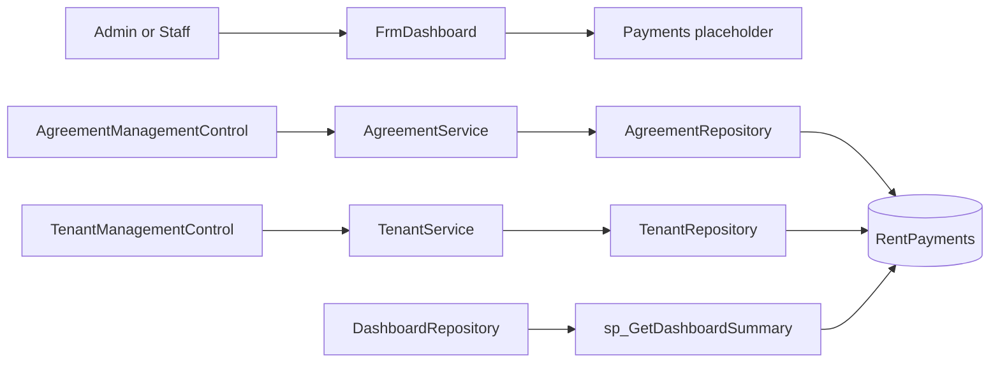
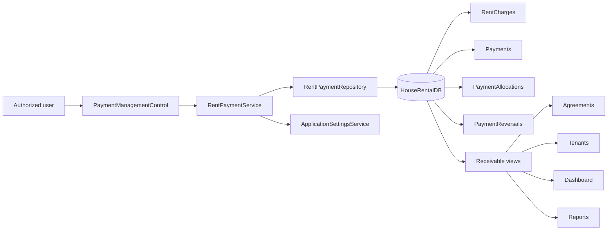
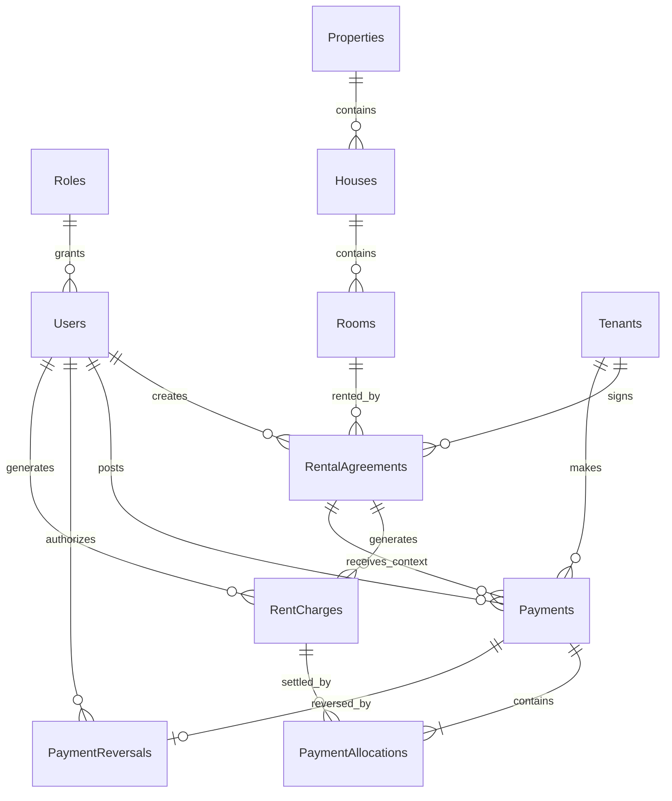

# Payments Module — Industrial Implementation Plan

## Document control

| Item | Value |
| --- | --- |
| Project | House Rental Management System |
| Module | Payments / Monthly Rent Collection |
| Document type | Architecture-aligned implementation, migration, integration, and quality plan |
| Baseline reviewed | Git branch `main`, commit `718f169` plus current working tree |
| Review date | 2026-07-11 |
| Application | C# Windows Forms desktop application |
| Framework | .NET Framework 4.7.2 |
| Architecture | Single-project, three-layer architecture: UI -> BLL -> DAL -> SQL Server |
| Database | SQL Server Express, `HouseRentalDB` |
| Data access | ADO.NET with parameterized SQL |
| Primary owners | Application developer, database developer, QA/reviewer |
| Status | Ready for business decisions and phased implementation |

---

## 1. Executive summary

The project already contains the beginning of a Payments module: a `RentPayment` model, a validation-only `RentPaymentService`, a `RentPayments` table, payment history queries in the Agreements and Tenants modules, dashboard totals, rent-report procedures, application settings, and a Rent Collection navigation placeholder.

The existing implementation is suitable only for a basic single-row-per-month demonstration. Its central structural problem is that `RentPayments` currently represents three different business concepts in one mutable row:

1. the monthly rent obligation (`DueAmount`);
2. the receipt or cash event (`PaidAmount`, `PaymentDate`, `ReceiptNo`); and
3. the remaining account balance (`BalanceAmount`, `Status`).

Those concepts must be separated before the module can safely support partial payments, one receipt covering multiple months, reversals, concurrent cashiers, reliable overdue reporting, or an auditable financial history.

The recommended target design preserves the current WinForms/BLL/DAL architecture and introduces a small receivables ledger:

- `RentCharges` records what an agreement owes for a billing period.
- `Payments` records an immutable posted receipt.
- `PaymentAllocations` records how a receipt settles one or more charges.
- `PaymentReversals` records a controlled counter-event instead of deleting history.
- Database views calculate balances and overdue state from posted, non-reversed allocations.

The deployed local database was inspected read-only. It currently contains one agreement and zero `RentPayments` rows, so this is the lowest-risk time to introduce the correct model. The migration must still support populated environments and must never assume all databases are empty.

The implementation order is intentionally database-outward: approve billing policy, add forward-only migrations and transactional procedures, implement typed repository and service contracts, build the dashboard-loaded Payments control, update dependent modules and reports, then execute automated, concurrency, migration, and manual acceptance tests.

### 1.1 Implementation delivery status — 2026-07-11

The Release 1 vertical slice described by this plan has now been implemented:

- rent-charge, payment, allocation, and reversal tables with constraints and indexes;
- forward migration of the legacy `RentPayments` structure;
- idempotent monthly charge generation, payment posting, and reversal procedures;
- ledger-backed balance, history, tenant, agreement, dashboard, and report views/procedures;
- typed Payment models, repository, service validation, authorization, safe errors, and audit integration;
- dashboard-loaded collection, dues/overdue, and payment-history UI;
- stored-data receipt viewing and print preview;
- Admin-only charge generation and reversal;
- SQL rollback smoke tests and read-model/constraint tests;
- successful Debug and Release builds and a runtime control-construction check.

Deferred extensions remain intentionally outside Release 1: proration, refunds, unapplied tenant credits, deposit custody, late-fee automation, cash-drawer sessions, multi-currency settlement, online gateways, and the broader Reports module/RDLC suite.

---

## 2. Analysis evidence and scope

### 2.1 Source areas reviewed

This plan is based on direct review of:

- `Housing rental.csproj`, `App.config`, `Program.cs`, and `ApplicationSessionContext.cs`;
- `Models/RentPayment.cs`, `Models/RentalAgreement.cs`, `Models/Tenant.cs`, `Models/User.cs`, and related entities;
- `BLL/RentPaymentService.cs`, `AgreementService.cs`, `TenantService.cs`, `DashboardService.cs`, `CurrentSession.cs`, and authentication behavior;
- `DAL/AgreementRepository.cs`, `TenantRepository.cs`, `DashboardRepository.cs`, `AuditRepository.cs`, `DbConnectionFactory.cs`, and `SqlHelper.cs`;
- `Forms/Dashboard/FrmDashboard.cs`, Agreement payment history, Tenant payment history, and existing UI conventions;
- all version-controlled database table, view, stored procedure, and seed scripts;
- existing Properties, Tenants, Agreements, and project architecture plans;
- Git status and recent implementation history;
- the live local `HouseRentalDB` catalog and row counts through a read-only SQL connection.

### 2.2 Verification results

| Check | Result |
| --- | --- |
| Project architecture | Single WinForms project with `Models`, `BLL`, `DAL`, `Forms`, `Database`, `Reports`, and `docs` |
| Framework/runtime | .NET Framework 4.7.2; SQL Server Express through `System.Data.SqlClient` |
| Payments UI | Sidebar entry exists; currently opens `ModulePlaceholderControl` |
| Payment model | Exists and mirrors the current `RentPayments` table |
| Payment BLL | Validation only; no persistence, queries, authorization, audit, or transactional workflow |
| Payment repository | Missing |
| Agreement/Tenant payment history | Implemented as read-only `DataTable` queries against `RentPayments` |
| Dashboard integration | Reads payment totals from `sp_GetDashboardSummary` |
| Reporting integration | `sp_GetRentCollectionReport` exists; RDLC implementation is not present |
| Live database connectivity | Confirmed read-only |
| Live payment data | `RentPayments` contains 0 rows |
| Live related data | 1 agreement, 1 tenant, 1 room, 3 users, 45 audit records |
| Version-controlled/live schema alignment | Core payment columns, constraints, indexes, views, and procedures are aligned |
| Working-tree protection | Existing user edit in the Agreements plan is unrelated and must remain untouched |

### 2.3 Analysis boundary

The catalog inspection confirms object structure and row counts, but it is not a substitute for a release database audit. Before deploying a migration, Phase 0 must inspect every target environment for schema drift, duplicate receipts, inconsistent balances, invalid dates, orphan references, and unrecorded manual changes.

---

## 3. Current architecture and module map

### 3.1 Relevant repository structure

```text
housing_rental/
├── App.config
├── ApplicationSessionContext.cs
├── Housing rental.csproj
├── Models/
│   ├── RentPayment.cs
│   ├── RentalAgreement.cs
│   ├── Tenant.cs
│   ├── Property.cs
│   ├── House.cs
│   ├── Room.cs
│   ├── User.cs
│   ├── DashboardSummary.cs
│   └── ServiceResult.cs
├── BLL/
│   ├── RentPaymentService.cs
│   ├── AgreementService.cs
│   ├── TenantService.cs
│   ├── PropertyService.cs
│   ├── DashboardService.cs
│   ├── CurrentSession.cs
│   └── AuthService.cs
├── DAL/
│   ├── AgreementRepository.cs
│   ├── TenantRepository.cs
│   ├── DashboardRepository.cs
│   ├── AuditRepository.cs
│   ├── DbConnectionFactory.cs
│   └── SqlHelper.cs
├── Forms/
│   ├── Dashboard/FrmDashboard.cs
│   ├── Agreements/AgreementManagementControl.cs
│   └── Tenants/TenantManagementControl.cs
├── Database/
│   ├── 01_CreateDatabase.sql
│   ├── 02_CreateTables.sql
│   ├── 03_CreateViews.sql
│   ├── 04_CreateStoredProcedures.sql
│   └── 05_SeedData.sql
├── Reports/
└── docs/
```

### 3.2 Current runtime flow



### 3.3 Target runtime flow



The direction of dependencies must remain unchanged: Forms call BLL services; BLL owns policy, validation, permissions, and orchestration; DAL owns SQL and transactional persistence; SQL Server owns relational integrity and concurrency safeguards.

---

## 4. Current implementation inventory and gap analysis

| Area | Current state | Required decision/action |
| --- | --- | --- |
| `RentPayment` model | One entity mirrors the overloaded table | Retire as write contract; replace with charge, payment, allocation, reversal, and read DTOs |
| `RentPaymentService` | Validates month/year/due/paid and calculates balance/status in memory | Rebuild as payment application service with permissions, repository, idempotency, posting, reversal, and query methods |
| `RentPaymentRepository` | Missing | Create dedicated repository with typed mappings and atomic commands |
| Payments UI | Placeholder | Create a dashboard-loaded `PaymentManagementControl` |
| `RentPayments` table | Mixes charge, receipt, and balance | Migrate to a receivables ledger; preserve legacy data |
| Receipt uniqueness | Unique constraint on `ReceiptNo` | Retain concept; generate numbers concurrency-safely with a SQL sequence |
| Monthly uniqueness | Not enforced | Add one rent charge per agreement/billing period, not one payment per period |
| Partial payment support | A row may be marked Partial, but a second installment has no safe representation | Use multiple Payments allocated to one charge |
| Multi-month receipt | Not supported | One Payment can have many allocations |
| Overpayment | Only blocked by BLL against one row | Define policy; recommended first release rejects unallocated excess |
| Reversal/correction | `Cancelled` status exists but no actor, reason, timestamp, or counter-event | Add immutable reversal workflow and metadata |
| Balance integrity | Caller supplies `BalanceAmount` | Calculate from charges minus effective allocations; never trust UI balance |
| Overdue state | Persisted status with no automatic transition | Derive from due date and outstanding balance |
| Receipt/payment method | Method nullable and uncontrolled text | Require a recognized method; capture external reference when applicable |
| Authorization | Payments sidebar available to authenticated users; BLL has no checks | Enforce permissions at BLL boundary, not only in UI |
| Audit | Generic best-effort audit is outside financial transactions | Persist financial actor/time/reason in core tables; use `AuditLogs` as secondary operational audit |
| Concurrency | No row version, locked balance recheck, or idempotency key | Add locked allocation validation, unique request key, and row versions where edited state exists |
| Queries | Operational modules bind to weakly typed `DataTable` | Use typed DTOs for payment workflows; retain `DataTable` at report boundaries |
| Dashboard | Due is the sum of existing payment rows only | Base metrics on generated charges and effective allocations |
| Currency | `DefaultCurrency` setting exists, while dashboard uses OS `"C"` formatting | Centralize ISO currency/culture formatting and store currency code on financial records |
| Database deployment | Bootstrap scripts drop/recreate tables | Keep bootstrap scripts for clean install; use forward-only migrations for upgrades |
| Tests | No automated test project | Add unit, SQL integration, migration, concurrency, and smoke coverage |

### 4.1 Specific weaknesses in the current table

The current database enforces month range, positive due amount, nonnegative paid/balance values, recognized status, receipt uniqueness, and foreign keys. It does **not** enforce:

- `PaymentYear` within any valid range;
- `PaidAmount <= DueAmount`;
- `BalanceAmount = DueAmount - PaidAmount`;
- uniqueness of agreement + payment year + payment month;
- payment period inside the agreement term;
- non-null or recognized payment method;
- a valid agreement lifecycle state for collection;
- reversal actor, reason, or timestamp;
- immutable posted receipts;
- currency consistency;
- idempotent posting;
- indexes supporting agreement/month/status/date collection queries.

Adding only more checks to the existing table would not solve the core modeling conflict: a due amount and a receipt are separate events.

---

## 5. Domain language and ownership

### 5.1 Canonical terms

| Term | Meaning | Source of truth |
| --- | --- | --- |
| Agreement | Contract defining tenant, room, term, and contractual monthly rent | `RentalAgreements` |
| Billing period | Calendar month or approved period for which rent is charged | `RentCharges.BillingPeriodStart/End` |
| Charge | Amount owed because of rent, deposit, fee, or approved adjustment | `RentCharges` |
| Due date | Date after which an outstanding charge is overdue | `RentCharges.DueDate` |
| Payment | Money received and posted under one receipt | `Payments` |
| Allocation | Portion of a payment applied to a specific charge | `PaymentAllocations` |
| Unapplied amount | Posted money not assigned to a charge | Not supported in Release 1 unless explicitly approved |
| Reversal | Controlled event neutralizing a posted payment while preserving history | `PaymentReversals` |
| Outstanding balance | Charge amount minus effective, non-reversed allocations | Calculated view/query |
| Receipt | Human-readable evidence of one posted payment | `Payments.ReceiptNo` plus receipt report |
| Overdue | A charge has a positive balance after its due date | Derived state, not a manually edited payment status |

### 5.2 Data ownership rules

- Agreements own contractual rent and term eligibility.
- Payments must use the agreement rent snapshot, never the current room price.
- RentCharges own obligations and due dates.
- Payments own received money, receipt identity, method, reference, collector, and posting time.
- PaymentAllocations own settlement relationships.
- No UI, report, or BLL method may store a caller-calculated balance as authoritative.
- Posted financial history is append-only except for controlled reversal or adjustment events.
- A payment is never reassigned to another tenant or agreement after posting.
- Historical records remain queryable when a tenant, room, property, agreement, or user becomes inactive.
- `AuditLogs` supplements core financial metadata; it is not the only evidence that a payment was posted or reversed.

---

## 6. Business decisions required before coding

These decisions change calculations and database rules. Record the approved values in an Architecture Decision Record before Phase 1.

| ID | Decision | Recommended default for this project |
| --- | --- | --- |
| PAY-D01 | Billing calendar | Calendar month, represented by the first day of the month |
| PAY-D02 | Agreement date convention | Start and end dates inclusive |
| PAY-D03 | First/last partial month | No proration in Release 1; charge full month when agreement overlaps the billing month |
| PAY-D04 | Due day | Use `AppSettings.RentDueDay`; clamp to the last valid day of short months |
| PAY-D05 | Charge generation | Idempotent manual/month-open action plus optional startup reminder; no hidden timer |
| PAY-D06 | Collection eligibility | Allow active agreements and closed agreements with existing outstanding charges; never create new charges after effective closure |
| PAY-D07 | Allocation order | User may select; default oldest due date first |
| PAY-D08 | Overpayment | Reject amount above selected outstanding charges in Release 1 |
| PAY-D09 | Multi-month receipt | Supported through multiple allocations |
| PAY-D10 | Multiple agreement receipt | Reject in Release 1; one payment belongs to one tenant and one agreement context |
| PAY-D11 | Future prepayment | Allow only when an existing future charge has already been generated |
| PAY-D12 | Currency | One configured ISO 4217 code for Release 1; snapshot it on charges and payments |
| PAY-D13 | Reversal permissions | Admin only; reason mandatory; no deletion |
| PAY-D14 | Backdated posting | Admin only outside the current business day; always capture actual system posting timestamp |
| PAY-D15 | Receipt numbering | System generated and immutable |
| PAY-D16 | Security deposit handling | Keep outside monthly rent until a dedicated deposit ledger is approved |
| PAY-D17 | Late fees | Out of Release 1; add as explicit charge type later, never mutate monthly rent |
| PAY-D18 | Business timezone | Explicit configured timezone; default to deployment locale until setting exists |

If proration, unapplied credits, refunds, multiple currencies, or multi-agreement receipts are required, approve them before schema implementation. They are domain changes, not UI enhancements.

---

## 7. Business rules catalogue

### 7.1 Charge rules

| ID | Rule | Enforcement |
| --- | --- | --- |
| PAY-CHG-001 | Every rent charge belongs to exactly one agreement | DB FK + BLL |
| PAY-CHG-002 | Billing period and due date are required | DB + BLL |
| PAY-CHG-003 | One monthly rent charge exists per agreement and billing period | Filtered/unique DB index |
| PAY-CHG-004 | Rent amount is greater than zero | DB check + BLL |
| PAY-CHG-005 | Currency code is required and consistent with configured Release 1 currency | DB + BLL |
| PAY-CHG-006 | Rent amount comes from the agreement snapshot | Transactional DAL |
| PAY-CHG-007 | Period must overlap the agreement effective term | Transactional DAL |
| PAY-CHG-008 | Generation is idempotent | Unique index + generation run key |
| PAY-CHG-009 | An allocated charge cannot be deleted | No delete workflow + FK |
| PAY-CHG-010 | Overdue is derived from due date and positive balance | View/query |

### 7.2 Payment rules

| ID | Rule | Enforcement |
| --- | --- | --- |
| PAY-PMT-001 | Posted payment total is greater than zero | DB check + BLL |
| PAY-PMT-002 | Receipt number is required, immutable, and unique | DB unique constraint + generated sequence |
| PAY-PMT-003 | Payment has tenant/agreement context and an authorized collector | DB FKs + BLL |
| PAY-PMT-004 | Payment method is required and recognized | DB check/lookup + BLL |
| PAY-PMT-005 | Bank/mobile methods require an external reference | BLL + optional DB check |
| PAY-PMT-006 | Sum of allocations equals payment amount in Release 1 | Transactional stored procedure |
| PAY-PMT-007 | Allocation cannot exceed the locked outstanding charge balance | Transaction + DB procedure |
| PAY-PMT-008 | A client request can post at most once | Unique `RequestId`/idempotency key |
| PAY-PMT-009 | Posted payment fields cannot be edited | No update command; DB permissions/procedure boundary |
| PAY-PMT-010 | A reversed payment cannot be reversed again | Unique reversal per payment + transaction |
| PAY-PMT-011 | Reversal requires Admin, reason, actor, and timestamp | BLL + DB procedure |
| PAY-PMT-012 | Cancelled/reversed money is excluded from effective collections | Views/query |
| PAY-PMT-013 | Payment date is business-effective date; `PostedAt` is system timestamp | DB defaults + BLL policy |
| PAY-PMT-014 | Raw SQL exceptions never reach the UI | BLL error mapping + diagnostic log |

### 7.3 Agreement lifecycle rules

- Existing charges remain collectible after agreement expiry or termination.
- New rent charges are not generated after the agreement's effective end/closure period.
- Cancelling an agreement with posted financial activity must be blocked or converted to a controlled agreement correction process.
- Renewal creates charges under the correct successor Agreement ID; payment history remains connected through tenant and renewal-chain reporting.
- Agreement activation and charge generation are separate operations. Activation must not silently create cash receipts.

---

## 8. Target data model

### 8.1 Relationship model



### 8.2 `RentCharges`

Recommended columns:

| Column | Type | Notes |
| --- | --- | --- |
| `ChargeId` | `BIGINT IDENTITY` PK | Durable internal key |
| `AgreementId` | `INT NOT NULL` FK | Contract source |
| `ChargeType` | `NVARCHAR(30) NOT NULL` | `MonthlyRent`, later `LateFee`, `Adjustment` |
| `BillingPeriod` | `DATE NOT NULL` | First day of month for monthly rent |
| `PeriodStart` | `DATE NOT NULL` | Explicit calculation boundary |
| `PeriodEnd` | `DATE NOT NULL` | Explicit calculation boundary |
| `DueDate` | `DATE NOT NULL` | Used to derive overdue state |
| `Amount` | `DECIMAL(18,2) NOT NULL` | Original obligation |
| `CurrencyCode` | `CHAR(3) NOT NULL` | ISO currency snapshot |
| `Description` | `NVARCHAR(250) NULL` | Human-readable context |
| `SourceType` | `NVARCHAR(30) NOT NULL` | `AgreementRent`, `ManualAdjustment`, etc. |
| `GenerationRunId` | `UNIQUEIDENTIFIER NULL` | Trace/idempotency of batch generation |
| `Status` | `NVARCHAR(20) NOT NULL` | `Open`, `Waived`; Paid/Overdue should be derived |
| `CreatedByUserId` | `INT NOT NULL` FK | Generator/actor |
| `CreatedAt` | `DATETIME2(0) NOT NULL` | UTC or documented business-time policy |
| `RowVersion` | `ROWVERSION NOT NULL` | Controlled adjustment/concurrency |

Key safeguards:

```text
UNIQUE (AgreementId, ChargeType, BillingPeriod) WHERE ChargeType = 'MonthlyRent'
CHECK (Amount > 0)
CHECK (PeriodEnd >= PeriodStart)
CHECK (BillingPeriod = DATEFROMPARTS(YEAR(BillingPeriod), MONTH(BillingPeriod), 1))
CHECK (Status IN ('Open', 'Waived'))
```

### 8.3 `Payments`

| Column | Type | Notes |
| --- | --- | --- |
| `PaymentId` | `BIGINT IDENTITY` PK | Posted receipt key |
| `ReceiptNo` | `NVARCHAR(50) NOT NULL` UQ | System generated |
| `RequestId` | `UNIQUEIDENTIFIER NOT NULL` UQ | Client idempotency key |
| `TenantId` | `INT NOT NULL` FK | Receipt payer context |
| `AgreementId` | `INT NOT NULL` FK | Release 1 allocation context |
| `PaymentDate` | `DATE NOT NULL` | Effective business date |
| `Amount` | `DECIMAL(18,2) NOT NULL` | Total received |
| `CurrencyCode` | `CHAR(3) NOT NULL` | Must match allocated charges |
| `PaymentMethod` | `NVARCHAR(30) NOT NULL` | `Cash`, `BankTransfer`, `Card`, `MobileBanking`, `Cheque` |
| `ExternalReference` | `NVARCHAR(100) NULL` | Bank/mobile/cheque reference |
| `Status` | `NVARCHAR(20) NOT NULL` | `Posted` or `Reversed` |
| `Remarks` | `NVARCHAR(300) NULL` | Non-sensitive operational note |
| `CollectedByUserId` | `INT NOT NULL` FK | Logged-in actor |
| `PostedAt` | `DATETIME2(0) NOT NULL` | Actual system posting time |
| `RowVersion` | `ROWVERSION NOT NULL` | Read consistency/status transition |

Key safeguards:

```text
UNIQUE (ReceiptNo)
UNIQUE (RequestId)
CHECK (Amount > 0)
CHECK (Status IN ('Posted', 'Reversed'))
CHECK (PaymentMethod IN (...approved values...))
```

### 8.4 `PaymentAllocations`

| Column | Type | Notes |
| --- | --- | --- |
| `AllocationId` | `BIGINT IDENTITY` PK | Allocation key |
| `PaymentId` | `BIGINT NOT NULL` FK | Receipt |
| `ChargeId` | `BIGINT NOT NULL` FK | Settled obligation |
| `Amount` | `DECIMAL(18,2) NOT NULL` | Applied amount |
| `CreatedAt` | `DATETIME2(0) NOT NULL` | Trace |

Safeguards:

- unique `(PaymentId, ChargeId)`;
- check `Amount > 0`;
- allocation and balance checks performed inside the locked posting transaction;
- no update/delete commands after posting.

### 8.5 `PaymentReversals`

| Column | Type | Notes |
| --- | --- | --- |
| `ReversalId` | `BIGINT IDENTITY` PK | Reversal event |
| `PaymentId` | `BIGINT NOT NULL` FK/UQ | Exactly one reversal per payment |
| `Reason` | `NVARCHAR(500) NOT NULL` | Mandatory explanation |
| `ReversedByUserId` | `INT NOT NULL` FK | Admin actor |
| `ReversedAt` | `DATETIME2(0) NOT NULL` | System time |
| `RequestId` | `UNIQUEIDENTIFIER NOT NULL` UQ | Idempotent reversal request |

The reversal transaction inserts this event and changes the receipt status to `Reversed`. It does not delete allocations; effective-balance views ignore allocations belonging to reversed payments.

### 8.6 Optional later tables

Do not add these until the corresponding scope is approved:

- `PaymentMethodDefinitions` for configurable methods;
- `ChargeAdjustments` for waivers/credits with approval;
- `Refunds` and `RefundAllocations` for outbound money;
- `TenantCredits` for unapplied overpayments;
- `CashSessions` for drawer opening/closing and cashier reconciliation;
- `DepositTransactions` for security-deposit custody and refund;
- `PaymentAttachments` for cheque/deposit evidence.

---

## 9. Database migration and deployment plan

### 9.1 Deployment principles

- Keep `Database/01` through `05` as clean-install bootstrap scripts.
- Never use `02_CreateTables.sql` as an upgrade script because it drops data.
- Add a `Database/Migrations` folder and `SchemaVersions` table.
- Use forward-only, reviewable, idempotent migrations where practical.
- Use `SET XACT_ABORT ON` and transactions around related schema/data changes.
- Back up and verify restore capability before production-like deployment.
- Run preflight data checks before adding constraints.
- Store a deployment checksum/version and execution timestamp.

### 9.2 Proposed migration sequence

```text
Database/Migrations/
├── 20260711_001_CreateSchemaVersions.sql
├── 20260711_002_CreatePaymentLedgerTables.sql
├── 20260711_003_CreatePaymentSequencesAndTypes.sql
├── 20260711_004_MigrateLegacyRentPayments.sql
├── 20260711_005_CreatePaymentViews.sql
├── 20260711_006_CreatePaymentProcedures.sql
├── 20260711_007_UpdateDashboardAndReports.sql
├── 20260711_008_CreatePaymentIndexes.sql
└── 20260711_009_ValidatePaymentMigration.sql
```

### 9.3 Legacy data migration

For each current `RentPayments` row:

1. validate its agreement, collector, month/year, due/paid/balance arithmetic, receipt, and status;
2. create one `RentCharges` row for its agreement and billing period;
3. if `PaidAmount > 0` and the record is not cancelled, create one `Payments` row retaining receipt/date/method/collector/remarks;
4. create an allocation equal to the effective paid amount, capped only after discrepancies are resolved—not silently;
5. map cancelled records to a reversed legacy receipt only if evidence supports that interpretation;
6. store original `PaymentId` in a migration mapping table or migration audit column;
7. reconcile totals by agreement, tenant, period, receipt, and grand total;
8. archive the source as `LegacyRentPayments` until acceptance and rollback windows close.

The local inspected database has zero rows, so the migration should take the empty-data path there. The script must still fail safely when another environment has ambiguous or inconsistent records.

### 9.4 Compatibility transition

Existing Agreement and Tenant repositories query `dbo.RentPayments` directly. Use one controlled transition:

- deploy the new ledger and `vw_PaymentHistory` first;
- update Agreement, Tenant, Dashboard, and report queries to the new views;
- run comparison tests;
- then rename/archive the legacy table;
- optionally expose a temporary compatibility view only during the cutover;
- remove the compatibility layer after all callers are migrated.

Do not maintain two writable sources of truth.

### 9.5 Number generation

Create a SQL sequence and allocate the receipt number inside the posting transaction. Suggested display format:

```text
RCP-yyyyMM-########
```

The unique constraint remains the final safeguard. Do not use `MAX(...) + 1`, client timestamps, or row counts for numbering.

### 9.6 Table-valued parameter

Define an allocation table type:

```text
dbo.PaymentAllocationInput
    ChargeId BIGINT NOT NULL
    Amount   DECIMAL(18,2) NOT NULL
```

The posting procedure accepts one header plus this allocation set, validates it, and commits the receipt and all allocations atomically.

---

## 10. SQL views, procedures, and indexes

### 10.1 Required views

| View | Responsibility |
| --- | --- |
| `vw_RentChargeBalances` | Charge amount, effective allocated amount, balance, and derived status |
| `vw_AgreementReceivables` | Agreement totals: charged, paid, outstanding, overdue |
| `vw_TenantReceivables` | Tenant totals across historical agreements |
| `vw_PaymentHistory` | Receipt header plus tenant, agreement, room hierarchy, collector, reversal state |
| `vw_PaymentAllocationDetails` | Receipt-to-charge breakdown for details and receipt rendering |
| `vw_MonthlyRentCollectionSummary` | Period charges, collections, outstanding, and overdue with reversed receipts excluded |

Derived charge status should follow one shared expression:

```text
Waived                  when charge status is Waived
Paid                    when effective balance = 0
Overdue                 when effective balance > 0 and DueDate < business date
Partial                 when effective paid > 0 and balance > 0
Due                     otherwise
```

### 10.2 Required procedures

| Procedure | Responsibility |
| --- | --- |
| `sp_Payment_GenerateMonthlyCharges` | Idempotently generate eligible monthly charges through a requested period |
| `sp_Payment_Post` | Lock charges, validate request and balances, allocate receipt number, insert payment/allocations, commit once |
| `sp_Payment_Reverse` | Lock receipt, verify state, insert reversal, mark receipt reversed, commit once |
| `sp_Payment_GetCollectionContext` | Load tenant/agreement identity, open charges, balance, and allowed collection context |
| `sp_Payment_SearchCharges` | Filter dues by tenant, property, status, period, and due date |
| `sp_Payment_SearchHistory` | Filter receipts with paging and stable sorting |
| `sp_GetRentCollectionReport` | Replace legacy implementation with effective ledger data |
| `sp_GetTenantPaymentHistory` | Replace legacy implementation with payment/allocation history |
| `sp_GetDashboardSummary` | Calculate collected/due/overdue from charges and effective allocations |

### 10.3 Posting transaction

`sp_Payment_Post` must:

1. enable `XACT_ABORT` and begin a short transaction;
2. reject an already-used `RequestId`, or return the original successful result idempotently;
3. lock and reload tenant, agreement, selected charges, and current effective allocations with `UPDLOCK, HOLDLOCK` as appropriate;
4. validate agreement/tenant association, currency, charge status, and all selected balances;
5. verify allocation totals equal the payment amount;
6. reject allocation greater than outstanding balance;
7. allocate the receipt sequence;
8. insert the Payment and all PaymentAllocations;
9. return Payment ID, Receipt number, and posted totals;
10. commit once.

The filtered/unique constraints remain final concurrency safeguards. Convert duplicate/idempotency conflicts into clear domain results.

### 10.4 Reversal transaction

`sp_Payment_Reverse` must:

1. lock the payment row;
2. verify it exists and is Posted;
3. reject a duplicate reversal request safely;
4. verify a nonempty reason and actor;
5. insert `PaymentReversals`;
6. set the payment to Reversed;
7. return the restored charge balances;
8. commit once.

### 10.5 Index plan

Add measured indexes for:

- `RentCharges(AgreementId, BillingPeriod)` including due date, amount, status;
- `RentCharges(DueDate, Status)` including agreement, amount;
- unique monthly charge key;
- `Payments(AgreementId, PaymentDate DESC)` including amount, status, receipt;
- `Payments(TenantId, PaymentDate DESC)`;
- `Payments(Status, PaymentDate)`;
- unique receipt and request IDs;
- `PaymentAllocations(ChargeId)` including payment and amount;
- unique `(PaymentId, ChargeId)`;
- unique reversal payment/request IDs.

Inspect actual execution plans and logical reads with representative data. Avoid adding every possible index to a small write-sensitive ledger.

---

## 11. Model and contract plan

### 11.1 Proposed files

```text
Models/Payments/
├── RentCharge.cs
├── Payment.cs
├── PaymentAllocation.cs
├── PaymentReversal.cs
├── PaymentCollectionContext.cs
├── ChargeListItem.cs
├── PaymentListItem.cs
├── PaymentDetails.cs
├── PaymentAllocationRequest.cs
├── PostPaymentRequest.cs
├── PostPaymentResult.cs
├── ReversePaymentRequest.cs
├── PaymentSearchCriteria.cs
├── ChargeSearchCriteria.cs
└── ReceivableSummary.cs
```

The current `Models/RentPayment.cs` may remain temporarily for legacy migration reads, but it should not be used as the new posting request.

### 11.2 Typed operational contracts

`PostPaymentRequest` should carry only user intent:

- `RequestId`;
- tenant/agreement IDs;
- payment date;
- amount and currency;
- method and external reference;
- remarks;
- selected charge IDs and allocation amounts.

It must not accept receipt number, collected-user ID, status, posted timestamp, or balance from the UI. Those values come from the authenticated session, database sequence, system clock, and locked ledger calculations.

### 11.3 Constants

Centralize strings in small .NET Framework-compatible static classes:

```text
Domain/PaymentStatuses.cs
Domain/ChargeStatuses.cs
Domain/ChargeTypes.cs
Domain/PaymentMethods.cs
Domain/PaymentPermissions.cs
```

Avoid string duplication across Forms, BLL, DAL mapping, and tests. SQL constraints must be updated whenever an approved domain value changes.

### 11.4 Money and date handling

- Continue using `decimal`, never `double` or `float`.
- Round only according to the configured currency's approved minor-unit rule.
- Use `DATE` for business dates and `DATETIME2(0)` for event timestamps.
- Introduce an injectable `IClock` or equivalent small abstraction so overdue/date policies are testable.
- Document whether timestamps are UTC or business local time; apply the same rule everywhere.
- Format currency with configured currency metadata, not only the workstation's OS culture.

---

## 12. DAL implementation plan

Create:

```text
DAL/RentPaymentRepository.cs
```

### 12.1 Repository responsibilities

- Execute parameterized read queries and stored procedures.
- Own SQL connections, commands, transactions, and typed mappings.
- Post and reverse through one database call per business transaction.
- Never perform UI validation or authorization.
- Never expose raw `SqlException` messages as user-facing strings.
- Use explicit `SqlDbType`, size, precision, and scale; avoid `AddWithValue` in new payment code.
- Return typed objects for workflows and `DataTable` only for RDLC/report boundaries.

### 12.2 Required methods

| Method | Purpose |
| --- | --- |
| `PaymentCollectionContext GetCollectionContext(int agreementId, DateTime asOfDate)` | Identity, contract, open charges, totals |
| `IReadOnlyList<ChargeListItem> SearchCharges(ChargeSearchCriteria criteria)` | Due/overdue work queue |
| `IReadOnlyList<PaymentListItem> SearchPayments(PaymentSearchCriteria criteria)` | Paged receipt history |
| `PaymentDetails GetPaymentDetails(long paymentId)` | Header, allocations, reversal details |
| `PostPaymentResult PostPayment(PostPaymentCommand command)` | Atomic posting stored procedure |
| `PostPaymentResult GetByRequestId(Guid requestId)` | Idempotent retry resolution |
| `ServiceResult ReversePayment(ReversePaymentCommand command)` | Atomic reversal stored procedure |
| `int GenerateMonthlyCharges(DateTime throughPeriod, int actorUserId, Guid runId)` | Idempotent charge generation |
| `ReceivableSummary GetAgreementSummary(int agreementId)` | Agreement integration |
| `ReceivableSummary GetTenantSummary(int tenantId)` | Tenant integration |
| `DataTable GetRentCollectionReport(DateTime from, DateTime to, ...)` | RDLC/report source |

### 12.3 Mapping standards

Use private mapping functions such as:

```csharp
private static ChargeListItem MapCharge(SqlDataReader reader)
private static PaymentListItem MapPayment(SqlDataReader reader)
private static PaymentDetails MapPaymentDetails(...)
```

Use column names intentionally, handle nullable values explicitly, and keep result-set contracts covered by integration tests.

### 12.4 Error classification

Map known SQL conditions into domain errors:

- duplicate request -> return prior success or `AlreadyProcessed`;
- charge balance conflict -> `BalanceChanged`;
- duplicate receipt -> retry number generation inside bounded procedure logic;
- invalid FK -> `RelatedRecordUnavailable`;
- deadlock/timeout -> safe retry guidance, not automatic repeated posting unless idempotency is guaranteed;
- connectivity failure -> friendly operational message and diagnostic details.

---

## 13. BLL implementation plan

Refactor:

```text
BLL/RentPaymentService.cs
```

### 13.1 Service responsibilities

- Enforce authentication and role/permission policy for every command.
- Normalize and validate request fields.
- Load application settings and approved payment methods.
- Generate the actor from `CurrentSession`, never from a form field.
- Delegate locked balance/eligibility rechecks to the repository procedure.
- Return `ServiceResult<T>` with actionable, nontechnical messages.
- Log operational audit after success while preserving core financial audit in the transaction.
- Provide typed read methods to Payments, Agreements, Tenants, and Dashboard consumers.

### 13.2 Required service methods

| Method | Permission | Purpose |
| --- | --- | --- |
| `GetCollectionContext(int agreementId)` | ViewPayments | Load collection workspace |
| `SearchCharges(ChargeSearchCriteria criteria)` | ViewPayments | Load due/overdue queue |
| `SearchPayments(PaymentSearchCriteria criteria)` | ViewPayments | Search receipt history |
| `GetPaymentDetails(long paymentId)` | ViewPayments | View receipt/allocation/reversal detail |
| `PostPayment(PostPaymentRequest request)` | CollectPayment | Validate and post atomically |
| `ReversePayment(ReversePaymentRequest request)` | ReversePayment/Admin | Validate and reverse atomically |
| `GenerateMonthlyCharges(DateTime throughPeriod)` | GenerateCharges/Admin | Generate missing rent obligations |
| `GetAgreementReceivableSummary(int agreementId)` | ViewPayments | Agreement read integration |
| `GetTenantReceivableSummary(int tenantId)` | ViewPayments | Tenant read integration |

### 13.3 Validation sequence

For posting:

1. require an authenticated user with CollectPayment permission;
2. validate Request ID, agreement, tenant, payment date, amount, currency, method, reference, remarks, and allocations;
3. reject duplicate charge IDs and nonpositive allocation amounts;
4. require allocation sum to equal payment total;
5. enforce backdate/future-date policy;
6. call the repository once;
7. translate concurrency/constraint outcomes into domain messages;
8. return receipt result and trigger noncritical UI refresh/audit.

The BLL provides an early, friendly check. The database transaction repeats every integrity-critical check because another user may change balances after the form loads.

### 13.4 Authorization matrix

| Action | Staff | Admin |
| --- | --- | --- |
| View dues/history | Yes | Yes |
| Collect current-date payment | Yes | Yes |
| Print/reprint receipt | Yes | Yes |
| Generate current-period charges | Optional policy | Yes |
| Backdate payment | No | Yes |
| Reverse payment | No | Yes |
| View diagnostic/migration reconciliation | No | Yes |

UI visibility is a convenience; service authorization is mandatory.

---

## 14. UI implementation plan

### 14.1 Integration pattern

Create:

```text
Forms/Payments/PaymentManagementControl.cs
Forms/Payments/PaymentManagementControl.Designer.cs
```

Update `FrmDashboard.BtnPayments_Click` to use:

```csharp
NavigateToControl("Monthly Rent Collection", new PaymentManagementControl());
```

Add the new files to `Housing rental.csproj` following the existing UserControl/Designer pattern.

### 14.2 Main layout

```text
+-----------------------------------------------------------------------+
| Summary: Due | Overdue | Collected this month | Reversed this month   |
+-----------------------------------------------------------------------+
| Tabs: Collect Payment | Dues & Overdue | Payment History | Batch Runs |
+-----------------------------------------------------------------------+
| Search/filters                          | Context / action panel       |
| DataGridView                            | Tenant + agreement           |
|                                         | Open charges                 |
|                                         | Allocation + payment fields  |
+-----------------------------------------------------------------------+
| Status / validation / refresh state                                  |
+-----------------------------------------------------------------------+
```

### 14.3 Collect Payment tab

Workflow:

1. search by agreement number, tenant name/phone, property, house, or room;
2. select one agreement context;
3. show tenant identity, room path, agreement dates/status, monthly rent, and total outstanding;
4. show open charges oldest-first with due date, amount, paid, balance, and derived status;
5. allow selection and allocation amounts, with an `Apply oldest first` convenience action;
6. enter payment date, method, reference, and remarks;
7. show an immutable confirmation summary before posting;
8. disable the Post button during the request and reuse the same Request ID on uncertain retry;
9. display receipt number only after confirmed database success;
10. offer Print/View Receipt and reset the form.

Never clear a form after an unknown timeout until the service resolves the Request ID. This prevents duplicate receipts when the database committed but the response was interrupted.

### 14.4 Dues & Overdue tab

Filters:

- search text;
- property/house;
- tenant;
- agreement status;
- charge status (`Due`, `Partial`, `Overdue`, `Paid`, `Waived`);
- billing period;
- due date range;
- minimum balance.

Actions:

- Collect selected;
- Open agreement;
- Open tenant;
- Refresh;
- Export/report later;
- Generate missing charges (authorized users only).

### 14.5 Payment History tab

Columns:

- receipt number;
- payment/effective date;
- posted timestamp;
- tenant;
- agreement;
- property/house/room;
- amount/currency;
- method/reference;
- collector;
- status;
- reversal actor/time when applicable.

Actions:

- View details;
- Print/reprint receipt;
- Reverse (Admin and Posted only);
- open tenant/agreement context.

### 14.6 Batch Runs tab

Admin-focused view of monthly charge generation:

- requested through period;
- generation run ID;
- actor/time;
- agreements evaluated;
- charges created;
- duplicates skipped;
- exceptions requiring review;
- reconciliation result.

If batch history is not persisted in Release 1, retain generation information in audit/diagnostic logs and omit the tab until it has a reliable source.

### 14.7 UI quality requirements

- Match existing Segoe UI, neutral surfaces, blue primary action, green success, and red validation styling.
- Use keyboard-friendly tab order, Enter/Escape behavior, and visible focus.
- Format dates and currency consistently through shared helpers.
- Color status badges without relying on color alone.
- Show empty/loading/error states explicitly.
- Debounce searches and page large histories.
- Keep network/database work off the UI thread if operations become perceptibly slow; marshal results back safely.
- Confirm posting and reversal with a concise financial summary, not a generic Yes/No prompt.
- Do not expose database IDs as primary user labels.

---

## 15. Receipt and reporting plan

### 15.1 Receipt data contract

The receipt must include:

- application/property identity as approved;
- immutable receipt number;
- payment date and posted timestamp;
- tenant name and agreement number;
- room path;
- method and external reference;
- total received and currency;
- allocation lines by billing period/charge;
- collector name;
- remarks when appropriate;
- `AppSettings.ReceiptFooter`;
- `REVERSED` watermark/status and reversal reference when applicable.

Generate receipts from stored payment/allocation data after posting. Never render an official receipt from unsaved form fields.

### 15.2 Recommended reports

| Report | Source |
| --- | --- |
| Payment Receipt | Payment detail/allocation procedure |
| Daily Collection | `vw_PaymentHistory`, effective Posted receipts |
| Rent Collection by Date | Updated `sp_GetRentCollectionReport` |
| Monthly Due and Overdue | `vw_RentChargeBalances` |
| Tenant Statement | Charges + effective allocations by tenant/date |
| Agreement Ledger | Charges + allocations by agreement |
| Reversal Report | Payments joined to PaymentReversals |
| Cashier Collection Summary | Posted receipts by collector/method/day |
| Property Rent Performance | Charges, collections, and outstanding by property |

RDLC report datasets may remain `DataTable` based, but business definitions must come from the shared ledger views/procedures.

### 15.3 Reporting invariants

- Reversed receipts are visible as history but excluded from effective collection totals.
- Charge totals are never multiplied by joining directly to multiple allocations without pre-aggregation.
- Monthly due is based on charges, not only tenants who have made a payment.
- Historical reports use payment/charge currency snapshots.
- A report displays the business-date range and generation timestamp.

---

## 16. Cross-module integration plan

### 16.1 Agreements

Replace direct reads from legacy `RentPayments` with typed/view-backed ledger history. Agreement details should show:

- total charges;
- effective payments;
- outstanding balance;
- overdue amount/count;
- receipt history and reversals.

Agreement cancellation checks must distinguish financial activity from reversed-only history and should use an explicit repository query, not a raw row count.

### 16.2 Tenants

Replace `sp_GetTenantPaymentHistory` with ledger-aware history and add a tenant statement summary. A tenant with multiple historical agreements must see one chronological statement without losing agreement context.

### 16.3 Properties, Houses, and Rooms

Payment reports require the room hierarchy through the immutable Agreement relationship. Current property/house/room names are live master data; if legal receipts must preserve names exactly as issued, add receipt snapshot fields or a receipt document archive in a later approved phase.

### 16.4 Dashboard

Update dashboard definitions:

| Metric | Correct source |
| --- | --- |
| Monthly expected/charged | Monthly RentCharges for the period |
| Monthly collected | Posted Payments by PaymentDate, excluding reversed |
| Monthly outstanding | Charge amount minus effective allocations |
| Overdue payments | Prefer `OverdueCharges` count; rename UI label to avoid ambiguity |
| Total tenant balance | Open/overdue charge balances |

The current dashboard uses `ToString("C")`, which follows workstation culture rather than `DefaultCurrency`. Replace it with a shared configured formatter.

### 16.5 Users, Roles, and Audit

- Payment and reversal actors come from `CurrentSession.User`.
- Inactive users remain referenced historically.
- Role checks live in the service.
- Generic `AuditLogs` entries should include action, record ID, receipt number, and non-sensitive description.
- Core Payments/Reversal rows retain authoritative actor and timestamps even if generic audit insertion fails.

### 16.6 Settings

Implement a small settings repository/service or cached provider for:

- `DefaultCurrency`;
- `RentDueDay`;
- `ReceiptFooter`;
- business timezone/date policy when added;
- optional allowed payment methods.

Validate settings at startup/admin save time. A malformed due day or currency code must not cause silent incorrect billing.

### 16.7 Reports and future Expenses module

Payments represent rental inflow. `Expenses` represents outflow. Do not merge them into one table. A later income/profit report may aggregate both, but each domain keeps its own lifecycle, permissions, and audit trail.

---

## 17. Security, audit, privacy, and reliability

### 17.1 Security controls

- Enforce least privilege for database users in deployed environments.
- Keep SQL parameterized and typed.
- Do not place card numbers, bank credentials, or sensitive secrets in remarks/reference fields.
- If card processing is added later, integrate a compliant payment provider; never store raw card details.
- Redact sensitive SQL/connection information from user messages and logs.
- Recheck authorization inside each public service command.
- Protect connection strings appropriately for the deployment model.

### 17.2 Audit requirements

Record for every post/reversal:

- immutable business record ID and receipt;
- authenticated actor;
- effective date and system timestamp;
- method/reference;
- amount/currency;
- allocations;
- reversal actor/time/reason;
- client Request ID/correlation ID.

Audit descriptions must not contain secrets or unnecessary personal identity data.

### 17.3 Reliability controls

- Use idempotency for posting and reversal.
- Keep transactions short and database-owned.
- Resolve uncertain outcomes by Request ID before allowing retry.
- Use command timeouts appropriate to measured operations.
- Handle SQL unavailable, deadlock, timeout, and constraint conflicts separately.
- Never auto-retry a non-idempotent financial command.
- Add reconciliation queries and operational runbooks.

### 17.4 Reconciliation checks

Scheduled/manual reconciliation must verify:

- every allocation references an existing payment and charge;
- allocation amount is positive;
- every Posted payment's allocations equal its amount;
- reversed receipts have exactly one reversal event;
- effective allocated total never exceeds a charge amount;
- no duplicate monthly charge exists;
- no duplicate receipt or Request ID exists;
- summary view totals agree with base-table totals;
- currency agrees across each payment and its charges.

Any mismatch is a release blocker until explained and repaired through a controlled correction.

---

## 18. Error handling and observability

### 18.1 User-facing messages

Examples:

- `The selected balance changed because another payment was posted. Refresh and review the allocation.`
- `This payment request was already completed as receipt RCP-....`
- `The payment could not be confirmed. The system is checking the request before allowing a retry.`
- `Only an administrator can reverse a posted payment.`
- `The database is unavailable. No new receipt has been confirmed.`

Do not append raw `Exception.Message` to financial workflow messages.

### 18.2 Diagnostic logging

Add a lightweight diagnostic logging abstraction before release. Capture:

- correlation/Request ID;
- operation name;
- user ID, not password or secrets;
- elapsed time;
- sanitized SQL error number/category;
- success/failure/uncertain outcome;
- application and schema version.

File/database logging location and retention must be documented. Diagnostic logs and business audit serve different purposes.

---

## 19. Test strategy

### 19.1 Test project

Add a separate test project compatible with the solution/framework, for example:

```text
HousingRental.Tests/
├── Unit/
├── Integration/
├── Migration/
└── Fixtures/
```

If introducing repository interfaces is too large for the first slice, extract the calculation/policy code into pure classes and test those immediately, then add SQL integration tests around the concrete repository.

### 19.2 Unit tests

Cover:

- payment method/reference validation;
- amount/allocation totals and rounding;
- duplicate/invalid allocations;
- backdate/future-date policy;
- permission matrix;
- overdue status derivation;
- due-date calculation for February/leap years and short months;
- agreement-period overlap logic;
- first/last-month policy;
- currency validation/formatting;
- safe error mapping;
- missing session handling.

### 19.3 SQL/DAL integration tests

Cover:

- FK, check, unique, and filtered constraints;
- monthly charge idempotency;
- receipt and Request ID uniqueness;
- posting one payment to one charge;
- partial payments from multiple receipts;
- one receipt allocated to multiple months;
- exact settlement;
- over-allocation rejection;
- reversal restoring effective balances;
- duplicate reversal rejection;
- tenant/agreement mismatch rejection;
- reversed receipts excluded from summaries;
- stored procedure result mappings;
- report totals without join multiplication.

### 19.4 Concurrency tests

Run with two independent SQL connections:

| Scenario | Expected result |
| --- | --- |
| Two cashiers settle the same final balance | One valid winner; loser receives balance-changed result; no over-allocation |
| Same Request ID submitted twice | Exactly one payment/receipt; both callers resolve same result |
| Two monthly generation runs | Exactly one monthly charge per agreement/period |
| Post and reverse same payment concurrently | One consistent final state, no duplicate reversal |
| Receipt sequence under parallel posts | Unique, monotonic sequence values; no `MAX + 1` race |

### 19.5 Migration tests

- Empty current database.
- Valid Paid, Partial, Pending, Overdue, and Cancelled legacy examples.
- Multiple legacy rows for the same agreement/month.
- Duplicate receipt anomaly.
- Incorrect balance arithmetic.
- Missing/invalid method.
- Orphan or inactive related records.
- Rerunning each migration safely.
- Roll-forward after an interrupted deployment.
- Total reconciliation before and after migration.

### 19.6 End-to-end/manual scenarios

| Scenario | Expected result |
| --- | --- |
| Generate current month | Missing eligible charges created once |
| Generate same month again | No duplicates; clear skipped/created result |
| Collect full rent | Posted receipt; charge Paid; dashboard/history refresh |
| Collect partial rent | Receipt posted; charge Partial with correct balance |
| Settle remainder later | Second receipt; charge Paid; both receipts preserved |
| Pay two open months | One receipt with two allocations; correct period balances |
| Attempt overpayment | Blocked before and inside transaction |
| Submit twice after UI delay | One receipt due to Request ID |
| Reverse posted receipt as Staff | Blocked |
| Reverse as Admin with reason | Receipt Reversed; balances restored; history retained |
| View Tenant/Agreement history | Same ledger totals and receipt status everywhere |
| Print receipt | Stored data and allocation lines render correctly |
| SQL Server unavailable | No false success/receipt; actionable message |
| Agreement closes with debt | Existing charges remain visible and collectible |
| Workstation culture changes | Currency remains configured consistently |

### 19.7 Non-functional targets

Initial targets to validate with representative data:

- collection context under 500 ms at 10,000 charges under local SQL Express conditions;
- paged payment history under 1 second at 100,000 receipts;
- post/reverse command under 2 seconds without blocking contention;
- no UI freeze during long searches/reports;
- correct high-DPI layout and keyboard navigation;
- Release build and clean-machine database bootstrap succeed.

Targets may be adjusted after measurement, but regression thresholds must then be recorded.

---

## 20. Phased implementation roadmap

### Phase 0 — Decisions, baseline, and safety

Tasks:

- Approve PAY-D01 through PAY-D18.
- Create an ADR for ledger structure and proration/overpayment policy.
- Back up each target database and test restore.
- Run schema-drift and legacy-data quality queries.
- Capture baseline totals and query performance.
- Establish test database creation/cleanup process.

Exit gate: approved business rules, reproducible database baseline, and no unexplained legacy anomalies.

### Phase 1 — Schema foundation

Tasks:

- Add `SchemaVersions`.
- Create ledger tables, constraints, sequences, TVP, and core indexes.
- Add migration mapping/reconciliation support.
- Update clean-install bootstrap scripts to represent the final schema without using them for upgrades.

Exit gate: new schema installs on an empty database and upgrades a representative copy without losing data.

### Phase 2 — Transactional SQL workflows

Tasks:

- Implement charge generation, payment posting, and reversal procedures.
- Add ledger views and reconciliation queries.
- Add SQL integration and concurrency tests.
- Verify idempotency and locked balance checks.

Exit gate: database guarantees prevent duplicate charging, duplicate posting, over-allocation, and destructive reversal.

### Phase 3 — Typed DAL and BLL

Tasks:

- Add Payments models/DTOs/constants.
- Implement `RentPaymentRepository`.
- Refactor `RentPaymentService` with authorization, settings, error mapping, and typed results.
- Add unit and repository integration tests.

Exit gate: all critical workflows can be executed and verified without UI code.

### Phase 4 — Payments UI

Tasks:

- Build `PaymentManagementControl` and designer.
- Implement Collect, Dues, History, and authorized generation/reversal workflows.
- Add confirmation, Request ID handling, empty/error/loading states, paging, and formatting.
- Replace dashboard placeholder and update `.csproj`.

Exit gate: Staff can post valid receipts and Admin can reverse them through a usable, safe interface.

### Phase 5 — Cross-module migration

Tasks:

- Move Agreement and Tenant histories to ledger views/contracts.
- Update agreement financial-activity guards.
- Update Dashboard metrics and labels.
- Update stored report procedures.
- Implement configured currency formatter/settings provider.
- Remove all read dependencies on legacy `RentPayments`.

Exit gate: Payments, Agreements, Tenants, Dashboard, and Reports show reconciled totals from one source.

### Phase 6 — Receipts and reports

Tasks:

- Implement RDLC receipt and collection/due/statement reports.
- Add reprint and reversed-receipt behavior.
- Verify report totals, page layout, currency, and empty datasets.

Exit gate: official receipt/report output comes only from stored ledger data and passes visual/data QA.

### Phase 7 — Legacy cutover and hardening

Tasks:

- Execute final reconciliation.
- Rename/archive legacy table and remove temporary compatibility view.
- Run permissions, performance, concurrency, migration, backup/restore, Debug, Release, and smoke tests.
- Prepare operator runbook and support/error guide.

Exit gate: all P0/P1 defects closed, reconciliation is exact, rollback/restore rehearsed, acceptance signed.

---

## 21. File-by-file implementation manifest

### New application files

```text
Models/Payments/*
Domain/PaymentStatuses.cs
Domain/ChargeStatuses.cs
Domain/ChargeTypes.cs
Domain/PaymentMethods.cs
Domain/PaymentPermissions.cs
DAL/RentPaymentRepository.cs
BLL/ApplicationSettingsService.cs            (or equivalent provider)
DAL/ApplicationSettingsRepository.cs         (if not already introduced elsewhere)
Forms/Payments/PaymentManagementControl.cs
Forms/Payments/PaymentManagementControl.Designer.cs
Reports/PaymentReceipt.rdlc
Reports/RentCollectionReport.rdlc
Reports/MonthlyDueReport.rdlc
Reports/TenantStatementReport.rdlc
Database/Migrations/*
HousingRental.Tests/*
```

### Existing files to update

| File | Change |
| --- | --- |
| `BLL/RentPaymentService.cs` | Replace validation-only implementation with full typed workflows |
| `Forms/Dashboard/FrmDashboard.cs` | Load Payments control and refresh dashboard after relevant operations |
| `DAL/DashboardRepository.cs` / procedure | Consume ledger summary |
| `DAL/AgreementRepository.cs` | Replace direct legacy payment queries/row-count guard |
| `DAL/TenantRepository.cs` | Replace legacy payment history/balance queries |
| Agreement/Tenant controls | Bind updated ledger history/status fields |
| `Models/DashboardSummary.cs` | Rename/add clear charged, collected, outstanding, overdue metrics if approved |
| `Database/02_CreateTables.sql` | Clean-install final schema only |
| `Database/03_CreateViews.sql` | Ledger views and updated dependent views |
| `Database/04_CreateStoredProcedures.sql` | Final clean-install procedures |
| `Database/05_SeedData.sql` | Approved settings/method defaults only; no fake financial receipts by default |
| `Housing rental.csproj` | Include new code, designer, report, migration, and documentation files |
| `README.md` | Database migration/run instructions and module overview |

---

## 22. Acceptance criteria

The Payments module is complete when:

- the Payments sidebar opens a real dashboard-loaded management control;
- rent charges are generated idempotently from eligible agreement snapshots;
- partial payments preserve every receipt and produce the correct balance;
- one receipt can settle multiple existing billing periods;
- posted payments and allocations commit atomically;
- the UI cannot supply authoritative receipt number, status, collector, posting time, or balance;
- over-allocation is impossible even under concurrent posting;
- duplicate/uncertain retries resolve through Request ID without duplicate receipts;
- reversals are Admin-only, reasoned, traceable, and non-destructive;
- reversed receipts remain visible but do not count toward effective collections;
- Agreement and Tenant history use the new ledger;
- Dashboard and reports use charge/allocation definitions consistently;
- configured currency is displayed consistently;
- all new SQL is parameterized and typed;
- critical financial audit fields are committed with the financial transaction;
- forward migrations preserve and reconcile legacy data;
- no normal workflow physically deletes posted financial history;
- unit, integration, concurrency, migration, and manual tests pass;
- Debug and Release builds succeed;
- receipt and reports pass data and visual QA;
- backup, restore, reconciliation, and deployment runbooks are documented.

---

## 23. Definition of done checklist

### Architecture and code

- [ ] Forms call BLL only; BLL calls DAL only.
- [ ] Operational workflows use typed models instead of `DataTable`.
- [ ] Report boundaries may use stable `DataTable` datasets.
- [ ] Payment status/method/permission strings are centralized.
- [ ] `decimal` and explicit date/time policy are used consistently.
- [ ] New SQL parameters specify type, length, precision, and scale.
- [ ] Raw database exceptions do not reach users.
- [ ] All new files are included in the project.
- [ ] Debug and Release builds pass without new warnings.

### Database

- [ ] Forward migration tested on empty and populated databases.
- [ ] Legacy preflight and reconciliation pass.
- [ ] Unique monthly charge, receipt, Request ID, allocation, and reversal constraints exist.
- [ ] Posting and reversal are atomic and idempotent.
- [ ] Effective balances are calculated, not caller-maintained.
- [ ] Required indexes are supported by measured query plans.
- [ ] Bootstrap and upgrade paths are documented separately.

### Security and audit

- [ ] Staff/Admin permissions match the approved matrix.
- [ ] Service methods reject unauthorized direct calls.
- [ ] No sensitive payment credentials are stored.
- [ ] Post/reversal records contain actor, time, request ID, and reason where required.
- [ ] Generic audit and diagnostic logging are sanitized.

### Quality and operations

- [ ] Unit, SQL integration, concurrency, migration, report, and smoke tests pass.
- [ ] Uncertain timeout/retry scenario is verified.
- [ ] Dashboard, Tenant, Agreement, and report totals reconcile.
- [ ] Receipt printing/reprinting/reversed state is verified.
- [ ] Backup restore and migration rollback/roll-forward rehearsal is complete.
- [ ] Operator runbook explains generation, collection, reversal, reconciliation, and recovery.

---

## 24. Risks and mitigations

| Risk | Impact | Mitigation |
| --- | --- | --- |
| Keeping the overloaded legacy row | Lost installment history and unreliable balances | Separate charges, payments, and allocations before UI implementation |
| Concurrent final-balance payments | Over-allocation/double collection | Locked posting transaction + constraint + concurrency test |
| Timeout after database commit | Cashier retries and duplicates receipt | Request ID idempotency and result lookup |
| `MAX + 1` receipt numbering | Duplicate numbers under concurrency | SQL sequence + unique constraint |
| Manually editable balances/status | Financial drift | Derived views and no update workflow |
| Destructive bootstrap used for upgrade | Data loss | Versioned migrations and deployment runbook |
| Reversal implemented as delete | Missing audit/history | Append-only reversal event |
| Cancelled/reversed amounts included in reports | Incorrect revenue/dashboard | Shared effective-allocation views and reconciliation tests |
| Agreement renewal/lifecycle ambiguity | Charge assigned to wrong agreement/period | Approved period policy and ledger integration tests |
| Workstation-specific currency formatting | Misleading receipts/dashboard | Configured ISO currency formatter |
| UI-only role checks | Unauthorized direct service action | BLL permission checks |
| Best-effort audit is only trace | Weak financial accountability | Core actor/time/reason fields in transaction |
| Live database differs from scripts | Migration failure | Phase 0 drift audit and preflight checks |
| Oversized history freezes WinForms | Poor usability | Paging, indexes, debounce, asynchronous loading |
| Scope expands into full accounting | Delivery delay/complexity | Keep Release 1 as rental receivables; defer GL, refunds, credits, deposits |

---

## 25. Recommended delivery priority

| Priority | Work |
| --- | --- |
| P0 — financial correctness | Business decisions, ledger split, atomic posting, balance locking, idempotency, reversal, migration/reconciliation |
| P1 — release readiness | Authorization, typed DAL/BLL, Payments UI, Agreement/Tenant/Dashboard integration, tests, error policy |
| P2 — operational completeness | Receipts, RDLC reports, paging, diagnostic logging, settings/currency hardening |
| P3 — future capabilities | Proration, late fees, credits, refunds, deposit ledger, cash sessions, online gateway, multi-currency |

---

## 26. Final recommendation

Do not build the Payments screen directly on the current mutable `RentPayments` row. Implement the receivables ledger first, while the inspected database has no payment rows and migration risk is low. Keep the project's existing WinForms -> BLL -> DAL -> SQL Server architecture, but make SQL Server the final authority for atomic posting, allocation limits, uniqueness, idempotency, and reversal integrity.

The decisive architectural rule is:

> A charge records what is owed; a payment records money received; an allocation connects them; a reversal preserves the correction history.

Once that separation is in place, partial rent, multi-month receipts, tenant and agreement statements, dashboard balances, overdue work queues, receipt printing, and reports can all use one reconciled source of truth without corrupting financial history.
