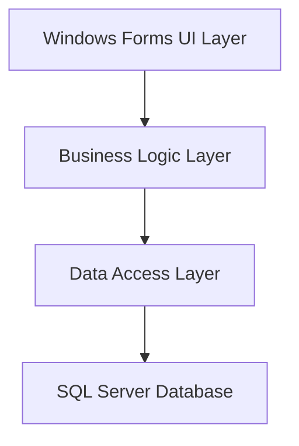
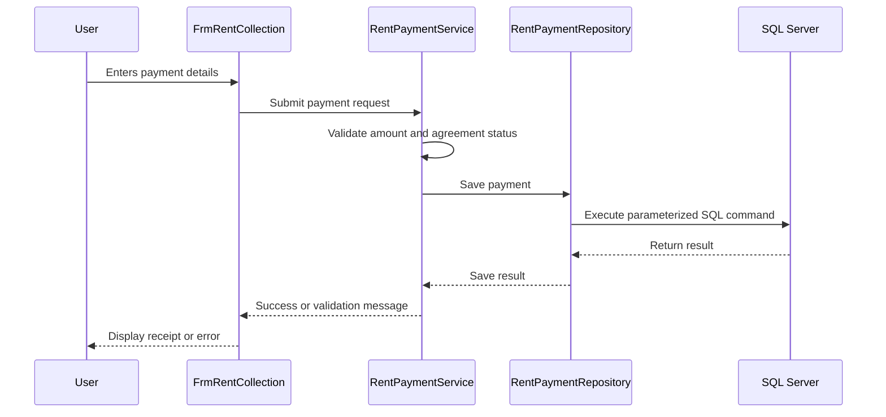
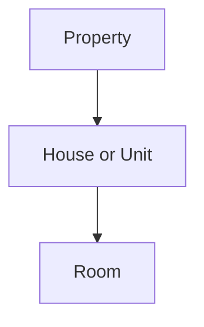
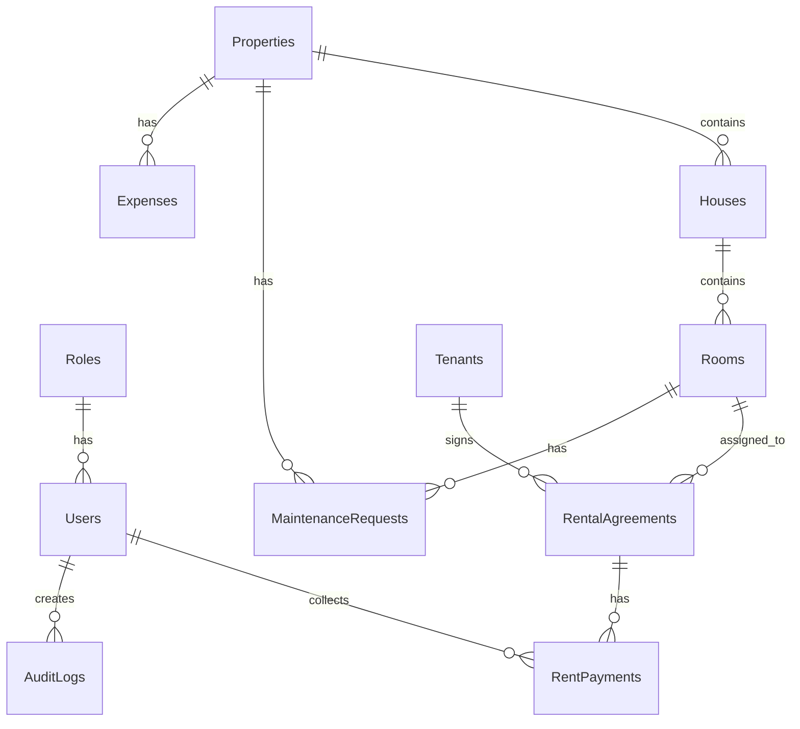
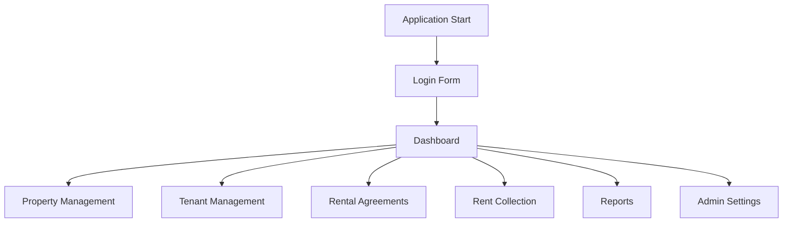
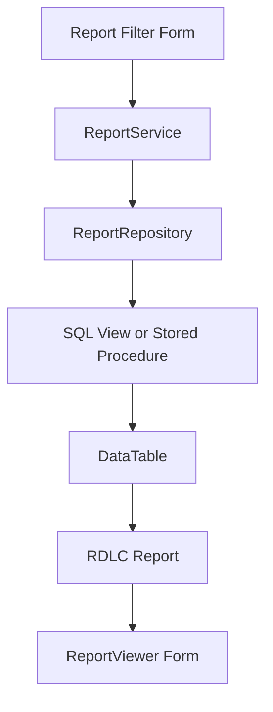

# House Rental Management System

## Professional Project Planning and Architecture Document

| Document Item | Details |
| --- | --- |
| Project Name | House Rental Management System |
| Project Type | University Lab Project |
| Application Type | Desktop Application |
| Language | C# |
| UI Framework | Windows Forms |
| Database | Microsoft SQL Server 2025 Express |
| Data Access | ADO.NET |
| Architecture | 3-Layer Architecture |
| Reporting | Microsoft ReportViewer with RDLC |
| IDE | Visual Studio Community 2022 |
| Version Control | Git |
| Database Tool | SQL Server Management Studio |

---

## Table of Contents

1. Executive Summary
2. Current Project Analysis
3. Project Objectives
4. Scope of the System
5. Technology Stack
6. Architecture Overview
7. Proposed Project Structure
8. Module Planning
9. Database Planning
10. Business Logic Planning
11. Data Access Planning
12. User Interface Planning
13. Reporting Planning
14. Security Planning
15. Error Handling and Validation
16. Development Roadmap
17. Testing Plan
18. Final Submission Plan
19. Quality Checklist
20. Future Enhancements

---

## 1. Executive Summary

The **House Rental Management System** is a C# Windows Forms desktop application designed for managing rental properties, houses, rooms, tenants, rental agreements, monthly rent collection, and reports. The system is planned as a university lab project but will follow professional software design principles so that the final submission is clean, organized, and easy to explain.

The project will use a **3-Layer Architecture**:

- **UI Layer** for Windows Forms screens and user interaction.
- **Business Logic Layer** for validation, rules, calculations, and workflows.
- **Data Access Layer** for SQL Server communication using ADO.NET.

The application will use Microsoft SQL Server Express as the database and Microsoft ReportViewer with RDLC files for reports.

---

## 2. Current Project Analysis

### 2.1 Existing Workspace Structure

Current project structure:

```text
housing_rental/
|-- App.config
|-- Form1.cs
|-- Form1.Designer.cs
|-- Housing rental.csproj
|-- Housing rental.slnx
|-- Program.cs
|-- Properties/
|-- docs/
|   |-- HOUSE_RENTAL_MANAGEMENT_PROJECT_PLAN.md
|   |-- PROJECT_PLANNING_AND_ARCHITECTURE.md
|-- bin/
|-- obj/
```

### 2.2 Existing Code State

The current project is a fresh Windows Forms application.

| Area | Current Status |
| --- | --- |
| Main entry point | `Program.cs` exists |
| Startup form | `Form1` |
| UI modules | Not implemented yet |
| BLL layer | Not implemented yet |
| DAL layer | Not implemented yet |
| Models/entities | Not implemented yet |
| Reports | Not implemented yet |
| Database scripts | Not implemented yet |
| Connection string | Not yet added to `App.config` |
| Git repository | Not initialized in current workspace |

### 2.3 Current Project Problems To Fix

The current project needs the following improvements:

- Rename `Form1` to a meaningful form such as `FrmLogin`.
- Add the SQL Server connection string to `App.config`.
- Create separate folders or projects for UI, BLL, DAL, and Models.
- Add database scripts for tables, seed data, views, and reports.
- Add a professional form naming convention.
- Add Git version control and `.gitignore`.
- Implement role-based login before the main system modules.

---

## 3. Project Objectives

### 3.1 Main Objective

To develop a complete desktop-based House Rental Management System that can manage rental properties, rooms, tenants, agreements, payments, and reports using C#, Windows Forms, ADO.NET, and SQL Server.

### 3.2 Specific Objectives

- Build a secure login system with Admin and Staff roles.
- Provide a dashboard with important rental summaries.
- Manage property, house, and room hierarchy.
- Manage tenant personal and contact information.
- Create and manage rental agreements.
- Record monthly rent collection.
- Track paid, partial, due, and overdue rent.
- Generate professional reports using RDLC.
- Store all data in SQL Server.
- Maintain a clean 3-layer architecture.
- Prepare the project for university lab submission.

---

## 4. Scope of the System

### 4.1 In Scope

The system will include:

- User login and role-based access.
- Admin and Staff users.
- Dashboard summary cards.
- Property management.
- House/unit management.
- Room management.
- Tenant management.
- Rental agreement management.
- Monthly rent collection.
- Payment history.
- Reports.
- Basic settings.
- Audit logging.

### 4.2 Optional Scope

The following modules are optional but recommended if time allows:

- Maintenance request management.
- Expense tracking.
- Database backup instruction screen.
- Advanced charts.
- Agreement expiry notifications.
- Receipt printing.

### 4.3 Out of Scope

The following are not required for this university lab project:

- Online payment gateway.
- Web application.
- Mobile application.
- Cloud deployment.
- Multi-branch enterprise rental system.
- SMS or email integration.

---

## 5. Technology Stack

| Layer | Technology |
| --- | --- |
| Programming Language | C# |
| User Interface | Windows Forms |
| Framework | .NET Framework 4.7.2 |
| Database | Microsoft SQL Server 2025 Express |
| Database Access | ADO.NET |
| Reporting | Microsoft ReportViewer RDLC |
| IDE | Visual Studio Community 2022 |
| Database Management | SQL Server Management Studio |
| Version Control | Git |

### 5.1 Database Connection

SQL Server instance:

```text
.\SQLEXPRESS
```

Database:

```text
HouseRentalDB
```

Recommended C# connection string:

```csharp
string connectionString =
    @"Server=.\SQLEXPRESS;Database=HouseRentalDB;Trusted_Connection=True;TrustServerCertificate=True;";
```

Recommended `App.config`:

```xml
<connectionStrings>
  <add name="HouseRentalDB"
       connectionString="Server=.\SQLEXPRESS;Database=HouseRentalDB;Trusted_Connection=True;TrustServerCertificate=True;"
       providerName="System.Data.SqlClient" />
</connectionStrings>
```

---

## 6. Architecture Overview

### 6.1 Selected Architecture

The project will use **3-Layer Architecture**.



### 6.2 Layer Responsibilities

| Layer | Responsibility |
| --- | --- |
| UI Layer | Displays forms, accepts user input, shows validation messages |
| BLL Layer | Applies business rules, validation, calculations, role checks |
| DAL Layer | Executes SQL queries and communicates with SQL Server |
| Database | Stores all system data |

### 6.3 Request Flow Example

Example: collecting monthly rent.



---

## 7. Proposed Project Structure

### 7.1 Recommended Single-Project Structure

This structure is best if the university expects one WinForms project.

```text
housing_rental/
|-- App.config
|-- Program.cs
|-- Housing rental.csproj
|
|-- Models/
|   |-- Role.cs
|   |-- User.cs
|   |-- Property.cs
|   |-- House.cs
|   |-- Room.cs
|   |-- Tenant.cs
|   |-- RentalAgreement.cs
|   |-- RentPayment.cs
|   |-- MaintenanceRequest.cs
|   |-- Expense.cs
|   |-- AuditLog.cs
|
|-- BLL/
|   |-- AuthService.cs
|   |-- UserService.cs
|   |-- DashboardService.cs
|   |-- PropertyService.cs
|   |-- TenantService.cs
|   |-- AgreementService.cs
|   |-- RentPaymentService.cs
|   |-- ReportService.cs
|
|-- DAL/
|   |-- DbConnectionFactory.cs
|   |-- SqlHelper.cs
|   |-- UserRepository.cs
|   |-- DashboardRepository.cs
|   |-- PropertyRepository.cs
|   |-- TenantRepository.cs
|   |-- AgreementRepository.cs
|   |-- RentPaymentRepository.cs
|   |-- ReportRepository.cs
|
|-- Forms/
|   |-- Auth/
|   |   |-- FrmLogin.cs
|   |   |-- FrmChangePassword.cs
|   |
|   |-- Dashboard/
|   |   |-- FrmDashboard.cs
|   |
|   |-- Properties/
|   |   |-- FrmPropertyList.cs
|   |   |-- FrmPropertyEntry.cs
|   |   |-- FrmHouseList.cs
|   |   |-- FrmHouseEntry.cs
|   |   |-- FrmRoomList.cs
|   |   |-- FrmRoomEntry.cs
|   |
|   |-- Tenants/
|   |   |-- FrmTenantList.cs
|   |   |-- FrmTenantEntry.cs
|   |   |-- FrmTenantDetails.cs
|   |
|   |-- Agreements/
|   |   |-- FrmAgreementList.cs
|   |   |-- FrmAgreementEntry.cs
|   |   |-- FrmAgreementDetails.cs
|   |
|   |-- Payments/
|   |   |-- FrmRentCollection.cs
|   |   |-- FrmPaymentHistory.cs
|   |   |-- FrmPaymentReceipt.cs
|   |
|   |-- Reports/
|   |   |-- FrmReports.cs
|   |   |-- FrmReportViewer.cs
|   |
|   |-- Admin/
|       |-- FrmUserManagement.cs
|       |-- FrmSettings.cs
|
|-- Reports/
|   |-- TenantListReport.rdlc
|   |-- PropertyOccupancyReport.rdlc
|   |-- RentCollectionReport.rdlc
|   |-- MonthlyDueReport.rdlc
|   |-- AgreementReport.rdlc
|
|-- Database/
|   |-- 01_CreateDatabase.sql
|   |-- 02_CreateTables.sql
|   |-- 03_CreateViews.sql
|   |-- 04_CreateStoredProcedures.sql
|   |-- 05_SeedData.sql
|
|-- docs/
|   |-- PROJECT_PLANNING_AND_ARCHITECTURE.md
```

### 7.2 Professional Multi-Project Structure

This structure is best if the instructor gives higher marks for strict separation.

```text
HouseRentalManagement.sln
|-- HousingRental.UI/
|-- HousingRental.BLL/
|-- HousingRental.DAL/
|-- HousingRental.Entities/
|-- Database/
|-- docs/
```

### 7.3 Recommended Choice

For this lab project, use the **single-project structure with organized folders** unless the instructor specifically requires multiple projects. It is easier to build and demonstrate, while still showing the 3-layer architecture clearly.

---

## 8. Module Planning

### 8.1 Authentication Module

Purpose:

Authenticate users and control access by role.

Features:

- Login with username and password.
- Admin and Staff roles.
- Active/inactive user status.
- Password hash storage.
- Last login tracking.
- Logout.

Forms:

- `FrmLogin`
- `FrmChangePassword`
- `FrmUserManagement`

Classes:

- `AuthService`
- `UserService`
- `UserRepository`
- `Role`
- `User`

### 8.2 Dashboard Module

Purpose:

Show a quick overview of the rental business.

Dashboard cards:

- Total properties.
- Total houses.
- Total rooms.
- Available rooms.
- Occupied rooms.
- Total tenants.
- Active agreements.
- Monthly expected rent.
- Monthly collected rent.
- Monthly due rent.
- Overdue payments.

Classes:

- `DashboardService`
- `DashboardRepository`
- `DashboardSummary`

### 8.3 Property, House, and Room Module

Purpose:

Manage rental locations using a clear hierarchy.



Features:

- Add, edit, search, and deactivate properties.
- Add houses under properties.
- Add rooms under houses.
- Track room type and monthly rent.
- Track room status.

Room statuses:

| Status | Meaning |
| --- | --- |
| Available | Room can be rented |
| Occupied | Room has an active agreement |
| Maintenance | Room is temporarily unavailable |
| Inactive | Room is not used anymore |

### 8.4 Tenant Module

Purpose:

Manage tenant records and tenant contact details.

Features:

- Add tenant.
- Edit tenant.
- Search tenant.
- View tenant details.
- View tenant agreements.
- View tenant payment history.

Important fields:

- Full name.
- Phone.
- Email.
- National ID or student ID.
- Address.
- Emergency contact.
- Status.

### 8.5 Rental Agreement Module

Purpose:

Manage contracts between tenants and rooms.

Features:

- Create agreement.
- Select tenant.
- Select available room.
- Set start and end date.
- Set monthly rent.
- Set security deposit.
- Renew agreement.
- Terminate agreement.

Agreement statuses:

| Status | Meaning |
| --- | --- |
| Draft | Created but not active |
| Active | Currently valid |
| Expired | End date has passed |
| Terminated | Ended manually |
| Cancelled | Cancelled before activation |

Important business rules:

- A room cannot have more than one active agreement.
- Agreement end date must be after start date.
- Monthly rent must be greater than zero.
- Room becomes `Occupied` when agreement becomes active.
- Room becomes `Available` when agreement ends.

### 8.6 Monthly Rent Collection Module

Purpose:

Record rent payments and track balances.

Features:

- Generate or create monthly due records.
- Collect full payment.
- Collect partial payment.
- Track balance.
- Track payment method.
- Generate receipt number.
- View payment history.

Payment statuses:

| Status | Meaning |
| --- | --- |
| Pending | Payment not received |
| Partial | Some amount received |
| Paid | Full payment received |
| Overdue | Payment is late |
| Cancelled | Payment record cancelled |

Payment methods:

- Cash.
- Bank transfer.
- Mobile payment.
- Card.

### 8.7 Reports Module

Purpose:

Generate printable reports for demonstration and management.

Reports:

- Tenant list report.
- Property occupancy report.
- Rent collection report.
- Monthly due report.
- Agreement report.
- Income summary report.

Report filters:

- Date from.
- Date to.
- Property.
- Tenant.
- Payment status.
- Agreement status.

### 8.8 Admin and Settings Module

Purpose:

Control administrative data.

Features:

- Manage users.
- Manage roles.
- Change password.
- View audit logs.
- Application settings.

Admin-only actions:

- Create user.
- Deactivate user.
- Delete or deactivate major records.
- Change system settings.

---

## 9. Database Planning

### 9.1 Database Name

```sql
HouseRentalDB
```

### 9.2 Main Tables

| Table | Purpose |
| --- | --- |
| `Roles` | Stores Admin and Staff roles |
| `Users` | Stores login users |
| `Properties` | Stores rental properties |
| `Houses` | Stores houses, flats, or units |
| `Rooms` | Stores rooms |
| `Tenants` | Stores tenant information |
| `RentalAgreements` | Stores rental contracts |
| `RentPayments` | Stores monthly payments |
| `MaintenanceRequests` | Stores repair requests |
| `Expenses` | Stores expenses |
| `AuditLogs` | Stores user activity |
| `AppSettings` | Stores configurable settings |

### 9.3 Entity Relationship Diagram



### 9.4 Core Table Columns

#### Roles

| Column | Type |
| --- | --- |
| RoleId | int identity primary key |
| RoleName | nvarchar(50) |
| Description | nvarchar(200) |
| IsActive | bit |

#### Users

| Column | Type |
| --- | --- |
| UserId | int identity primary key |
| RoleId | int foreign key |
| FullName | nvarchar(100) |
| Username | nvarchar(50) unique |
| PasswordHash | nvarchar(255) |
| PasswordSalt | nvarchar(255) |
| Phone | nvarchar(30) |
| Email | nvarchar(100) |
| IsActive | bit |
| LastLoginAt | datetime null |
| CreatedAt | datetime |

#### Properties

| Column | Type |
| --- | --- |
| PropertyId | int identity primary key |
| PropertyName | nvarchar(100) |
| Address | nvarchar(250) |
| City | nvarchar(80) |
| Description | nvarchar(300) |
| IsActive | bit |
| CreatedAt | datetime |

#### Houses

| Column | Type |
| --- | --- |
| HouseId | int identity primary key |
| PropertyId | int foreign key |
| HouseName | nvarchar(100) |
| FloorNo | nvarchar(20) |
| Description | nvarchar(300) |
| IsActive | bit |
| CreatedAt | datetime |

#### Rooms

| Column | Type |
| --- | --- |
| RoomId | int identity primary key |
| HouseId | int foreign key |
| RoomNo | nvarchar(50) |
| RoomType | nvarchar(50) |
| MonthlyRent | decimal(18,2) |
| Status | nvarchar(30) |
| Description | nvarchar(300) |
| CreatedAt | datetime |

#### Tenants

| Column | Type |
| --- | --- |
| TenantId | int identity primary key |
| FullName | nvarchar(120) |
| Phone | nvarchar(30) |
| Email | nvarchar(100) |
| NationalId | nvarchar(80) |
| Address | nvarchar(250) |
| EmergencyContactName | nvarchar(100) |
| EmergencyContactPhone | nvarchar(30) |
| Status | nvarchar(30) |
| CreatedAt | datetime |

#### RentalAgreements

| Column | Type |
| --- | --- |
| AgreementId | int identity primary key |
| AgreementNo | nvarchar(50) unique |
| TenantId | int foreign key |
| RoomId | int foreign key |
| StartDate | date |
| EndDate | date |
| MonthlyRent | decimal(18,2) |
| SecurityDeposit | decimal(18,2) |
| Status | nvarchar(30) |
| Notes | nvarchar(500) |
| CreatedByUserId | int foreign key |
| CreatedAt | datetime |

#### RentPayments

| Column | Type |
| --- | --- |
| PaymentId | int identity primary key |
| ReceiptNo | nvarchar(50) unique |
| AgreementId | int foreign key |
| PaymentMonth | int |
| PaymentYear | int |
| DueAmount | decimal(18,2) |
| PaidAmount | decimal(18,2) |
| BalanceAmount | decimal(18,2) |
| PaymentDate | date |
| PaymentMethod | nvarchar(50) |
| Status | nvarchar(30) |
| CollectedByUserId | int foreign key |
| Remarks | nvarchar(300) |
| CreatedAt | datetime |

### 9.5 Recommended Views

| View | Purpose |
| --- | --- |
| `vw_RoomOccupancy` | Property, house, room, tenant, and room status |
| `vw_ActiveAgreements` | Current active agreements |
| `vw_RentCollectionSummary` | Monthly rent collection summary |
| `vw_TenantBalances` | Tenant due and balance information |

### 9.6 Recommended Stored Procedures

| Procedure | Purpose |
| --- | --- |
| `sp_GetDashboardSummary` | Load dashboard card totals |
| `sp_GetRentCollectionReport` | Load payment report by date range |
| `sp_GetTenantPaymentHistory` | Load tenant payment history |
| `sp_GenerateMonthlyRentDue` | Create monthly pending rent records |

---

## 10. Business Logic Planning

### 10.1 BLL Classes

| Class | Responsibility |
| --- | --- |
| `AuthService` | Login, password verification, current user |
| `UserService` | User management and role checks |
| `DashboardService` | Dashboard totals and summaries |
| `PropertyService` | Property, house, and room rules |
| `TenantService` | Tenant validation and workflows |
| `AgreementService` | Agreement creation, renewal, termination |
| `RentPaymentService` | Payment collection and balance calculation |
| `ReportService` | Report data preparation |
| `AuditService` | Activity logging |

### 10.2 Important Business Rules

Authentication:

- Username is required.
- Password is required.
- Inactive users cannot log in.
- User role controls available menus.

Property and room:

- Property name is required.
- House must belong to a valid property.
- Room must belong to a valid house.
- Monthly rent must be greater than zero.

Agreement:

- Tenant must exist.
- Room must be available.
- End date must be after start date.
- Room cannot have two active agreements.
- Agreement number must be unique.

Payment:

- Payment must belong to an agreement.
- Paid amount cannot be negative.
- Paid amount cannot exceed due amount unless advance payment is allowed.
- Receipt number must be unique.
- Balance equals due amount minus paid amount.

---

## 11. Data Access Planning

### 11.1 DAL Classes

| Class | Responsibility |
| --- | --- |
| `DbConnectionFactory` | Creates SQL Server connection |
| `SqlHelper` | Shared ADO.NET helper methods |
| `UserRepository` | User and role queries |
| `PropertyRepository` | Property, house, room queries |
| `TenantRepository` | Tenant queries |
| `AgreementRepository` | Agreement queries |
| `RentPaymentRepository` | Payment queries |
| `ReportRepository` | Report queries |

### 11.2 ADO.NET Standards

- Use `System.Data.SqlClient`.
- Use `SqlConnection`, `SqlCommand`, `SqlDataReader`, and `DataTable`.
- Always use parameterized SQL.
- Use `using` blocks to dispose resources.
- Use transactions when multiple tables must update together.
- Do not put UI code in DAL.
- Do not put business rules in DAL.

### 11.3 Connection Factory Design

```csharp
using System.Configuration;
using System.Data.SqlClient;

namespace Housing_rental.DAL
{
    public static class DbConnectionFactory
    {
        public static SqlConnection CreateConnection()
        {
            string connectionString =
                ConfigurationManager.ConnectionStrings["HouseRentalDB"].ConnectionString;

            return new SqlConnection(connectionString);
        }
    }
}
```

---

## 12. User Interface Planning

### 12.1 UI Flow



### 12.2 Main Forms

| Form | Purpose |
| --- | --- |
| `FrmLogin` | User login |
| `FrmDashboard` | Main application dashboard |
| `FrmPropertyList` | View and search properties |
| `FrmPropertyEntry` | Add/edit property |
| `FrmHouseList` | View houses |
| `FrmHouseEntry` | Add/edit house |
| `FrmRoomList` | View rooms |
| `FrmRoomEntry` | Add/edit room |
| `FrmTenantList` | View and search tenants |
| `FrmTenantEntry` | Add/edit tenant |
| `FrmAgreementList` | View agreements |
| `FrmAgreementEntry` | Add/edit agreement |
| `FrmRentCollection` | Collect rent |
| `FrmPaymentHistory` | View payment history |
| `FrmReports` | Select report and filters |
| `FrmReportViewer` | Display RDLC report |
| `FrmUserManagement` | Manage users |
| `FrmSettings` | Manage system settings |

### 12.3 UI Design Guidelines

- Use clear form titles.
- Use consistent button names: `Add`, `Edit`, `Save`, `Cancel`, `Search`, `Refresh`, `Print`.
- Use `DataGridView` for list screens.
- Use ComboBox controls for statuses and related records.
- Use DateTimePicker controls for dates.
- Use TextBox controls for text fields.
- Use NumericUpDown or validated TextBox controls for money fields.
- Show validation messages clearly.
- Confirm before delete, deactivate, terminate, or cancel actions.

### 12.4 Dashboard Layout

Recommended dashboard:

```text
+-------------------------------------------------------------+
| House Rental Management System                              |
+-------------------+-----------------------------------------+
| Dashboard         | Total Properties    Available Rooms     |
| Properties        | Total Tenants       Occupied Rooms      |
| Tenants           | Active Agreements   Monthly Collection  |
| Agreements        | Due Rent            Overdue Payments    |
| Rent Collection   |                                         |
| Reports           | Recent Payments Grid                     |
| Users             | Expiring Agreements Grid                 |
| Settings          |                                         |
+-------------------+-----------------------------------------+
```

---

## 13. Reporting Planning

### 13.1 ReportViewer Flow



### 13.2 Report List

| Report | File |
| --- | --- |
| Tenant List Report | `TenantListReport.rdlc` |
| Property Occupancy Report | `PropertyOccupancyReport.rdlc` |
| Rent Collection Report | `RentCollectionReport.rdlc` |
| Monthly Due Report | `MonthlyDueReport.rdlc` |
| Agreement Report | `AgreementReport.rdlc` |
| Income Summary Report | `IncomeSummaryReport.rdlc` |

---

## 14. Security Planning

### 14.1 Authentication

- Login requires username and password.
- Passwords should not be stored as plain text.
- Use a password hash.
- Store inactive users but prevent them from logging in.

### 14.2 Authorization

| Feature | Admin | Staff |
| --- | --- | --- |
| Dashboard | Yes | Yes |
| Properties | Yes | Yes |
| Tenants | Yes | Yes |
| Agreements | Yes | Yes |
| Rent Collection | Yes | Yes |
| Reports | Yes | View only |
| User Management | Yes | No |
| Settings | Yes | No |
| Delete/Deactivate | Yes | Limited |

### 14.3 Audit Logging

Log these actions:

- Successful login.
- Failed login.
- User creation.
- Tenant creation.
- Agreement creation.
- Agreement termination.
- Rent collection.
- Major update or delete actions.

---

## 15. Error Handling and Validation

### 15.1 UI Validation

UI should check:

- Required fields.
- Valid date selection.
- Valid numeric amount.
- Required ComboBox selection.

### 15.2 BLL Validation

BLL should check:

- Room availability.
- Agreement date rules.
- Duplicate username.
- Payment amount rules.
- Role permission rules.

### 15.3 Database Error Handling

DAL should handle:

- SQL connection failures.
- Constraint violations.
- Duplicate key errors.
- Transaction rollback.

User-friendly messages:

- "Please enter the tenant name."
- "This room is already occupied."
- "Payment amount cannot exceed the due amount."
- "Database connection failed. Please check SQL Server."

---

## 16. Development Roadmap

### Phase 1: Foundation

Tasks:

- Initialize Git.
- Add `.gitignore`.
- Add database connection string.
- Create folders: `Models`, `BLL`, `DAL`, `Forms`, `Reports`, `Database`.
- Rename `Form1` to `FrmLogin`.
- Create `DbConnectionFactory`.

Deliverable:

- Clean project structure with working startup form.

### Phase 2: Database

Tasks:

- Create SQL scripts.
- Create tables.
- Add primary keys and foreign keys.
- Insert roles: Admin and Staff.
- Insert default admin user.
- Create views for dashboard and reports.

Deliverable:

- SQL Server database ready for application use.

### Phase 3: Login and Dashboard

Tasks:

- Build login form.
- Implement password validation.
- Implement role-based login.
- Build dashboard shell.
- Add navigation menu.

Deliverable:

- User can log in and reach dashboard.

### Phase 4: Property Management

Tasks:

- Implement property model, repository, service, and forms.
- Implement house model, repository, service, and forms.
- Implement room model, repository, service, and forms.

Deliverable:

- Property, house, and room hierarchy works.

### Phase 5: Tenant Management

Tasks:

- Implement tenant model.
- Implement tenant repository.
- Implement tenant service.
- Build tenant list and entry forms.

Deliverable:

- Tenant records can be added, edited, searched, and viewed.

### Phase 6: Agreement Management

Tasks:

- Implement agreement model.
- Implement agreement repository.
- Implement agreement service.
- Build agreement forms.
- Update room status based on agreement status.

Deliverable:

- Tenants can be assigned to available rooms.

### Phase 7: Rent Collection

Tasks:

- Implement payment model.
- Implement payment repository.
- Implement payment service.
- Build rent collection form.
- Add receipt number generation.
- Add payment history.

Deliverable:

- Monthly rent can be collected and tracked.

### Phase 8: Reports

Tasks:

- Add ReportViewer.
- Create RDLC files.
- Create report queries.
- Add report filters.

Deliverable:

- Main reports can be generated and printed.

### Phase 9: Final Polish

Tasks:

- Improve UI consistency.
- Test all major workflows.
- Add screenshots.
- Prepare final documentation.
- Prepare database scripts.

Deliverable:

- Project ready for university lab submission.

---

## 17. Testing Plan

### 17.1 Manual Test Cases

| Test Case | Expected Result |
| --- | --- |
| Login with Admin | Dashboard opens with all menus |
| Login with Staff | Dashboard opens with limited menus |
| Login with wrong password | Error message appears |
| Add property | Property appears in property list |
| Add house | House appears under selected property |
| Add room | Room appears with Available status |
| Add tenant | Tenant appears in tenant list |
| Create agreement | Room becomes Occupied |
| Try to rent occupied room | System blocks the action |
| Collect full rent | Payment status becomes Paid |
| Collect partial rent | Payment status becomes Partial |
| Open rent report | Report shows filtered payment records |

### 17.2 Edge Cases

- SQL Server service is stopped.
- Duplicate username.
- Duplicate agreement number.
- Duplicate receipt number.
- Agreement end date before start date.
- Payment amount is negative.
- Payment amount is greater than due amount.
- Staff user opens Admin-only form.

---

## 18. Final Submission Plan

Recommended final submission structure:

```text
HouseRentalManagement_Submission/
|-- SourceCode/
|-- Database/
|   |-- 01_CreateDatabase.sql
|   |-- 02_CreateTables.sql
|   |-- 03_CreateViews.sql
|   |-- 04_CreateStoredProcedures.sql
|   |-- 05_SeedData.sql
|-- Documentation/
|   |-- PROJECT_PLANNING_AND_ARCHITECTURE.md
|   |-- UserManual.pdf
|   |-- Screenshots/
|-- README.md
```

README should include:

- Project title.
- Technology stack.
- Setup instructions.
- Database setup instructions.
- Default login credentials.
- Main features.
- Screenshots.
- Student name and ID.

---

## 19. Quality Checklist

Before submitting:

- Project opens in Visual Studio 2022.
- Project builds without errors.
- SQL scripts run successfully in SSMS.
- Database name is `HouseRentalDB`.
- SQL Server instance is `.\SQLEXPRESS`.
- Connection string is added to `App.config`.
- Default Admin login works.
- Form names are meaningful.
- No default `Form1` title remains.
- BLL contains business rules.
- DAL uses parameterized SQL.
- UI does not directly run SQL queries.
- Reports open successfully.
- Git repository excludes `bin`, `obj`, and `.vs`.
- Documentation explains architecture clearly.

---

## 20. Future Enhancements

Possible future improvements:

- Email rent reminders.
- SMS notifications.
- Backup and restore database from the application.
- Export reports to PDF.
- Advanced dashboard charts.
- Tenant document upload.
- Maintenance cost analytics.
- Multi-property owner management.
- Web version of the system.

---

## Final Recommendation

The project should be implemented step by step, starting with the database, login, and dashboard. After the foundation is stable, build the core rental workflow in this order:

1. Property, house, and room management.
2. Tenant management.
3. Rental agreement management.
4. Monthly rent collection.
5. Reports.
6. Admin settings and final polish.

This structure will make the House Rental Management System organized, professional, and suitable for a university lab project submission.
