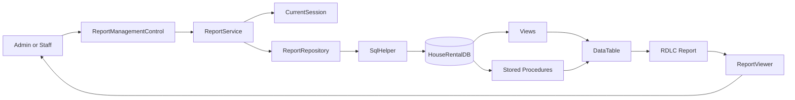
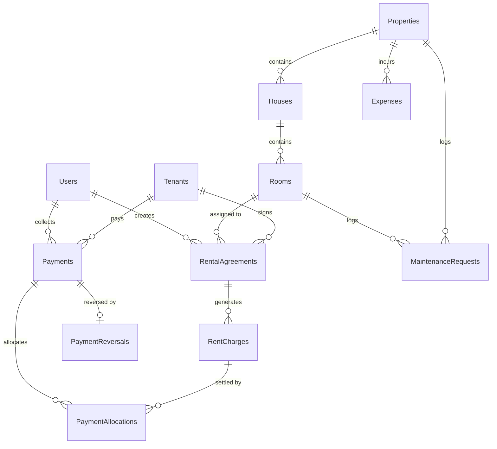
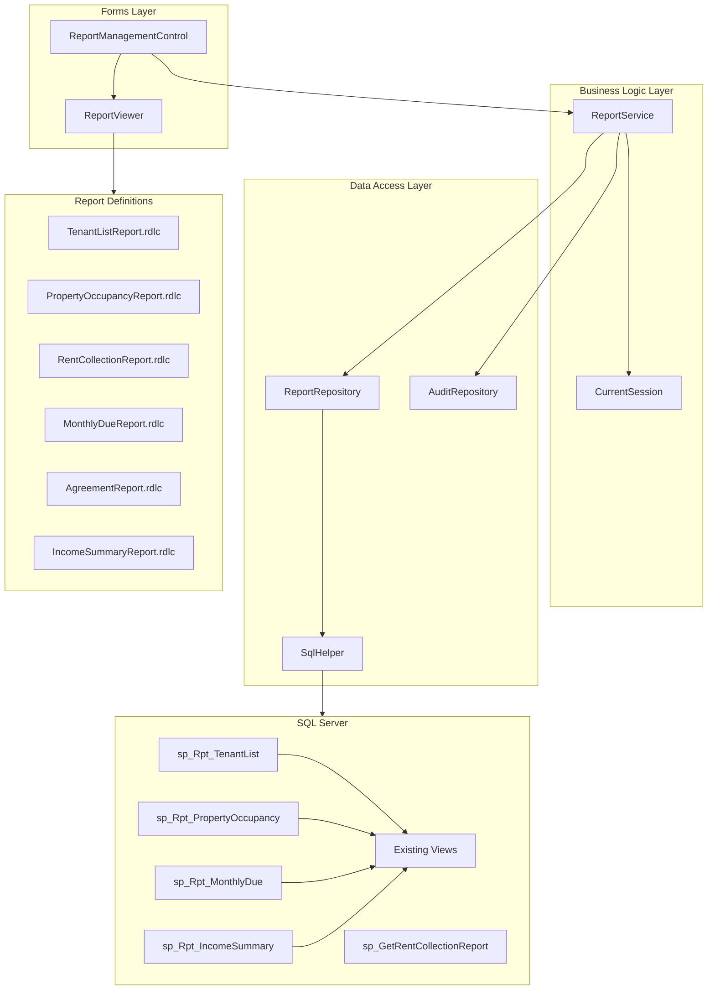
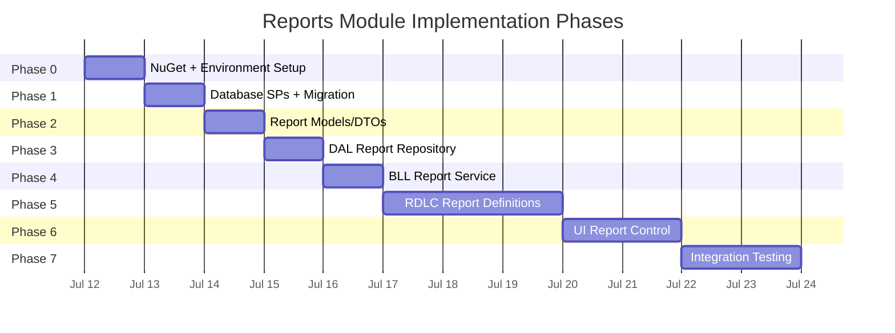

# Reports Module — Industrial Implementation Plan

## Document control

| Item | Value |
| --- | --- |
| Project | House Rental Management System |
| Module | Reports / RDLC Report Viewer Suite |
| Document type | Architecture-aligned implementation, integration, and quality plan |
| Baseline reviewed | Git branch `main`, current working tree as of 2026-07-11 |
| Review date | 2026-07-11 |
| Application | C# Windows Forms desktop application |
| Framework | .NET Framework 4.7.2 |
| Architecture | Single-project, three-layer architecture: UI → BLL → DAL → SQL Server |
| Database | SQL Server Express, `HouseRentalDB` |
| Data access | ADO.NET with parameterized SQL |
| Reporting engine | Microsoft ReportViewer (RDLC — Report Definition Language Client-Side) |
| Primary owners | Application developer, database developer, QA/reviewer |
| Status | Ready for review, business decisions, and phased implementation |

---

## 1. Executive summary

The project architecture document (section 13) specifies six RDLC reports served through a dedicated Reports module: Tenant List, Property Occupancy, Rent Collection, Monthly Due, Agreement, and Income Summary. The sidebar navigation in `FrmDashboard` already has a **Reports** button wired to a `ModulePlaceholderControl`, and the `Forms/Reports/` and `Reports/` directories exist but are empty. No report models, repository, service, RDLC files, or viewer form have been created yet.

The Reports module sits at the consumption end of every other domain: it reads from Properties, Houses, Rooms, Tenants, Agreements, Charges, Payments, Allocations, Reversals, Expenses, and Maintenance — but it writes to none of them. This "read-only consumer" position means the module can be built almost entirely on the existing database views and stored procedures, with a few targeted additions for report-specific aggregation.

### 1.1 What this plan delivers

1. **Six production RDLC reports** with parameter-driven filters, grouped layouts, subtotals, conditional formatting, and print/export capability.
2. **ReportService** (BLL) — authorization, parameter validation, and data preparation for each report.
3. **ReportRepository** (DAL) — typed queries returning `DataTable` objects, reusing existing views and adding four new stored procedures.
4. **Report models** — DTOs and filter parameters for type-safe BLL↔UI contracts.
5. **ReportManagementControl** (UI) — dashboard-docked `UserControl` with a report selector, context-sensitive filter panel, and embedded `ReportViewer`.
6. **Database migration** — four new stored procedures for report-specific aggregation; no table changes.
7. **SQL smoke tests** — read-only validation scripts for every new procedure.
8. **Complete `.csproj` integration** — NuGet package, Compile entries, EmbeddedResource entries.

### 1.2 What this plan does not deliver

- Custom chart controls or dashboard analytics widgets (future enhancement).
- Scheduled/automated report generation or email delivery.
- Export-to-Excel business logic beyond ReportViewer's built-in export.
- SSRS (server-side) deployment; all reports are client-side RDLC.
- Changes to existing tables, views, or stored procedures.

---

## 2. Analysis evidence and scope

### 2.1 Source areas reviewed

This plan is based on direct review of:

- `Housing rental.csproj` — project references, Compile items, framework version, and existing NuGet/assembly references;
- `App.config` — connection string and runtime configuration;
- `ApplicationSessionContext.cs`, `BLL/CurrentSession.cs` — session and role management;
- `Models/` — all 15 entity/DTO files including `DashboardSummary.cs`, `PaymentModels.cs`, `PaymentConstants.cs`, `ServiceResult.cs`;
- `BLL/` — all 9 service classes including `DashboardService.cs`, `RentPaymentService.cs`, `AgreementService.cs`, `TenantService.cs`, `PropertyService.cs`;
- `DAL/` — all 10 repository/helper classes including `DashboardRepository.cs`, `RentPaymentRepository.cs`, `SqlHelper.cs`, `DbConnectionFactory.cs`, `AuditRepository.cs`;
- `Database/02_CreateTables.sql` — 13 tables with constraints, indexes, sequences, and UDTs;
- `Database/03_CreateViews.sql` — 11 views including `vw_RoomOccupancy`, `vw_AgreementDirectory`, `vw_PaymentHistory`, `vw_RentChargeBalances`, `vw_TenantReceivables`, `vw_RentCollectionSummary`;
- `Database/04_CreateStoredProcedures.sql` — `sp_GetDashboardSummary`, `sp_GetRentCollectionReport`, `sp_GetTenantPaymentHistory`, plus payment ledger procedures;
- `Database/05_SeedData.sql` — roles, default admin, application settings;
- `Database/Migrations/` — two existing forward-only payment ledger migrations;
- `Forms/Dashboard/FrmDashboard.cs` — navigation architecture, sidebar button wiring, `NavigateToControl()` pattern;
- `Forms/Payments/PaymentManagementControl.cs` — reference implementation for dashboard-loaded control pattern;
- `Forms/Reports/` — empty directory, confirming no prior implementation;
- `Reports/` — empty directory, designated for `.rdlc` files;
- `docs/PROJECT_PLANNING_AND_ARCHITECTURE.md` — sections 8.7, 13, 12.2, and 16 covering report specifications;
- `docs/PAYMENTS_MODULE_IMPLEMENTATION_PLAN.md` — architecture conventions, document structure, and implementation patterns.

### 2.2 Verification results

| Check | Result |
| --- | --- |
| Project architecture | Three-layer WinForms: `Forms/` → `BLL/` → `DAL/` → SQL Server |
| Framework/runtime | .NET Framework 4.7.2; SQL Server Express via `System.Data.SqlClient` |
| Reports sidebar | Button exists; currently opens `ModulePlaceholderControl("Reports", ...)` |
| Reports UI | `Forms/Reports/` directory is empty |
| Report RDLC files | `Reports/` directory is empty |
| Report models | Missing |
| Report BLL service | Missing (planned as `ReportService` in architecture doc) |
| Report DAL repository | Missing (planned as `ReportRepository` in architecture doc) |
| ReportViewer reference | Not yet added to `.csproj` |
| Existing report SP | `sp_GetRentCollectionReport` exists and returns `vw_PaymentHistory` data |
| Existing report views | `vw_RoomOccupancy`, `vw_AgreementDirectory`, `vw_TenantReceivables`, `vw_RentCollectionSummary`, `vw_RentChargeBalances`, `vw_PaymentHistory` — all available |
| Dashboard summary SP | `sp_GetDashboardSummary` provides current-month financial totals |
| Application settings | `DefaultCurrency`, `RentDueDay`, `ReceiptFooter`, `ApplicationName` configured |
| Authorization model | `CurrentSession.IsAuthenticated`, `CurrentSession.IsAdmin`; Staff gets "View only" access to Reports |
| Audit logging | `AuditRepository.Add()` available for report-generation audit events |

### 2.3 Analysis boundary

This plan covers the full implementation of the Reports module as specified in the architecture document section 13. It reuses existing database objects wherever possible and introduces new stored procedures only where report-specific aggregation or parameterization is needed beyond what current views provide.

---

## 3. Current architecture and module map

### 3.1 Repository structure (report-relevant)

```text
housing_rental/
├── App.config
├── Housing rental.csproj
├── Models/
│   ├── DashboardSummary.cs
│   ├── PaymentModels.cs
│   ├── PaymentConstants.cs
│   ├── Property.cs
│   ├── House.cs
│   ├── Room.cs
│   ├── Tenant.cs
│   ├── RentalAgreement.cs
│   ├── Expense.cs
│   ├── MaintenanceRequest.cs
│   └── ServiceResult.cs
├── BLL/
│   ├── DashboardService.cs          ← uses sp_GetDashboardSummary
│   ├── RentPaymentService.cs        ← uses payment views/procedures
│   ├── AgreementService.cs
│   ├── TenantService.cs
│   ├── PropertyService.cs
│   └── CurrentSession.cs
├── DAL/
│   ├── DashboardRepository.cs       ← pattern: SP → DataTable → Model
│   ├── RentPaymentRepository.cs     ← pattern: SQL → SqlDataReader → List<T>
│   ├── SqlHelper.cs                 ← ExecuteDataTable() utility
│   ├── DbConnectionFactory.cs
│   └── AuditRepository.cs
├── Forms/
│   ├── Dashboard/FrmDashboard.cs    ← NavigateToControl() host
│   ├── Reports/                     ← EMPTY — target for ReportManagementControl
│   └── Common/ModulePlaceholderControl.cs
├── Reports/                         ← EMPTY — target for .rdlc files
├── Database/
│   ├── 02_CreateTables.sql
│   ├── 03_CreateViews.sql           ← 11 existing views
│   ├── 04_CreateStoredProcedures.sql ← existing report/dashboard SPs
│   └── Migrations/
└── docs/
```

### 3.2 Data flow for reports



### 3.3 Database entity relationships (report data sources)



---

## 4. Implementation inventory and gap analysis

| Area | Current state | Required action |
| --- | --- | --- |
| Report models/DTOs | Missing | Create `ReportModels.cs` with filter and result DTOs |
| `ReportService` (BLL) | Missing | Create with authorization, validation, and data preparation |
| `ReportRepository` (DAL) | Missing | Create with parameterized queries returning `DataTable` |
| `ReportManagementControl` (UI) | Missing | Create dashboard-loaded `UserControl` with selector and viewer |
| RDLC report definitions | Missing | Create 6 `.rdlc` files in `Reports/` |
| ReportViewer NuGet | Not referenced | Add `Microsoft.ReportingServices.ReportViewerControl.WinForms` |
| Report stored procedures | `sp_GetRentCollectionReport` exists; 4 more needed | Add new migration with 4 SPs |
| Dashboard integration | Placeholder active | Replace with `ReportManagementControl` in `BtnReports_Click` |
| `.csproj` entries | No report-related Compile/EmbeddedResource | Add all new files |
| Audit logging | Available through `AuditRepository` | Log report generation events |

### 4.1 Existing reusable database objects

| Object | Report(s) it serves |
| --- | --- |
| `vw_TenantReceivables` | Tenant List Report |
| `vw_RoomOccupancy` | Property Occupancy Report |
| `vw_AgreementDirectory` | Agreement Report |
| `vw_PaymentHistory` | Rent Collection Report |
| `vw_RentChargeBalances` | Monthly Due Report |
| `vw_RentCollectionSummary` | Income Summary Report |
| `sp_GetRentCollectionReport` | Rent Collection Report (parameterized) |
| `sp_GetTenantPaymentHistory` | Tenant-specific payment history |

### 4.2 New database objects needed

| Object | Purpose |
| --- | --- |
| `sp_Rpt_TenantList` | Parameterized tenant listing with optional status filter and receivable summary |
| `sp_Rpt_PropertyOccupancy` | Property/house/room occupancy with optional property filter |
| `sp_Rpt_MonthlyDue` | Outstanding charges for a specified billing period with aging |
| `sp_Rpt_IncomeSummary` | Revenue vs. expenses aggregation by month for a date range |

---

## 5. Report catalogue

### 5.1 Report specifications

| # | Report name | File | Primary data source | Key parameters | Grouping | Purpose |
| --- | --- | --- | --- | --- | --- | --- |
| RPT-01 | Tenant List Report | `TenantListReport.rdlc` | `sp_Rpt_TenantList` | Status filter (All/Active/Inactive/Blacklisted), search text | None (flat list) | Master list of tenants with contact details and receivable summary |
| RPT-02 | Property Occupancy Report | `PropertyOccupancyReport.rdlc` | `sp_Rpt_PropertyOccupancy` | Property filter (All/specific), include inactive rooms | Property → House → Room | Occupancy status across portfolio with tenant assignments |
| RPT-03 | Rent Collection Report | `RentCollectionReport.rdlc` | `sp_GetRentCollectionReport` | Date range (from/to) | Date grouping with daily subtotals | Payment receipts within a period with collection method and collector |
| RPT-04 | Monthly Due Report | `MonthlyDueReport.rdlc` | `sp_Rpt_MonthlyDue` | Billing period (month/year), charge status filter | Agreement with charge-level detail | Outstanding rent charges for a specific month with aging indicators |
| RPT-05 | Agreement Report | `AgreementReport.rdlc` | `vw_AgreementDirectory` | Status filter (All/Active/Expired/Terminated/Draft/Cancelled) | Status grouping | Active and historical agreements with financial position |
| RPT-06 | Income Summary Report | `IncomeSummaryReport.rdlc` | `sp_Rpt_IncomeSummary` | Date range (from month/to month) | Monthly rows | Revenue, expenses, and net income aggregation by month |

### 5.2 RDLC report layout standards

All reports must follow these conventions:

- **Page size**: A4 portrait (21cm × 29.7cm), margins 1.5cm.
- **Header**: Report title (left), date range or filter summary (center), generation timestamp and user (right).
- **Footer**: Page number "Page X of Y" (right), application name from `AppSettings` (left).
- **Font**: Segoe UI, 9pt body, 12pt title, 10pt group headers.
- **Currency formatting**: Use `DefaultCurrency` from `AppSettings` with `N2` format.
- **Alternating row colors**: White / Light Gray (#F5F5F5).
- **Overdue highlighting**: Red foreground for overdue amounts.
- **Group subtotals**: Bold, with background color #E8E8E8.
- **Grand totals**: Bold, with background color #D0D0D0.
- **No empty reports**: Display "No records found for the selected criteria" when result set is empty.

---

## 6. Report detail specifications

### 6.1 RPT-01: Tenant List Report

**Purpose**: Provides a comprehensive directory of all tenants with their contact details, current status, and financial position.

**Parameters**:
| Parameter | Type | Default | Required |
| --- | --- | --- | --- |
| Status | String (All/Active/Inactive/Blacklisted) | All | No |
| SearchText | String | Empty | No |

**Columns**:
| Column | Source | Width | Format |
| --- | --- | --- | --- |
| # | Row number | 5% | Integer |
| Tenant Name | `FullName` | 18% | Text |
| Phone | `Phone` | 12% | Text |
| Email | `Email` | 15% | Text |
| National ID | `NationalId` | 12% | Text |
| Status | `Status` | 8% | Text, color-coded |
| Total Due | `TotalDue` | 10% | Currency |
| Total Paid | `TotalPaid` | 10% | Currency |
| Balance | `TotalBalance` | 10% | Currency, red if > 0 |

**Footer totals**: Sum of Total Due, Total Paid, Balance.

**SQL source**: New `sp_Rpt_TenantList` wrapping `vw_TenantReceivables` with status and search filters.

---

### 6.2 RPT-02: Property Occupancy Report

**Purpose**: Shows the complete property hierarchy with room occupancy status, current tenants, and agreement details.

**Parameters**:
| Parameter | Type | Default | Required |
| --- | --- | --- | --- |
| PropertyId | Int (null = all) | null | No |
| IncludeInactive | Bit | 0 | No |

**Groups**:
- **Level 1**: Property Name
- **Level 2**: House Name

**Detail columns**:
| Column | Source | Width | Format |
| --- | --- | --- | --- |
| Room No | `RoomNo` | 10% | Text |
| Room Type | `RoomType` | 10% | Text |
| Monthly Rent | `MonthlyRent` | 12% | Currency |
| Status | `RoomStatus` | 10% | Text, color-coded |
| Tenant | `TenantName` | 18% | Text (blank if vacant) |
| Agreement No | `AgreementNo` | 12% | Text |
| Lease Start | `StartDate` | 10% | Date |
| Lease End | `EndDate` | 10% | Date |
| Agreement Status | `AgreementStatus` | 8% | Text |

**Group subtotals**: Room count, occupied count, vacancy rate per house and per property.

**Grand totals**: Total rooms, occupied rooms, available rooms, overall occupancy rate, total monthly rent potential.

**SQL source**: New `sp_Rpt_PropertyOccupancy` wrapping `vw_RoomOccupancy` with property filter and inactive inclusion.

---

### 6.3 RPT-03: Rent Collection Report

**Purpose**: Lists all payment receipts within a date range with collection method, allocated amounts, and collector identity.

**Parameters**:
| Parameter | Type | Default | Required |
| --- | --- | --- | --- |
| DateFrom | Date | First day of current month | Yes |
| DateTo | Date | Today | Yes |

**Columns**:
| Column | Source | Width | Format |
| --- | --- | --- | --- |
| Receipt No | `ReceiptNo` | 10% | Text |
| Payment Date | `PaymentDate` | 8% | Date |
| Tenant | `TenantName` | 15% | Text |
| Agreement | `AgreementNo` | 10% | Text |
| Property | `PropertyName` | 12% | Text |
| Room | `RoomNo` | 6% | Text |
| Amount | `PaidAmount` | 10% | Currency |
| Currency | `CurrencyCode` | 5% | Text |
| Method | `PaymentMethod` | 8% | Text |
| Reference | `ExternalReference` | 8% | Text |
| Status | `Status` | 5% | Text, red if Reversed |
| Collected By | `CollectedByName` | 10% | Text |

**Footer totals**: Total amount (posted only), count of receipts, count of reversals.

**SQL source**: Existing `sp_GetRentCollectionReport(@DateFrom, @DateTo)`.

---

### 6.4 RPT-04: Monthly Due Report

**Purpose**: Shows all rent charges for a specific billing period with payment status, aging, and outstanding balances.

**Parameters**:
| Parameter | Type | Default | Required |
| --- | --- | --- | --- |
| BillingPeriod | Date (first of month) | Current month | Yes |
| ChargeStatus | String (All/Due/Partial/Paid/Overdue/Waived) | All | No |

**Columns**:
| Column | Source | Width | Format |
| --- | --- | --- | --- |
| Agreement No | `AgreementNo` | 10% | Text |
| Tenant | `TenantName` | 15% | Text |
| Property | `PropertyName` | 12% | Text |
| Room | `RoomNo` | 6% | Text |
| Charge Type | `ChargeType` | 8% | Text |
| Due Date | `DueDate` | 8% | Date |
| Charge Amount | `Amount` | 10% | Currency |
| Paid Amount | `PaidAmount` | 10% | Currency |
| Balance | `BalanceAmount` | 10% | Currency, red if > 0 |
| Status | `ChargeStatus` | 8% | Text, color-coded |
| Days Overdue | Calculated | 5% | Integer, red if > 0 |

**Footer totals**: Total charge amount, total paid, total balance, count by status.

**SQL source**: New `sp_Rpt_MonthlyDue` joining `vw_RentChargeBalances` with agreement/tenant/property context.

---

### 6.5 RPT-05: Agreement Report

**Purpose**: Directory of rental agreements filtered by status, with tenant details, room assignments, and financial position.

**Parameters**:
| Parameter | Type | Default | Required |
| --- | --- | --- | --- |
| Status | String (All/Draft/Active/Expired/Terminated/Cancelled) | All | No |

**Groups**:
- **Level 1**: Agreement Status

**Detail columns**:
| Column | Source | Width | Format |
| --- | --- | --- | --- |
| Agreement No | `AgreementNo` | 9% | Text |
| Tenant | `TenantName` | 13% | Text |
| Phone | `TenantPhone` | 8% | Text |
| Property | `PropertyName` | 10% | Text |
| House | `HouseName` | 8% | Text |
| Room | `RoomNo` | 5% | Text |
| Start Date | `StartDate` | 7% | Date |
| End Date | `EndDate` | 7% | Date |
| Monthly Rent | `MonthlyRent` | 8% | Currency |
| Total Due | `TotalDue` | 8% | Currency |
| Total Paid | `TotalPaid` | 8% | Currency |
| Balance | `TotalBalance` | 8% | Currency, red if > 0 |

**Group subtotals**: Count of agreements, sum of monthly rent, sum of balances per status.

**Grand totals**: Total agreements, total monthly rent, total due, total paid, total balance.

**SQL source**: Existing `vw_AgreementDirectory` with status filter applied in stored procedure or parameterized query.

---

### 6.6 RPT-06: Income Summary Report

**Purpose**: Monthly revenue vs. expenses summary showing net income over a date range. Aggregates payment collections and recorded expenses by month.

**Parameters**:
| Parameter | Type | Default | Required |
| --- | --- | --- | --- |
| DateFrom | Date (first of month) | 6 months ago | Yes |
| DateTo | Date (first of month) | Current month | Yes |

**Columns**:
| Column | Source | Width | Format |
| --- | --- | --- | --- |
| Period | Year-Month | 15% | "MMMM yyyy" |
| Expected Rent | Sum of charges | 15% | Currency |
| Collected Rent | Sum of posted payments | 15% | Currency |
| Collection Rate | Collected / Expected × 100 | 10% | Percentage |
| Expenses | Sum of expenses | 15% | Currency |
| Net Income | Collected − Expenses | 15% | Currency, red if negative |
| Variance | Expected − Collected | 15% | Currency |

**Footer totals**: Grand totals for all monetary columns, average collection rate.

**SQL source**: New `sp_Rpt_IncomeSummary` joining `vw_RentCollectionSummary` with `Expenses` aggregation.

---

## 7. Domain language and data ownership

### 7.1 Report-specific terms

| Term | Meaning |
| --- | --- |
| Report filter | User-supplied parameters that constrain the report data set |
| Report data source | A `DataTable` object bound to an RDLC report definition |
| Report viewer | The `Microsoft.Reporting.WinForms.ReportViewer` control embedded in the UI |
| Report parameter | An RDLC-level parameter passed from the application for display in headers/footers |
| Report generation | The act of executing a query and rendering the result through RDLC |

### 7.2 Data ownership rules

- Reports are **read-only consumers**. They never insert, update, or delete data.
- Report queries must use existing views and new read-only stored procedures. They must not use raw table access that bypasses view-level balance calculations.
- Financial amounts displayed in reports must come from the same calculation views (`vw_RentChargeBalances`, `vw_AgreementReceivables`, `vw_TenantReceivables`) used by the dashboard and payments module.
- Report generation is logged through `AuditRepository` for accountability, but audit failure must not prevent report display.
- Staff users can view all reports. Admin users have no additional report-specific privileges in Release 1. Both roles see the same report data (no row-level security).

---

## 8. Target implementation architecture

### 8.1 New file manifest

| Layer | File | Type | Purpose |
| --- | --- | --- | --- |
| Models | `Models/ReportModels.cs` | Class | Filter DTOs and report parameter contracts |
| BLL | `BLL/ReportService.cs` | Class | Authorization, validation, data preparation, audit |
| DAL | `DAL/ReportRepository.cs` | Class | Parameterized SQL queries returning `DataTable` |
| UI | `Forms/Reports/ReportManagementControl.cs` | UserControl | Report selector, filter panel, ReportViewer host |
| UI | `Forms/Reports/ReportManagementControl.Designer.cs` | Designer | WinForms designer code |
| RDLC | `Reports/TenantListReport.rdlc` | RDLC | Tenant list report definition |
| RDLC | `Reports/PropertyOccupancyReport.rdlc` | RDLC | Property occupancy report definition |
| RDLC | `Reports/RentCollectionReport.rdlc` | RDLC | Rent collection report definition |
| RDLC | `Reports/MonthlyDueReport.rdlc` | RDLC | Monthly due report definition |
| RDLC | `Reports/AgreementReport.rdlc` | RDLC | Agreement directory report definition |
| RDLC | `Reports/IncomeSummaryReport.rdlc` | RDLC | Income summary report definition |
| Database | `Database/Migrations/20260711_003_ReportProcedures.sql` | SQL | Forward-only migration with 4 new SPs |
| Database | `Database/Tests/ReportProceduresSmokeTest.sql` | SQL | Read-only validation for new SPs |

### 8.2 Dependency diagram



---

## 9. Database implementation

### 9.1 Migration: `20260711_003_ReportProcedures.sql`

This migration creates four new read-only stored procedures. It does not modify any existing tables, views, or procedures.

#### 9.1.1 `sp_Rpt_TenantList`

```sql
CREATE OR ALTER PROCEDURE dbo.sp_Rpt_TenantList
    @Status NVARCHAR(30) = NULL,
    @SearchText NVARCHAR(150) = NULL
AS
BEGIN
    SET NOCOUNT ON;

    SELECT
        t.TenantId,
        t.FullName,
        t.Phone,
        t.Email,
        t.NationalId,
        t.Address,
        t.EmergencyContactName,
        t.EmergencyContactPhone,
        t.Status,
        t.CreatedAt,
        tr.TotalDue,
        tr.TotalPaid,
        tr.TotalBalance,
        tr.OverdueAmount,
        tr.OverdueCount,
        tr.ChargeCount,
        tr.PaymentCount
    FROM dbo.Tenants t
    LEFT JOIN dbo.vw_TenantReceivables tr ON tr.TenantId = t.TenantId
    WHERE
        (@Status IS NULL OR @Status = '' OR @Status = 'All' OR t.Status = @Status)
        AND
        (
            @SearchText IS NULL OR @SearchText = ''
            OR t.FullName LIKE '%' + @SearchText + '%'
            OR t.Phone LIKE '%' + @SearchText + '%'
            OR t.Email LIKE '%' + @SearchText + '%'
            OR t.NationalId LIKE '%' + @SearchText + '%'
        )
    ORDER BY t.FullName;
END;
```

#### 9.1.2 `sp_Rpt_PropertyOccupancy`

```sql
CREATE OR ALTER PROCEDURE dbo.sp_Rpt_PropertyOccupancy
    @PropertyId INT = NULL,
    @IncludeInactive BIT = 0
AS
BEGIN
    SET NOCOUNT ON;

    SELECT
        o.PropertyId,
        o.PropertyName,
        o.HouseId,
        o.HouseName,
        o.RoomId,
        o.RoomNo,
        o.RoomType,
        o.MonthlyRent,
        o.RoomStatus,
        o.TenantId,
        o.TenantName,
        o.AgreementId,
        o.AgreementNo,
        o.StartDate,
        o.EndDate,
        o.AgreementStatus
    FROM dbo.vw_RoomOccupancy o
    INNER JOIN dbo.Properties p ON p.PropertyId = o.PropertyId
    INNER JOIN dbo.Houses h ON h.HouseId = o.HouseId
    WHERE
        (@PropertyId IS NULL OR o.PropertyId = @PropertyId)
        AND (p.IsActive = 1)
        AND (h.IsActive = 1)
        AND (@IncludeInactive = 1 OR o.RoomStatus <> 'Inactive')
    ORDER BY o.PropertyName, o.HouseName, o.RoomNo;
END;
```

#### 9.1.3 `sp_Rpt_MonthlyDue`

```sql
CREATE OR ALTER PROCEDURE dbo.sp_Rpt_MonthlyDue
    @BillingPeriod DATE,
    @ChargeStatus NVARCHAR(30) = NULL
AS
BEGIN
    SET NOCOUNT ON;

    DECLARE @PeriodStart DATE = DATEFROMPARTS(YEAR(@BillingPeriod), MONTH(@BillingPeriod), 1);

    SELECT
        b.ChargeId,
        b.AgreementId,
        a.AgreementNo,
        t.FullName AS TenantName,
        t.Phone AS TenantPhone,
        p.PropertyName,
        h.HouseName,
        r.RoomNo,
        b.ChargeType,
        b.BillingPeriod,
        b.PeriodStart,
        b.PeriodEnd,
        b.DueDate,
        b.Amount,
        b.PaidAmount,
        b.BalanceAmount,
        b.CurrencyCode,
        b.ChargeStatus,
        CASE
            WHEN b.ChargeStatus = 'Overdue'
            THEN DATEDIFF(DAY, b.DueDate, CONVERT(DATE, GETDATE()))
            ELSE 0
        END AS DaysOverdue
    FROM dbo.vw_RentChargeBalances b
    INNER JOIN dbo.RentalAgreements a ON a.AgreementId = b.AgreementId
    INNER JOIN dbo.Tenants t ON t.TenantId = a.TenantId
    INNER JOIN dbo.Rooms r ON r.RoomId = a.RoomId
    INNER JOIN dbo.Houses h ON h.HouseId = r.HouseId
    INNER JOIN dbo.Properties p ON p.PropertyId = h.PropertyId
    WHERE
        b.BillingPeriod = @PeriodStart
        AND (@ChargeStatus IS NULL OR @ChargeStatus = '' OR @ChargeStatus = 'All' OR b.ChargeStatus = @ChargeStatus)
    ORDER BY
        CASE b.ChargeStatus
            WHEN 'Overdue' THEN 1
            WHEN 'Due' THEN 2
            WHEN 'Partial' THEN 3
            WHEN 'Paid' THEN 4
            WHEN 'Waived' THEN 5
            ELSE 6
        END,
        t.FullName,
        a.AgreementNo;
END;
```

#### 9.1.4 `sp_Rpt_IncomeSummary`

```sql
CREATE OR ALTER PROCEDURE dbo.sp_Rpt_IncomeSummary
    @DateFrom DATE,
    @DateTo DATE
AS
BEGIN
    SET NOCOUNT ON;

    DECLARE @PeriodFrom DATE = DATEFROMPARTS(YEAR(@DateFrom), MONTH(@DateFrom), 1);
    DECLARE @PeriodTo DATE = EOMONTH(DATEFROMPARTS(YEAR(@DateTo), MONTH(@DateTo), 1));

    ;WITH MonthSeries AS
    (
        SELECT @PeriodFrom AS PeriodStart
        UNION ALL
        SELECT DATEADD(MONTH, 1, PeriodStart)
        FROM MonthSeries
        WHERE DATEADD(MONTH, 1, PeriodStart) <= DATEFROMPARTS(YEAR(@PeriodTo), MONTH(@PeriodTo), 1)
    ),
    Charges AS
    (
        SELECT
            DATEFROMPARTS(YEAR(BillingPeriod), MONTH(BillingPeriod), 1) AS PeriodStart,
            SUM(CASE WHEN ChargeRecordStatus <> 'Waived' THEN Amount ELSE 0 END) AS ExpectedRent,
            SUM(CASE WHEN ChargeRecordStatus <> 'Waived' THEN PaidAmount ELSE 0 END) AS CollectedRent
        FROM dbo.vw_RentChargeBalances
        WHERE BillingPeriod BETWEEN @PeriodFrom AND @PeriodTo
        GROUP BY DATEFROMPARTS(YEAR(BillingPeriod), MONTH(BillingPeriod), 1)
    ),
    ExpenseAgg AS
    (
        SELECT
            DATEFROMPARTS(YEAR(ExpenseDate), MONTH(ExpenseDate), 1) AS PeriodStart,
            SUM(Amount) AS TotalExpenses
        FROM dbo.Expenses
        WHERE ExpenseDate BETWEEN @PeriodFrom AND @PeriodTo
        GROUP BY DATEFROMPARTS(YEAR(ExpenseDate), MONTH(ExpenseDate), 1)
    )
    SELECT
        ms.PeriodStart,
        YEAR(ms.PeriodStart) AS PeriodYear,
        MONTH(ms.PeriodStart) AS PeriodMonth,
        ISNULL(c.ExpectedRent, 0) AS ExpectedRent,
        ISNULL(c.CollectedRent, 0) AS CollectedRent,
        CASE
            WHEN ISNULL(c.ExpectedRent, 0) > 0
            THEN ROUND(ISNULL(c.CollectedRent, 0) * 100.0 / c.ExpectedRent, 2)
            ELSE 0
        END AS CollectionRate,
        ISNULL(e.TotalExpenses, 0) AS TotalExpenses,
        ISNULL(c.CollectedRent, 0) - ISNULL(e.TotalExpenses, 0) AS NetIncome,
        ISNULL(c.ExpectedRent, 0) - ISNULL(c.CollectedRent, 0) AS Variance
    FROM MonthSeries ms
    LEFT JOIN Charges c ON c.PeriodStart = ms.PeriodStart
    LEFT JOIN ExpenseAgg e ON e.PeriodStart = ms.PeriodStart
    ORDER BY ms.PeriodStart
    OPTION (MAXRECURSION 120);
END;
```

---

## 10. Models layer implementation

### 10.1 `Models/ReportModels.cs`

```csharp
using System;

namespace Housing_rental.Models
{
    // ── Report type enumeration ──

    public static class ReportTypes
    {
        public const string TenantList = "TenantList";
        public const string PropertyOccupancy = "PropertyOccupancy";
        public const string RentCollection = "RentCollection";
        public const string MonthlyDue = "MonthlyDue";
        public const string Agreement = "Agreement";
        public const string IncomeSummary = "IncomeSummary";
    }

    // ── Filter DTOs ──

    public class TenantListReportFilter
    {
        public string Status { get; set; }
        public string SearchText { get; set; }
    }

    public class PropertyOccupancyReportFilter
    {
        public int? PropertyId { get; set; }
        public bool IncludeInactive { get; set; }
    }

    public class RentCollectionReportFilter
    {
        public DateTime DateFrom { get; set; }
        public DateTime DateTo { get; set; }
    }

    public class MonthlyDueReportFilter
    {
        public DateTime BillingPeriod { get; set; }
        public string ChargeStatus { get; set; }
    }

    public class AgreementReportFilter
    {
        public string Status { get; set; }
    }

    public class IncomeSummaryReportFilter
    {
        public DateTime DateFrom { get; set; }
        public DateTime DateTo { get; set; }
    }

    // ── Report metadata ──

    public class ReportDefinition
    {
        public string ReportType { get; set; }
        public string DisplayName { get; set; }
        public string Description { get; set; }
        public string RdlcFileName { get; set; }
        public string DataSetName { get; set; }
    }
}
```

---

## 11. Data access layer implementation

### 11.1 `DAL/ReportRepository.cs` — design specification

The `ReportRepository` follows the established pattern used by `DashboardRepository` and `RentPaymentRepository`:

- Uses `SqlHelper.ExecuteDataTable()` for stored-procedure calls.
- Uses `DbConnectionFactory.CreateConnection()` with `using` blocks.
- Returns `DataTable` objects (RDLC `ReportViewer` binds to `DataTable`).
- All parameters are added via `SqlHelper.Parameter()`.
- No business rules, authorization, or UI code.

**Methods**:

| Method | Parameters | Returns | SQL Source |
| --- | --- | --- | --- |
| `GetTenantListData` | `string status, string searchText` | `DataTable` | `sp_Rpt_TenantList` |
| `GetPropertyOccupancyData` | `int? propertyId, bool includeInactive` | `DataTable` | `sp_Rpt_PropertyOccupancy` |
| `GetRentCollectionData` | `DateTime dateFrom, DateTime dateTo` | `DataTable` | `sp_GetRentCollectionReport` |
| `GetMonthlyDueData` | `DateTime billingPeriod, string chargeStatus` | `DataTable` | `sp_Rpt_MonthlyDue` |
| `GetAgreementData` | `string status` | `DataTable` | `vw_AgreementDirectory` (parameterized query) |
| `GetIncomeSummaryData` | `DateTime dateFrom, DateTime dateTo` | `DataTable` | `sp_Rpt_IncomeSummary` |
| `GetActiveProperties` | none | `DataTable` | Simple query on `Properties` |

**Implementation pattern** (representative example):

```csharp
public DataTable GetTenantListData(string status, string searchText)
{
    const string sql = "EXEC dbo.sp_Rpt_TenantList @Status, @SearchText;";

    return SqlHelper.ExecuteDataTable(sql,
        SqlHelper.Parameter("@Status", status),
        SqlHelper.Parameter("@SearchText", searchText));
}
```

---

## 12. Business logic layer implementation

### 12.1 `BLL/ReportService.cs` — design specification

The `ReportService` follows the pattern established by `DashboardService` and `RentPaymentService`:

- Constructor instantiates `ReportRepository` and `AuditRepository`.
- Every public method checks `CurrentSession.IsAuthenticated`.
- Every public method validates filter parameters.
- Every public method wraps repository calls in try/catch and returns `ServiceResult<DataTable>`.
- Successful report generation is logged through `AuditRepository` (best-effort, exception-swallowed).
- No SQL code in BLL.

**Methods**:

| Method | Filter DTO | Validation rules |
| --- | --- | --- |
| `GetTenantListReport` | `TenantListReportFilter` | Status must be recognized or empty |
| `GetPropertyOccupancyReport` | `PropertyOccupancyReportFilter` | PropertyId must be null or > 0 |
| `GetRentCollectionReport` | `RentCollectionReportFilter` | DateFrom ≤ DateTo, both required |
| `GetMonthlyDueReport` | `MonthlyDueReportFilter` | BillingPeriod required, ChargeStatus recognized or empty |
| `GetAgreementReport` | `AgreementReportFilter` | Status must be recognized agreement status or empty |
| `GetIncomeSummaryReport` | `IncomeSummaryReportFilter` | DateFrom ≤ DateTo, range ≤ 24 months |
| `GetReportDefinitions` | none | Returns list of available `ReportDefinition` objects |
| `GetActiveProperties` | none | For property filter dropdown |
| `GetDefaultCurrency` | none | Reads `AppSettings.DefaultCurrency` |

**Authorization**: All reports are accessible to both Admin and Staff roles (architecture document section 14.2 specifies "Reports: Admin = Yes, Staff = View only"). Since all report operations are read-only, Staff "View only" is equivalent to full access.

**Implementation pattern** (representative example):

```csharp
public ServiceResult<DataTable> GetTenantListReport(TenantListReportFilter filter)
{
    if (!CurrentSession.IsAuthenticated)
        return ServiceResult<DataTable>.Failure("Please sign in before viewing reports.");

    if (filter == null)
        filter = new TenantListReportFilter();

    if (!string.IsNullOrWhiteSpace(filter.Status)
        && filter.Status != "All"
        && filter.Status != "Active"
        && filter.Status != "Inactive"
        && filter.Status != "Blacklisted")
        return ServiceResult<DataTable>.Failure("Please select a valid tenant status.");

    try
    {
        DataTable data = _reportRepository.GetTenantListData(
            Clean(filter.Status), Clean(filter.SearchText));

        TryAudit("Generate Report", "Reports", "TenantList",
            "Generated Tenant List Report. Status: " + (filter.Status ?? "All")
            + ". Records: " + data.Rows.Count + ".");

        return ServiceResult<DataTable>.Success(data, "Tenant List Report generated successfully.");
    }
    catch (Exception ex)
    {
        return ServiceResult<DataTable>.Failure("Unable to generate the report. " + ex.Message);
    }
}
```

---

## 13. User interface implementation

### 13.1 `Forms/Reports/ReportManagementControl` — design specification

The control follows the established `PaymentManagementControl` dashboard-loading pattern: a `UserControl` that is set to `DockStyle.Fill` inside `pnlContent` when the user clicks the Reports sidebar button.

#### 13.1.1 Layout structure

```text
+------------------------------------------------------------------+
|  Report Type: [ComboBox ▼]    [Filter Panel - Context Sensitive]  |
|                                                                    |
|  ┌── Filter Panel (varies by report type) ───────────────────┐   |
|  │ Status: [ComboBox ▼]  From: [DatePicker]  To: [DatePicker]│   |
|  │ Property: [ComboBox ▼]  Search: [TextBox]                  │   |
|  │                          [Generate Report]  [Clear Filters] │   |
|  └────────────────────────────────────────────────────────────┘   |
|                                                                    |
|  ┌── ReportViewer ────────────────────────────────────────────┐   |
|  │                                                              │   |
|  │  [Toolbar: Print | Export | Page Navigation | Zoom]          │   |
|  │                                                              │   |
|  │  ┌── Report Content ─────────────────────────────────────┐ │   |
|  │  │                                                         │ │   |
|  │  │                                                         │ │   |
|  │  │              RDLC Report Rendered Here                  │ │   |
|  │  │                                                         │ │   |
|  │  │                                                         │ │   |
|  │  └─────────────────────────────────────────────────────────┘ │   |
|  └──────────────────────────────────────────────────────────────┘   |
|                                                                    |
|  Status: [Report generated: 42 records]                            |
+------------------------------------------------------------------+
```

#### 13.1.2 Control hierarchy

| Control | Type | Purpose |
| --- | --- | --- |
| `pnlToolbar` | Panel | Top toolbar with report selector and action buttons |
| `cboReportType` | ComboBox | Report type selector (6 reports) |
| `pnlFilters` | Panel | Context-sensitive filter panel |
| `cboStatus` | ComboBox | Status filter (tenant/agreement/charge) |
| `cboProperty` | ComboBox | Property filter (occupancy report) |
| `dtpFrom` | DateTimePicker | Date range start |
| `dtpTo` | DateTimePicker | Date range end |
| `dtpBillingPeriod` | DateTimePicker | Billing period picker (monthly due) |
| `txtSearch` | TextBox | Search text filter |
| `chkIncludeInactive` | CheckBox | Include inactive rooms toggle |
| `btnGenerate` | Button | Generate report |
| `btnClear` | Button | Clear all filters |
| `reportViewer` | ReportViewer | Embedded RDLC report viewer |
| `lblStatus` | Label | Status bar message |

#### 13.1.3 Filter panel visibility matrix

| Report type | Status | Property | Date range | Billing period | Search | Include inactive |
| --- | --- | --- | --- | --- | --- | --- |
| Tenant List | ✓ (tenant statuses) | | | | ✓ | |
| Property Occupancy | | ✓ | | | | ✓ |
| Rent Collection | | | ✓ | | | |
| Monthly Due | ✓ (charge statuses) | | | ✓ | | |
| Agreement | ✓ (agreement statuses) | | | | | |
| Income Summary | | | ✓ | | | |

#### 13.1.4 Event flow

1. User selects report type from `cboReportType`.
2. `SelectedIndexChanged` fires → `UpdateFilterVisibility()` shows/hides relevant filter controls and populates dropdowns.
3. User sets filters and clicks **Generate Report**.
4. `BtnGenerate_Click` fires → builds filter DTO → calls `ReportService.GetXxxReport()`.
5. On success: binds `DataTable` to `ReportViewer` data source → sets RDLC path → sets report parameters (title, currency, user, timestamp) → calls `reportViewer.RefreshReport()`.
6. On failure: displays error in `lblStatus`.
7. **Clear Filters** resets all filter controls to defaults.

#### 13.1.5 ReportViewer configuration

```csharp
private void BindReport(string rdlcPath, string dataSetName, DataTable data,
    ReportParameter[] parameters)
{
    reportViewer.Reset();
    reportViewer.LocalReport.ReportEmbeddedResource = rdlcPath;

    ReportDataSource dataSource = new ReportDataSource(dataSetName, data);
    reportViewer.LocalReport.DataSources.Clear();
    reportViewer.LocalReport.DataSources.Add(dataSource);

    if (parameters != null && parameters.Length > 0)
    {
        reportViewer.LocalReport.SetParameters(parameters);
    }

    reportViewer.RefreshReport();
}
```

### 13.2 Dashboard integration

In `FrmDashboard.cs`, replace the current placeholder:

**Before**:
```csharp
private void BtnReports_Click(object sender, EventArgs e)
{
    SetActiveButton(sender as Button);
    ShowModule("Reports", "This module will show RDLC reports...");
}
```

**After**:
```csharp
private void BtnReports_Click(object sender, EventArgs e)
{
    SetActiveButton(sender as Button);
    NavigateToControl("Reports", new ReportManagementControl());
}
```

---

## 14. NuGet package and project references

### 14.1 Required NuGet package

| Package | Version | Purpose |
| --- | --- | --- |
| `Microsoft.ReportingServices.ReportViewerControl.WinForms` | Latest stable (≥ 150.x) | RDLC report rendering and viewer control |

**Installation command**:
```powershell
Install-Package Microsoft.ReportingServices.ReportViewerControl.WinForms
```

This package adds assembly references for:
- `Microsoft.Reporting.WinForms`
- `Microsoft.ReportViewer.Common`
- `Microsoft.ReportViewer.WinForms`

### 14.2 `.csproj` modifications

Add the following entries to `Housing rental.csproj`:

**Compile entries**:
```xml
<Compile Include="Models\ReportModels.cs" />
<Compile Include="BLL\ReportService.cs" />
<Compile Include="DAL\ReportRepository.cs" />
<Compile Include="Forms\Reports\ReportManagementControl.cs">
  <SubType>UserControl</SubType>
</Compile>
<Compile Include="Forms\Reports\ReportManagementControl.Designer.cs">
  <DependentUpon>ReportManagementControl.cs</DependentUpon>
</Compile>
```

**EmbeddedResource entries** (RDLC files):
```xml
<EmbeddedResource Include="Reports\TenantListReport.rdlc" />
<EmbeddedResource Include="Reports\PropertyOccupancyReport.rdlc" />
<EmbeddedResource Include="Reports\RentCollectionReport.rdlc" />
<EmbeddedResource Include="Reports\MonthlyDueReport.rdlc" />
<EmbeddedResource Include="Reports\AgreementReport.rdlc" />
<EmbeddedResource Include="Reports\IncomeSummaryReport.rdlc" />
```

**None entries** (database scripts):
```xml
<None Include="Database\Migrations\20260711_003_ReportProcedures.sql" />
<None Include="Database\Tests\ReportProceduresSmokeTest.sql" />
```

---

## 15. Implementation phases

### Phase 0: Prerequisites and environment preparation

| Task | Owner | Deliverable |
| --- | --- | --- |
| Install ReportViewer NuGet package | Dev | Package installed, `.csproj` references updated |
| Verify ReportViewer control appears in VS Toolbox | Dev | Toolbox screenshot or confirmation |
| Confirm all existing database views return data | Dev | Query results |
| Back up current working tree | Dev | Git commit or stash |

**Exit criteria**: NuGet installed, project builds, existing views return expected data.

---

### Phase 1: Database — report stored procedures

| Task | Owner | Deliverable |
| --- | --- | --- |
| Create migration `20260711_003_ReportProcedures.sql` | DB Dev | SQL file with 4 SPs |
| Execute migration against local `HouseRentalDB` | DB Dev | Procedures visible in SSMS |
| Create `ReportProceduresSmokeTest.sql` | DB Dev | Test script |
| Run smoke tests | DB Dev | All tests pass |

**Exit criteria**: All 4 new SPs execute without error and return correct result sets.

---

### Phase 2: Models — report DTOs and constants

| Task | Owner | Deliverable |
| --- | --- | --- |
| Create `Models/ReportModels.cs` | Dev | File with 6 filter DTOs, `ReportTypes` constants, `ReportDefinition` |
| Add Compile entry to `.csproj` | Dev | Build succeeds |

**Exit criteria**: Project builds with new models.

---

### Phase 3: DAL — report repository

| Task | Owner | Deliverable |
| --- | --- | --- |
| Create `DAL/ReportRepository.cs` | Dev | 7 methods returning `DataTable` |
| Add Compile entry to `.csproj` | Dev | Build succeeds |
| Verify each method returns data | Dev | Unit or manual test |

**Exit criteria**: All repository methods compile and return `DataTable` with correct columns.

---

### Phase 4: BLL — report service

| Task | Owner | Deliverable |
| --- | --- | --- |
| Create `BLL/ReportService.cs` | Dev | Authorization, validation, data preparation, audit |
| Add Compile entry to `.csproj` | Dev | Build succeeds |
| Test authorization (unauthenticated user blocked) | Dev | Test result |
| Test validation (invalid parameters rejected) | Dev | Test result |

**Exit criteria**: All service methods compile, authorize, validate, and return `ServiceResult<DataTable>`.

---

### Phase 5: RDLC — report definitions

| Task | Owner | Deliverable |
| --- | --- | --- |
| Create `TenantListReport.rdlc` | Dev | RDLC file |
| Create `PropertyOccupancyReport.rdlc` | Dev | RDLC file |
| Create `RentCollectionReport.rdlc` | Dev | RDLC file |
| Create `MonthlyDueReport.rdlc` | Dev | RDLC file |
| Create `AgreementReport.rdlc` | Dev | RDLC file |
| Create `IncomeSummaryReport.rdlc` | Dev | RDLC file |
| Add EmbeddedResource entries to `.csproj` | Dev | Build succeeds |

**RDLC design checklist per report**:
- [ ] Page size A4, margins 1.5cm
- [ ] Header with title, filters, timestamp, user
- [ ] Footer with page number and app name
- [ ] DataSet name matches code binding
- [ ] Column widths match specification
- [ ] Currency formatting with report parameter
- [ ] Alternating row colors
- [ ] Conditional formatting for overdue/negative values
- [ ] Group headers and subtotals where specified
- [ ] Grand total row
- [ ] Empty data message

**Exit criteria**: All 6 RDLC files are well-formed and build as embedded resources.

---

### Phase 6: UI — report management control

| Task | Owner | Deliverable |
| --- | --- | --- |
| Create `ReportManagementControl.Designer.cs` | Dev | Layout with all controls |
| Create `ReportManagementControl.cs` | Dev | Event handlers, filter logic, report binding |
| Add Compile entries to `.csproj` | Dev | Build succeeds |
| Wire `FrmDashboard.BtnReports_Click` to new control | Dev | Navigation works |
| Test each report type renders correctly | Dev | 6 screenshots |

**Exit criteria**: All 6 reports render with filters, print preview, and export working.

---

### Phase 7: Integration testing and polish

| Task | Owner | Deliverable |
| --- | --- | --- |
| Test with empty database (no data scenarios) | QA | "No records" message shown |
| Test with populated data (each report) | QA | Correct data, formatting, totals |
| Test print preview for all reports | QA | Print output matches screen |
| Test PDF export for all reports | QA | PDF opens correctly |
| Test authorization: unauthenticated access blocked | QA | Error message shown |
| Test date range validation | QA | Invalid ranges rejected |
| Verify audit log entries | QA | Report generation logged |
| Performance test with 1000+ records | QA | Renders within 3 seconds |
| UI polish: consistent styling with other modules | Dev | Visual consistency |
| Final build verification (Debug + Release) | Dev | Clean build |

**Exit criteria**: All reports tested, all edge cases handled, clean build in both configurations.

---

## 16. Phased delivery summary



**Estimated total effort**: 10–12 working days.

---

## 17. Business rules catalogue

### 17.1 Report access rules

| ID | Rule | Enforcement |
| --- | --- | --- |
| RPT-ACC-001 | User must be authenticated to view any report | `ReportService` checks `CurrentSession.IsAuthenticated` |
| RPT-ACC-002 | Both Admin and Staff roles can view all reports | No role restriction on read-only report access |
| RPT-ACC-003 | Report generation is logged in `AuditLogs` | Best-effort audit through `AuditRepository` |

### 17.2 Report parameter rules

| ID | Rule | Enforcement |
| --- | --- | --- |
| RPT-PAR-001 | Date range start must not be after end | BLL validation |
| RPT-PAR-002 | Income summary range must not exceed 24 months | BLL validation |
| RPT-PAR-003 | Billing period is normalized to first of month | BLL normalization |
| RPT-PAR-004 | Status filters must match recognized domain values | BLL validation |
| RPT-PAR-005 | Property filter must be null (all) or a valid PropertyId | BLL validation |
| RPT-PAR-006 | Search text is trimmed; empty string treated as no filter | BLL normalization |

### 17.3 Report data integrity rules

| ID | Rule | Enforcement |
| --- | --- | --- |
| RPT-DAT-001 | Financial amounts come from view-calculated balances, not raw tables | SP/View design |
| RPT-DAT-002 | Reversed payments excluded from collection totals | `vw_PaymentHistory.Status` filter |
| RPT-DAT-003 | Waived charges excluded from due totals | `vw_RentChargeBalances.ChargeRecordStatus` filter |
| RPT-DAT-004 | Overdue status derived from due date and balance, not stored | View calculation |
| RPT-DAT-005 | Currency displayed from `AppSettings.DefaultCurrency` | Report parameter |

---

## 18. Error handling strategy

| Error type | Handling approach |
| --- | --- |
| Unauthenticated access | `ServiceResult.Failure()` with login prompt message |
| Invalid filter parameters | `ServiceResult.Failure()` with descriptive validation message |
| SQL connection failure | Catch in `ReportService`, return safe message "Unable to generate the report. Database connection failed." |
| SQL timeout | Catch `SqlException` with number -2, return "The report query timed out. Try a narrower date range." |
| Empty result set | Display "No records found for the selected criteria" within the RDLC report body |
| ReportViewer rendering error | Catch in UI, display error in `lblStatus` |
| Audit logging failure | Swallow exception (audit is secondary to report display) |

---

## 19. RDLC report parameter catalogue

Each RDLC report receives these common parameters from the application:

| Parameter | Value source | Usage |
| --- | --- | --- |
| `ReportTitle` | Hard-coded per report type | Displayed in report header |
| `Currency` | `AppSettings.DefaultCurrency` | Currency label in headers and footers |
| `GeneratedBy` | `CurrentSession.User.FullName` | "Generated by" in header |
| `GeneratedAt` | `DateTime.Now.ToString("yyyy-MM-dd HH:mm")` | Timestamp in header |
| `FilterSummary` | Built from active filters | Filter description in sub-header |
| `ApplicationName` | `AppSettings.ApplicationName` | Footer label |

---

## 20. Testing plan

### 20.1 SQL smoke tests

Each new stored procedure is tested with:

1. **No parameters** (all defaults) — returns data or empty set without error.
2. **With filters** — returns filtered results matching expected count.
3. **Edge case: empty database** — returns empty set without error.
4. **Edge case: NULL parameters** — handled gracefully.
5. **Edge case: date boundaries** — first/last day of month, year boundaries.

### 20.2 BLL unit test cases

| Test case | Expected result |
| --- | --- |
| Unauthenticated user calls any report method | `ServiceResult.IsSuccess = false`, message contains "sign in" |
| Authenticated user with valid filters | `ServiceResult.IsSuccess = true`, `DataTable` returned |
| DateFrom > DateTo | `ServiceResult.IsSuccess = false`, message describes error |
| Income summary range > 24 months | `ServiceResult.IsSuccess = false`, message describes limit |
| Invalid status filter | `ServiceResult.IsSuccess = false`, message describes valid values |
| Null filter object | Defaults applied, report generated |

### 20.3 UI integration test cases

| Test case | Expected result |
| --- | --- |
| Select each report type | Filter panel updates correctly |
| Generate each report with default filters | Report renders in viewer |
| Generate report with no data | "No records found" message displayed |
| Print preview each report | Print dialog opens with correct layout |
| Export to PDF | PDF file saved and opens correctly |
| Clear filters | All controls reset to defaults |
| Switch between report types rapidly | No crashes, previous report cleared |
| Resize window | ReportViewer resizes proportionally |

### 20.4 Manual acceptance test matrix

| Report | Test with data | Test empty | Test filters | Test print | Test export |
| --- | --- | --- | --- | --- | --- |
| Tenant List | ☐ | ☐ | ☐ | ☐ | ☐ |
| Property Occupancy | ☐ | ☐ | ☐ | ☐ | ☐ |
| Rent Collection | ☐ | ☐ | ☐ | ☐ | ☐ |
| Monthly Due | ☐ | ☐ | ☐ | ☐ | ☐ |
| Agreement | ☐ | ☐ | ☐ | ☐ | ☐ |
| Income Summary | ☐ | ☐ | ☐ | ☐ | ☐ |

---

## 21. Quality checklist

Before marking the Reports module complete:

- [ ] All 6 RDLC reports render correctly with data
- [ ] All 6 RDLC reports display "No records" message with empty data
- [ ] All filter combinations work correctly
- [ ] Currency formatting consistent across all reports
- [ ] Overdue/negative amounts highlighted in red
- [ ] Group subtotals and grand totals calculate correctly
- [ ] Print preview produces correct A4 layout
- [ ] PDF export opens correctly
- [ ] Authorization blocks unauthenticated users
- [ ] Audit log entries created for each report generation
- [ ] No raw SQL exceptions reach the user
- [ ] Project builds cleanly in Debug configuration
- [ ] Project builds cleanly in Release configuration
- [ ] Report sidebar navigation works from dashboard
- [ ] ReportViewer toolbar (print, export, zoom, navigation) functional
- [ ] Performance: reports render within 3 seconds for typical data volumes
- [ ] All new files added to `.csproj`
- [ ] Database migration script is idempotent (`CREATE OR ALTER`)
- [ ] SQL smoke tests pass
- [ ] Code follows existing naming conventions and patterns
- [ ] No hardcoded connection strings or credentials in report code

---

## 22. Risk register

| Risk | Likelihood | Impact | Mitigation |
| --- | --- | --- | --- |
| ReportViewer NuGet version conflict with .NET 4.7.2 | Low | High | Pin specific version; test installation in isolated branch |
| RDLC designer not available in VS 2022 Community | Medium | Medium | Use RDLC XML editing or install RDLC Designer extension from marketplace |
| Large data volumes cause report timeout | Low | Medium | Add `CommandTimeout` to `SqlHelper`; optimize SP queries with proper indexes |
| Existing views change in future module updates | Low | Low | Report SPs wrap views; only SP interface is committed to |
| Currency formatting inconsistency | Low | Low | Centralize currency parameter; use single `GetDefaultCurrency()` source |

---

## 23. Future enhancements (out of scope)

These items are documented for future consideration but are not part of this implementation:

1. **Dashboard charts** — interactive chart widgets for revenue trends, occupancy rates.
2. **Scheduled reports** — automated report generation on a timer or calendar.
3. **Email delivery** — send reports as PDF attachments to administrators.
4. **Excel export with formatting** — beyond ReportViewer's built-in export.
5. **Custom date-range presets** — "This quarter", "Year to date", "Last 12 months".
6. **Tenant statement report** — individual tenant account statement with charge/payment history.
7. **Maintenance cost report** — maintenance requests by property with cost analysis.
8. **User activity report** — audit log summary by user and date range.
9. **Expense category breakdown** — pie chart or detailed expense report by category.
10. **Multi-currency support** — reports with currency conversion for multi-currency environments.

---

## 24. Appendix

### A. Existing view column reference

#### `vw_TenantReceivables`
`TenantId`, `FullName`, `Phone`, `TotalDue`, `TotalPaid`, `TotalBalance`, `OverdueAmount`, `OverdueCount`, `ChargeCount`, `PaymentCount`

#### `vw_RoomOccupancy`
`PropertyId`, `PropertyName`, `HouseId`, `HouseName`, `RoomId`, `RoomNo`, `RoomType`, `MonthlyRent`, `RoomStatus`, `TenantId`, `TenantName`, `AgreementId`, `AgreementNo`, `StartDate`, `EndDate`, `AgreementStatus`

#### `vw_AgreementDirectory`
`AgreementId`, `AgreementNo`, `TenantId`, `TenantName`, `TenantPhone`, `TenantStatus`, `PropertyId`, `PropertyName`, `HouseId`, `HouseName`, `RoomId`, `RoomNo`, `RoomType`, `RoomStatus`, `StartDate`, `EndDate`, `MonthlyRent`, `SecurityDeposit`, `AgreementStatus`, `CreatedByUserId`, `CreatedByName`, `CreatedAt`, `TotalDue`, `TotalPaid`, `TotalBalance`, `OverdueAmount`, `OverdueCount`, `PaymentCount`

#### `vw_PaymentHistory`
`PaymentId`, `ReceiptNo`, `RequestId`, `TenantId`, `TenantName`, `TenantPhone`, `AgreementId`, `AgreementNo`, `PropertyId`, `PropertyName`, `HouseId`, `HouseName`, `RoomId`, `RoomNo`, `PaymentDate`, `PostedAt`, `Amount`, `CurrencyCode`, `PaymentMethod`, `ExternalReference`, `Status`, `Remarks`, `CollectedByUserId`, `CollectedByName`, `ReversalId`, `ReversalReason`, `ReversedAt`, `ReversedByName`

#### `vw_RentChargeBalances`
`ChargeId`, `AgreementId`, `ChargeType`, `BillingPeriod`, `PeriodStart`, `PeriodEnd`, `DueDate`, `Amount`, `CurrencyCode`, `Description`, `ChargeRecordStatus`, `PaidAmount`, `BalanceAmount`, `ChargeStatus`, `CreatedByUserId`, `CreatedAt`

#### `vw_RentCollectionSummary`
`PaymentYear`, `PaymentMonth`, `TotalDue`, `TotalPaid`, `TotalBalance`, `PaymentCount`

### B. Project conventions reference

| Convention | Pattern |
| --- | --- |
| Models namespace | `Housing_rental.Models` |
| BLL namespace | `Housing_rental.BLL` |
| DAL namespace | `Housing_rental.DAL` |
| Forms namespace | `Housing_rental.Forms.Reports` |
| Service return type | `ServiceResult<T>` |
| Session access | `CurrentSession.IsAuthenticated`, `CurrentSession.User` |
| DB connection | `DbConnectionFactory.CreateConnection()` |
| SQL execution | `SqlHelper.ExecuteDataTable()` |
| Parameter creation | `SqlHelper.Parameter("@Name", value)` |
| Audit logging | `AuditRepository.Add(userId, action, table, recordId, description)` |
| Dashboard navigation | `NavigateToControl(title, new XxxControl())` |
| String cleanup | `string.IsNullOrWhiteSpace()` → `Trim()` |

---

*End of Reports Module Implementation Plan*
