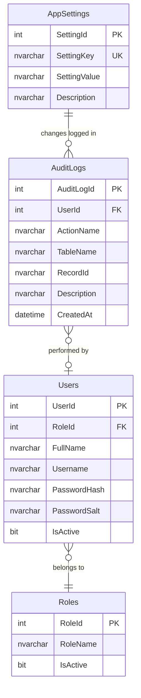
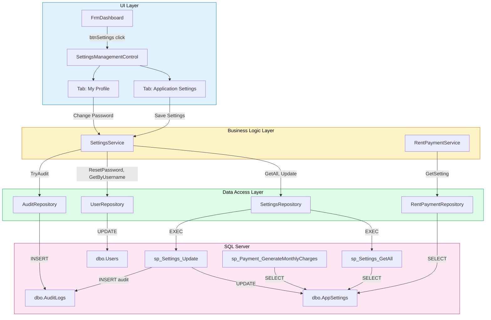

# Settings Module Implementation Plan

## Document Control

| Item | Details |
| --- | --- |
| Project | House Rental Management System |
| Module | Application Settings |
| Application Type | C# Windows Forms Desktop Application |
| Framework | .NET Framework 4.7.2 |
| Architecture | Single-project 3-layer architecture |
| Database | SQL Server Express, `HouseRentalDB` |
| Data Access | ADO.NET with parameterized SQL |
| Target Location | `Forms/Settings`, `BLL/SettingsService.cs`, `DAL/SettingsRepository.cs`, `Models/AppSettingItem.cs`, `Database/Migrations` |
| Related Modules | Dashboard (currency display), Payments (currency, due day, receipt footer), Reports (currency parameter), Audit Logs |

---

## Table of Contents

1. Purpose
2. Current Project Analysis
3. Settings Domain Model
4. Database Analysis and Migration Plan
5. DAL Implementation Plan
6. BLL Implementation Plan
7. UI Implementation Plan
8. Dashboard Integration
9. Cross-Module Impact Analysis
10. My Profile / Change Password Feature
11. Audit Log Integration
12. Error Handling Strategy
13. Security Considerations
14. Verification and Testing Plan
15. File Inventory and .csproj Updates
16. Implementation Sequence

---

## 1. Purpose

The Settings module provides a centralized Admin-only screen to manage application-wide configuration values stored in the `dbo.AppSettings` table. It also includes a "My Profile" section that allows **all authenticated users** to change their own password without requiring Admin permissions.

This module is a core dependency for:

- **Payments module** — reads `DefaultCurrency`, `RentDueDay`, and `ReceiptFooter` at runtime.
- **Dashboard** — displays currency from `DefaultCurrency` in financial summary cards.
- **Reports** — passes `DefaultCurrency` as an RDLC report parameter.
- **Stored procedures** — `sp_Payment_GenerateMonthlyCharges` reads `RentDueDay` and `DefaultCurrency` directly from the `AppSettings` table.
- **Audit trail** — every setting change must be logged for accountability.
- **User experience** — self-service password change reduces Admin burden.

The final implementation must follow the current project style: Windows Forms `UserControl` loaded inside `FrmDashboard`, business rules in `BLL`, SQL access in `DAL`, and data stored in SQL Server through parameterized ADO.NET queries.

---

## 2. Current Project Analysis

### 2.1 Existing Project Structure

The project uses an organized single-project 3-layer structure:

```text
housing_rental/
|-- App.config
|-- ApplicationSessionContext.cs
|-- Program.cs
|-- Housing rental.csproj
|-- Assets/
|-- BLL/
|   |-- AgreementService.cs
|   |-- AuthService.cs
|   |-- CurrentSession.cs
|   |-- DashboardService.cs
|   |-- PasswordHasher.cs
|   |-- PropertyService.cs
|   |-- RentPaymentService.cs
|   |-- ReportService.cs
|   |-- TenantService.cs
|   |-- UserService.cs
|-- DAL/
|   |-- AgreementRepository.cs
|   |-- AuditRepository.cs
|   |-- DashboardRepository.cs
|   |-- DbConnectionFactory.cs
|   |-- PropertyRepository.cs
|   |-- RentPaymentRepository.cs
|   |-- ReportRepository.cs
|   |-- RoleRepository.cs
|   |-- SqlHelper.cs
|   |-- TenantRepository.cs
|   |-- UserRepository.cs
|-- Database/
|   |-- 01_CreateDatabase.sql
|   |-- 02_CreateTables.sql
|   |-- 03_CreateViews.sql
|   |-- 04_CreateStoredProcedures.sql
|   |-- 05_SeedData.sql
|   |-- Migrations/
|   |-- Tests/
|-- Forms/
|   |-- Admin/
|   |-- Agreements/
|   |-- Auth/
|   |-- Common/
|   |-- Dashboard/
|   |-- Payments/
|   |-- Properties/
|   |-- Reports/
|   |-- Tenants/
|-- Models/
|-- Reports/
|-- docs/
```

| Layer | Existing Folder | Current Role |
| --- | --- | --- |
| UI | `Forms` | Login, dashboard, admin user management, property, tenant, agreement, payment, report modules |
| BLL | `BLL` | Authentication, users, dashboard, property, tenant, agreement, payment, report workflows |
| DAL | `DAL` | SQL Server repositories, helpers, audit logging |
| Models | `Models` | Entity classes, `ServiceResult` wrappers, payment constants |
| Database | `Database` | Tables, views, stored procedures, seed data, migrations |
| Docs | `docs` | Architecture and module implementation plans |

### 2.2 Existing Settings-Related Files

| File | Current Status | Settings Relevance |
| --- | --- | --- |
| `Database/02_CreateTables.sql` | Exists | Defines `dbo.AppSettings` table with `SettingId`, `SettingKey`, `SettingValue`, `Description` |
| `Database/05_SeedData.sql` | Exists | Seeds four keys: `ApplicationName`, `DefaultCurrency`, `RentDueDay`, `ReceiptFooter` |
| `DAL/RentPaymentRepository.cs` | Exists | Contains `GetSetting(string settingKey, string defaultValue)` method |
| `BLL/RentPaymentService.cs` | Exists | Contains `GetDefaultCurrency()` and `GetReceiptFooter()` methods |
| `Database/04_CreateStoredProcedures.sql` | Exists | `sp_Payment_GenerateMonthlyCharges` reads `RentDueDay` and `DefaultCurrency` from `AppSettings` |
| `Forms/Dashboard/FrmDashboard.cs` | Exists | `btnSettings` click currently opens `ModulePlaceholderControl` |
| `Models/` | Partial | No `AppSettingItem` model exists yet |
| `DAL/SettingsRepository.cs` | Missing | Required for settings CRUD operations |
| `BLL/SettingsService.cs` | Missing | Required for settings validation and business rules |
| `Forms/Settings/` | Missing | Required for the settings management screen |

### 2.3 Current Implementation Status

| Area | Current Status |
| --- | --- |
| AppSettings table | ✅ Implemented in `02_CreateTables.sql` |
| Seed data | ✅ Four settings seeded in `05_SeedData.sql` |
| Read-only access | ✅ `GetSetting()` in `RentPaymentRepository`, consumed by `RentPaymentService` |
| Settings model | ❌ Not implemented |
| Settings repository | ❌ Not implemented |
| Settings BLL service | ❌ Not implemented |
| Settings UI | ❌ Not implemented (placeholder only) |
| Dashboard navigation | ⚠️ Opens `ModulePlaceholderControl` |
| Audit integration | ❌ Not wired to settings changes |
| Change password (self) | ❌ Not available (only Admin reset exists in `UserService`) |
| My profile UI | ❌ Not implemented |

### 2.4 Current Architecture Pattern To Follow

All existing modules follow the same vertical pattern:

```text
FrmDashboard
    |
    v
[Module]ManagementControl (UserControl)
    |
    v
[Module]Service (BLL)
    |
    v
[Module]Repository (DAL)
    |
    v
SQL Server: [Table], [Views], [Stored Procedures]
```

The Settings module should mirror this pattern:

```text
FrmDashboard
    |
    v
SettingsManagementControl (UserControl)
    |
    v
SettingsService (BLL)             UserService (BLL) [existing, extended]
    |                                 |
    v                                 v
SettingsRepository (DAL)          UserRepository (DAL) [existing]
    |                                 |
    v                                 v
SQL Server: AppSettings           SQL Server: Users
```

### 2.5 Existing `GetSetting` Implementation in `RentPaymentRepository`

```csharp
public string GetSetting(string settingKey, string defaultValue)
{
    const string sql = "SELECT SettingValue FROM dbo.AppSettings WHERE SettingKey = @SettingKey;";

    using (SqlConnection connection = DbConnectionFactory.CreateConnection())
    using (SqlCommand command = new SqlCommand(sql, connection))
    {
        AddNVarChar(command, "@SettingKey", 100, settingKey);
        connection.Open();
        object value = command.ExecuteScalar();
        return value == null || value == DBNull.Value ? defaultValue : Convert.ToString(value);
    }
}
```

> **Note**: This `GetSetting` currently lives in `RentPaymentRepository`. The new `SettingsRepository` will provide the canonical CRUD methods for `AppSettings`. The existing `RentPaymentRepository.GetSetting()` will remain for backward compatibility to avoid a breaking refactor of the Payments module.

---

## 3. Settings Domain Model

### 3.1 New Model — `AppSettingItem`

Create a new model file:

```text
Models/AppSettingItem.cs
```

```csharp
using System;

namespace Housing_rental.Models
{
    public class AppSettingItem
    {
        public int SettingId { get; set; }
        public string SettingKey { get; set; }
        public string SettingValue { get; set; }
        public string Description { get; set; }
    }
}
```

### 3.2 Known Setting Keys

The system currently supports four application settings. The Settings module will manage all of these and support adding new ones in the future.

| SettingKey | Current Seed Value | Description | Consumers |
| --- | --- | --- | --- |
| `ApplicationName` | `House Rental Management System` | Application display name | Dashboard title, reports header |
| `DefaultCurrency` | `USD` | ISO 4217 currency code for all financial operations | Dashboard cards, payment forms, charge generation SP, reports |
| `RentDueDay` | `5` | Day of month when rent is due (1–31) | `sp_Payment_GenerateMonthlyCharges` stored procedure |
| `ReceiptFooter` | `Thank you for your payment.` | Footer text printed on payment receipts | `FrmPaymentReceipt` via `RentPaymentService.GetReceiptFooter()` |

### 3.3 Setting Categories (Logical Grouping)

For UI organization, settings will be grouped into logical categories:

| Category | Setting Keys | UI Section |
| --- | --- | --- |
| General | `ApplicationName` | General Settings |
| Financial | `DefaultCurrency`, `RentDueDay` | Financial Settings |
| Receipts | `ReceiptFooter` | Receipt Configuration |

### 3.4 Validation Rules Per Setting

| SettingKey | Type | Rules |
| --- | --- | --- |
| `ApplicationName` | String | Required, 1–100 characters |
| `DefaultCurrency` | String | Required, exactly 3 uppercase letters (ISO 4217 format) |
| `RentDueDay` | Integer | Required, integer between 1 and 28 (use 28 as max to avoid month-length issues; the SP already clamps to month-end) |
| `ReceiptFooter` | String | Required, 1–300 characters |

---

## 4. Database Analysis and Migration Plan

### 4.1 Existing `AppSettings` Table

```sql
CREATE TABLE dbo.AppSettings
(
    SettingId INT IDENTITY(1,1) NOT NULL CONSTRAINT PK_AppSettings PRIMARY KEY,
    SettingKey NVARCHAR(100) NOT NULL CONSTRAINT UQ_AppSettings_SettingKey UNIQUE,
    SettingValue NVARCHAR(300) NULL,
    Description NVARCHAR(300) NULL
);
```

### 4.2 Table Assessment

The existing table is sufficient for the Settings module. No schema migration is required because:

- `SettingKey` is already `UNIQUE` — prevents duplicate keys.
- `SettingValue` allows `NVARCHAR(300)` — sufficient for all current setting values.
- `Description` allows `NVARCHAR(300)` — sufficient for user-facing descriptions.
- No foreign key dependencies need to change.

### 4.3 Entity-Relationship Context



### 4.4 Cross-Module Database Dependencies

The `AppSettings` table has no foreign keys from or to other tables, but is read at runtime by:

| Consumer | SettingKey Used | Access Method |
| --- | --- | --- |
| `sp_Payment_GenerateMonthlyCharges` | `RentDueDay`, `DefaultCurrency` | Direct SQL `SELECT` inside the stored procedure |
| `RentPaymentRepository.GetSetting()` | `DefaultCurrency`, `ReceiptFooter` | ADO.NET parameterized query |
| `RentPaymentService.GetDefaultCurrency()` | `DefaultCurrency` | Via repository |
| `RentPaymentService.GetReceiptFooter()` | `ReceiptFooter` | Via repository |
| `ReportService.GetDefaultCurrency()` | `DefaultCurrency` | Delegates to `RentPaymentService` |
| `FrmDashboard.LoadDashboardSummary()` | `DefaultCurrency` | Via `RentPaymentService().GetDefaultCurrency()` |

### 4.5 Migration Script

Create:

```text
Database/Migrations/20260711_004_SettingsStoredProcedures.sql
```

While the AppSettings table requires no schema change, we need stored procedures for proper settings management:

```sql
USE HouseRentalDB;
GO

SET ANSI_NULLS ON;
SET QUOTED_IDENTIFIER ON;
GO

-- ============================================================
-- sp_Settings_GetAll
-- Returns all settings ordered by SettingKey.
-- ============================================================
CREATE OR ALTER PROCEDURE dbo.sp_Settings_GetAll
AS
BEGIN
    SET NOCOUNT ON;

    SELECT
        SettingId,
        SettingKey,
        SettingValue,
        Description
    FROM dbo.AppSettings
    ORDER BY SettingKey;
END;
GO

-- ============================================================
-- sp_Settings_GetByKey
-- Returns a single setting by its unique key.
-- ============================================================
CREATE OR ALTER PROCEDURE dbo.sp_Settings_GetByKey
    @SettingKey NVARCHAR(100)
AS
BEGIN
    SET NOCOUNT ON;

    SELECT
        SettingId,
        SettingKey,
        SettingValue,
        Description
    FROM dbo.AppSettings
    WHERE SettingKey = @SettingKey;
END;
GO

-- ============================================================
-- sp_Settings_Update
-- Updates the value of an existing setting.
-- Logs old and new values to AuditLogs.
-- Returns the updated row for confirmation.
-- ============================================================
CREATE OR ALTER PROCEDURE dbo.sp_Settings_Update
    @SettingKey NVARCHAR(100),
    @SettingValue NVARCHAR(300),
    @UpdatedByUserId INT
AS
BEGIN
    SET NOCOUNT ON;

    IF NOT EXISTS (SELECT 1 FROM dbo.AppSettings WHERE SettingKey = @SettingKey)
        THROW 52001, 'The specified setting key does not exist.', 1;

    IF NOT EXISTS (
        SELECT 1 FROM dbo.Users u
        INNER JOIN dbo.Roles r ON r.RoleId = u.RoleId
        WHERE u.UserId = @UpdatedByUserId AND u.IsActive = 1 AND r.RoleName = 'Admin'
    )
        THROW 52002, 'Only an active administrator can update application settings.', 1;

    DECLARE @OldValue NVARCHAR(300);
    SELECT @OldValue = SettingValue FROM dbo.AppSettings WHERE SettingKey = @SettingKey;

    UPDATE dbo.AppSettings
    SET SettingValue = @SettingValue
    WHERE SettingKey = @SettingKey;

    -- Audit log the change with old and new values
    INSERT INTO dbo.AuditLogs (UserId, ActionName, TableName, RecordId, Description, CreatedAt)
    VALUES (
        @UpdatedByUserId,
        'Update Setting',
        'AppSettings',
        @SettingKey,
        CONCAT('Changed [', @SettingKey, '] from ''',
               ISNULL(@OldValue, 'NULL'), ''' to ''',
               ISNULL(@SettingValue, 'NULL'), '''.'),
        GETDATE()
    );

    SELECT
        SettingId,
        SettingKey,
        SettingValue,
        Description
    FROM dbo.AppSettings
    WHERE SettingKey = @SettingKey;
END;
GO
```

### 4.6 Smoke Test Script

Create:

```text
Database/Tests/SettingsStoredProceduresSmokeTest.sql
```

```sql
USE HouseRentalDB;
GO

PRINT '=== Settings Stored Procedures Smoke Test ===';
PRINT '';

-- Test 1: sp_Settings_GetAll
PRINT 'Test 1: sp_Settings_GetAll';
EXEC dbo.sp_Settings_GetAll;
PRINT 'PASS: All settings returned.';
PRINT '';

-- Test 2: sp_Settings_GetByKey
PRINT 'Test 2: sp_Settings_GetByKey (DefaultCurrency)';
EXEC dbo.sp_Settings_GetByKey @SettingKey = 'DefaultCurrency';
PRINT 'PASS: Single setting returned.';
PRINT '';

-- Test 3: sp_Settings_Update (valid Admin update)
PRINT 'Test 3: sp_Settings_Update (valid Admin)';
DECLARE @AdminUserId INT = (
    SELECT TOP 1 UserId FROM dbo.Users u
    INNER JOIN dbo.Roles r ON r.RoleId = u.RoleId
    WHERE r.RoleName = 'Admin' AND u.IsActive = 1
);
IF @AdminUserId IS NOT NULL
BEGIN
    EXEC dbo.sp_Settings_Update
        @SettingKey = 'ReceiptFooter',
        @SettingValue = 'Test footer text.',
        @UpdatedByUserId = @AdminUserId;
    PRINT 'PASS: Setting updated and audit logged.';

    -- Restore original value
    EXEC dbo.sp_Settings_Update
        @SettingKey = 'ReceiptFooter',
        @SettingValue = 'Thank you for your payment.',
        @UpdatedByUserId = @AdminUserId;
    PRINT 'PASS: Original value restored.';
END
ELSE
BEGIN
    PRINT 'SKIP: No Admin user found.';
END
PRINT '';

-- Test 4: sp_Settings_Update (non-existent key)
PRINT 'Test 4: sp_Settings_Update (invalid key)';
BEGIN TRY
    EXEC dbo.sp_Settings_Update
        @SettingKey = 'NonExistentKey',
        @SettingValue = 'test',
        @UpdatedByUserId = 1;
    PRINT 'FAIL: Should have thrown error 52001.';
END TRY
BEGIN CATCH
    IF ERROR_NUMBER() = 52001
        PRINT 'PASS: Error 52001 thrown as expected.';
    ELSE
        PRINT 'FAIL: Unexpected error ' + CAST(ERROR_NUMBER() AS VARCHAR(20));
END CATCH
PRINT '';

-- Test 5: Verify audit log entries
PRINT 'Test 5: Verify audit log entries';
SELECT TOP 5 * FROM dbo.AuditLogs
WHERE TableName = 'AppSettings'
ORDER BY AuditLogId DESC;
PRINT 'PASS: Audit log entries retrieved.';
PRINT '';

PRINT '=== Settings Smoke Test Complete ===';
GO
```

---

## 5. DAL Implementation Plan

Create:

```text
DAL/SettingsRepository.cs
```

### 5.1 Repository Responsibilities

The repository should:

- Use `DbConnectionFactory.CreateConnection()` for all database connections.
- Use `SqlCommand`, `SqlDataReader`, and parameterized SQL.
- Avoid business logic and UI decisions.
- Return typed `AppSettingItem` objects.
- Call stored procedures for update operations.

### 5.2 Required Methods

| Method | Return Type | Purpose |
| --- | --- | --- |
| `GetAll()` | `List<AppSettingItem>` | Load all settings for the management grid |
| `GetByKey(string settingKey)` | `AppSettingItem` | Load a single setting by key |
| `GetValue(string settingKey, string defaultValue)` | `string` | Quick value lookup (mirrors existing `RentPaymentRepository.GetSetting`) |
| `Update(string settingKey, string settingValue, int updatedByUserId)` | `AppSettingItem` | Update a setting via the stored procedure, returns updated row |

### 5.3 Implementation Specification

```csharp
using System;
using System.Collections.Generic;
using System.Data;
using System.Data.SqlClient;
using Housing_rental.Models;

namespace Housing_rental.DAL
{
    public class SettingsRepository
    {
        public List<AppSettingItem> GetAll()
        {
            const string sql = "EXEC dbo.sp_Settings_GetAll;";

            List<AppSettingItem> settings = new List<AppSettingItem>();

            using (SqlConnection connection = DbConnectionFactory.CreateConnection())
            using (SqlCommand command = new SqlCommand(sql, connection))
            {
                connection.Open();

                using (SqlDataReader reader = command.ExecuteReader())
                {
                    while (reader.Read())
                    {
                        settings.Add(MapSetting(reader));
                    }
                }
            }

            return settings;
        }

        public AppSettingItem GetByKey(string settingKey)
        {
            const string sql = "EXEC dbo.sp_Settings_GetByKey @SettingKey;";

            using (SqlConnection connection = DbConnectionFactory.CreateConnection())
            using (SqlCommand command = new SqlCommand(sql, connection))
            {
                command.Parameters.AddWithValue("@SettingKey", settingKey);
                connection.Open();

                using (SqlDataReader reader = command.ExecuteReader())
                {
                    if (!reader.Read())
                    {
                        return null;
                    }

                    return MapSetting(reader);
                }
            }
        }

        public string GetValue(string settingKey, string defaultValue)
        {
            const string sql =
                "SELECT SettingValue FROM dbo.AppSettings WHERE SettingKey = @SettingKey;";

            using (SqlConnection connection = DbConnectionFactory.CreateConnection())
            using (SqlCommand command = new SqlCommand(sql, connection))
            {
                command.Parameters.AddWithValue("@SettingKey", settingKey);
                connection.Open();
                object value = command.ExecuteScalar();
                return value == null || value == DBNull.Value
                    ? defaultValue
                    : Convert.ToString(value);
            }
        }

        public AppSettingItem Update(
            string settingKey, string settingValue, int updatedByUserId)
        {
            const string sql =
                "EXEC dbo.sp_Settings_Update @SettingKey, @SettingValue, @UpdatedByUserId;";

            using (SqlConnection connection = DbConnectionFactory.CreateConnection())
            using (SqlCommand command = new SqlCommand(sql, connection))
            {
                command.Parameters.AddWithValue("@SettingKey", settingKey);
                command.Parameters.Add(SqlHelper.Parameter("@SettingValue", settingValue));
                command.Parameters.AddWithValue("@UpdatedByUserId", updatedByUserId);
                connection.Open();

                using (SqlDataReader reader = command.ExecuteReader())
                {
                    if (!reader.Read())
                    {
                        return null;
                    }

                    return MapSetting(reader);
                }
            }
        }

        private static AppSettingItem MapSetting(SqlDataReader reader)
        {
            return new AppSettingItem
            {
                SettingId = Convert.ToInt32(reader["SettingId"]),
                SettingKey = Convert.ToString(reader["SettingKey"]),
                SettingValue = Convert.ToString(reader["SettingValue"]),
                Description = Convert.ToString(reader["Description"])
            };
        }
    }
}
```

### 5.4 Query Standards

Following existing project conventions:

- Use explicit column lists — no `SELECT *`.
- Use `SqlHelper.Parameter()` for nullable parameters.
- Use `AddWithValue()` for non-nullable parameters.
- Use `DbConnectionFactory.CreateConnection()` for all connections.
- Dispose connections and commands with `using` blocks.
- Map results with a private static `Map*` method.

---

## 6. BLL Implementation Plan

Create:

```text
BLL/SettingsService.cs
```

### 6.1 Service Responsibilities

The service should:

- Validate setting values according to type-specific rules.
- Enforce Admin-only access for setting modifications.
- Normalize and sanitize values before persistence.
- Call `SettingsRepository` for all database operations.
- Return `ServiceResult` and `ServiceResult<T>` consistently.
- Log setting changes through `AuditRepository` (backup audit — the SP also logs).
- Provide `ChangePassword` for self-service password change (all users).
- Hide raw SQL exceptions behind user-friendly messages.

### 6.2 Required Service Methods

**Settings management (Admin-only):**

| Method | Return Type | Purpose |
| --- | --- | --- |
| `GetAllSettings()` | `ServiceResult<List<AppSettingItem>>` | Load all settings for the management screen |
| `GetSettingByKey(string key)` | `ServiceResult<AppSettingItem>` | Load a single setting for editing |
| `UpdateSetting(string key, string value)` | `ServiceResult` | Validate, normalize, save, and audit a setting change |
| `GetDefaultCurrency()` | `string` | Quick currency lookup for cross-module use |

**My Profile (all users):**

| Method | Return Type | Purpose |
| --- | --- | --- |
| `ChangeMyPassword(string currentPassword, string newPassword, string confirmNewPassword)` | `ServiceResult` | Self-service password change for the logged-in user |

### 6.3 Validation Rules

**Setting-specific validation:**

```csharp
private ServiceResult ValidateSettingValue(string settingKey, string value)
{
    switch (settingKey)
    {
        case "ApplicationName":
            if (string.IsNullOrWhiteSpace(value))
                return ServiceResult.Failure("Application name is required.");
            if (value.Trim().Length > 100)
                return ServiceResult.Failure(
                    "Application name must not exceed 100 characters.");
            break;

        case "DefaultCurrency":
            if (string.IsNullOrWhiteSpace(value))
                return ServiceResult.Failure("Default currency is required.");
            value = value.Trim().ToUpperInvariant();
            if (value.Length != 3
                || !Regex.IsMatch(value, @"^[A-Z]{3}$"))
                return ServiceResult.Failure(
                    "Currency must be a 3-letter ISO 4217 code (e.g., USD, BDT, EUR).");
            break;

        case "RentDueDay":
            if (string.IsNullOrWhiteSpace(value))
                return ServiceResult.Failure("Rent due day is required.");
            int dueDay;
            if (!int.TryParse(value.Trim(), out dueDay)
                || dueDay < 1 || dueDay > 28)
                return ServiceResult.Failure(
                    "Rent due day must be a number between 1 and 28.");
            break;

        case "ReceiptFooter":
            if (string.IsNullOrWhiteSpace(value))
                return ServiceResult.Failure("Receipt footer text is required.");
            if (value.Trim().Length > 300)
                return ServiceResult.Failure(
                    "Receipt footer must not exceed 300 characters.");
            break;

        default:
            if (value != null && value.Length > 300)
                return ServiceResult.Failure(
                    "Setting value must not exceed 300 characters.");
            break;
    }

    return ServiceResult.Success("Setting value is valid.");
}
```

**Password change validation:**

| Field | Rule |
| --- | --- |
| Current Password | Required, must match the logged-in user's stored hash |
| New Password | Required, minimum 6 characters, must not equal current password |
| Confirm New Password | Required, must match new password exactly |

### 6.4 Service Implementation Specification

```csharp
using System;
using System.Text.RegularExpressions;
using System.Collections.Generic;
using Housing_rental.DAL;
using Housing_rental.Models;

namespace Housing_rental.BLL
{
    public class SettingsService
    {
        private readonly SettingsRepository _settingsRepository;
        private readonly UserRepository _userRepository;
        private readonly AuditRepository _auditRepository;

        public SettingsService()
        {
            _settingsRepository = new SettingsRepository();
            _userRepository = new UserRepository();
            _auditRepository = new AuditRepository();
        }

        public ServiceResult<List<AppSettingItem>> GetAllSettings()
        {
            if (!CurrentSession.IsAdmin)
            {
                return ServiceResult<List<AppSettingItem>>.Failure(
                    "Only Admin users can manage application settings.");
            }

            try
            {
                List<AppSettingItem> settings = _settingsRepository.GetAll();
                return ServiceResult<List<AppSettingItem>>.Success(
                    settings, "Settings loaded successfully.");
            }
            catch (Exception ex)
            {
                return ServiceResult<List<AppSettingItem>>.Failure(
                    "Unable to load settings. " + ex.Message);
            }
        }

        public ServiceResult<AppSettingItem> GetSettingByKey(string key)
        {
            if (!CurrentSession.IsAdmin)
            {
                return ServiceResult<AppSettingItem>.Failure(
                    "Only Admin users can manage application settings.");
            }

            if (string.IsNullOrWhiteSpace(key))
            {
                return ServiceResult<AppSettingItem>.Failure(
                    "Setting key is required.");
            }

            try
            {
                AppSettingItem setting = _settingsRepository.GetByKey(key.Trim());

                if (setting == null)
                {
                    return ServiceResult<AppSettingItem>.Failure("Setting not found.");
                }

                return ServiceResult<AppSettingItem>.Success(
                    setting, "Setting loaded successfully.");
            }
            catch (Exception ex)
            {
                return ServiceResult<AppSettingItem>.Failure(
                    "Unable to load setting. " + ex.Message);
            }
        }

        public ServiceResult UpdateSetting(string key, string value)
        {
            if (!CurrentSession.IsAdmin)
            {
                return ServiceResult.Failure(
                    "Only Admin users can update application settings.");
            }

            if (string.IsNullOrWhiteSpace(key))
            {
                return ServiceResult.Failure("Setting key is required.");
            }

            ServiceResult validation = ValidateSettingValue(key.Trim(), value);

            if (!validation.IsSuccess)
            {
                return validation;
            }

            try
            {
                string normalizedValue = NormalizeValue(key.Trim(), value);
                _settingsRepository.Update(
                    key.Trim(), normalizedValue, CurrentSession.User.UserId);
                return ServiceResult.Success("Setting updated successfully.");
            }
            catch (Exception ex)
            {
                return ServiceResult.Failure(
                    "Unable to update setting. " + ex.Message);
            }
        }

        public string GetDefaultCurrency()
        {
            try
            {
                string value = _settingsRepository.GetValue("DefaultCurrency", "USD");
                value = string.IsNullOrWhiteSpace(value)
                    ? "USD" : value.Trim().ToUpperInvariant();
                return value.Length == 3 ? value : "USD";
            }
            catch
            {
                return "USD";
            }
        }

        public ServiceResult ChangeMyPassword(
            string currentPassword,
            string newPassword,
            string confirmNewPassword)
        {
            if (!CurrentSession.IsAuthenticated)
            {
                return ServiceResult.Failure(
                    "You must be logged in to change your password.");
            }

            if (string.IsNullOrWhiteSpace(currentPassword))
            {
                return ServiceResult.Failure("Current password is required.");
            }

            if (string.IsNullOrWhiteSpace(newPassword))
            {
                return ServiceResult.Failure("New password is required.");
            }

            if (newPassword.Length < 6)
            {
                return ServiceResult.Failure(
                    "New password must be at least 6 characters.");
            }

            if (newPassword != confirmNewPassword)
            {
                return ServiceResult.Failure(
                    "New password and confirmation do not match.");
            }

            if (currentPassword == newPassword)
            {
                return ServiceResult.Failure(
                    "New password must be different from the current password.");
            }

            try
            {
                User currentUser = _userRepository.GetByUsername(
                    CurrentSession.User.Username);

                if (currentUser == null)
                {
                    return ServiceResult.Failure(
                        "Unable to verify your account.");
                }

                string currentHash = PasswordHasher.ComputeSha256Hash(
                    currentPassword, currentUser.PasswordSalt);

                if (!string.Equals(
                    currentHash,
                    currentUser.PasswordHash,
                    StringComparison.OrdinalIgnoreCase))
                {
                    return ServiceResult.Failure(
                        "Current password is incorrect.");
                }

                string newSalt = Guid.NewGuid().ToString("N");
                string newHash = PasswordHasher.ComputeSha256Hash(newPassword, newSalt);
                _userRepository.ResetPassword(currentUser.UserId, newHash, newSalt);

                TryAudit(
                    "Change Password", "Users",
                    currentUser.UserId.ToString(),
                    "User changed their own password.");

                return ServiceResult.Success("Password changed successfully.");
            }
            catch (Exception ex)
            {
                return ServiceResult.Failure(
                    "Unable to change password. " + ex.Message);
            }
        }

        // ValidateSettingValue shown in section 6.3

        private string NormalizeValue(string key, string value)
        {
            if (value == null) return null;

            switch (key)
            {
                case "DefaultCurrency":
                    return value.Trim().ToUpperInvariant();
                default:
                    return value.Trim();
            }
        }

        private void TryAudit(
            string actionName, string tableName,
            string recordId, string description)
        {
            try
            {
                int? userId = CurrentSession.User == null
                    ? (int?)null : CurrentSession.User.UserId;
                _auditRepository.Add(
                    userId, actionName, tableName, recordId, description);
            }
            catch
            {
                // Audit logging should not block settings operations.
            }
        }
    }
}
```

### 6.5 Value Normalization

```csharp
private string NormalizeValue(string key, string value)
{
    if (value == null) return null;

    switch (key)
    {
        case "DefaultCurrency":
            return value.Trim().ToUpperInvariant();
        case "RentDueDay":
            return value.Trim();
        default:
            return value.Trim();
    }
}
```

### 6.6 Audit Helper

```csharp
private void TryAudit(
    string actionName, string tableName,
    string recordId, string description)
{
    try
    {
        int? userId = CurrentSession.User == null
            ? (int?)null : CurrentSession.User.UserId;
        _auditRepository.Add(userId, actionName, tableName, recordId, description);
    }
    catch
    {
        // Audit logging should not block settings operations.
    }
}
```

---

## 7. UI Implementation Plan

Create:

```text
Forms/Settings/SettingsManagementControl.cs
Forms/Settings/SettingsManagementControl.Designer.cs
```

### 7.1 UI Responsibilities

The `SettingsManagementControl` provides a tabbed interface with two sections:

1. **Application Settings Tab** — Admin-only management of `AppSettings` values.
2. **My Profile Tab** — Self-service password change for any authenticated user.

### 7.2 Layout Blueprint

```text
┌──────────────────────────────────────────────────────────────────────┐
│  SettingsManagementControl                                           │
│  ┌──────────────────────────────────────────────────────────────────┐│
│  │  TabControl                                                      ││
│  │  ┌─────────────────────┬───────────────────┐                     ││
│  │  │  Application Settings│  My Profile       │                     ││
│  │  └─────────────────────┴───────────────────┘                     ││
│  │                                                                  ││
│  │  ═══════════════════════════════════════════════                  ││
│  │  TAB 1: Application Settings (Admin Only)                        ││
│  │  ═══════════════════════════════════════════════                  ││
│  │                                                                  ││
│  │  ┌─────── General Settings ──────────────────────────────────┐   ││
│  │  │  Application Name:  [________________________________]    │   ││
│  │  └───────────────────────────────────────────────────────────┘   ││
│  │                                                                  ││
│  │  ┌─────── Financial Settings ────────────────────────────────┐   ││
│  │  │  Default Currency:  [______]  (3-letter ISO code)         │   ││
│  │  │  Rent Due Day:      [__▼__]   (1-28)                      │   ││
│  │  └───────────────────────────────────────────────────────────┘   ││
│  │                                                                  ││
│  │  ┌─────── Receipt Configuration ─────────────────────────────┐   ││
│  │  │  Receipt Footer:    [________________________________]    │   ││
│  │  │                     [________________________________]    │   ││
│  │  └───────────────────────────────────────────────────────────┘   ││
│  │                                                                  ││
│  │  [Save Settings]                   lblSettingsStatus              ││
│  │                                                                  ││
│  │  ═══════════════════════════════════════════════                  ││
│  │  TAB 2: My Profile                                               ││
│  │  ═══════════════════════════════════════════════                  ││
│  │                                                                  ││
│  │  ┌─────── User Information ──────────────────────────────────┐   ││
│  │  │  Full Name:     lblFullNameValue                           │   ││
│  │  │  Username:      lblUsernameValue                           │   ││
│  │  │  Role:          lblRoleValue                                │   ││
│  │  │  Email:         lblEmailValue                               │   ││
│  │  │  Last Login:    lblLastLoginValue                           │   ││
│  │  └───────────────────────────────────────────────────────────┘   ││
│  │                                                                  ││
│  │  ┌─────── Change Password ───────────────────────────────────┐   ││
│  │  │  Current Password:      [____________________________]    │   ││
│  │  │  New Password:          [____________________________]    │   ││
│  │  │  Confirm New Password:  [____________________________]    │   ││
│  │  └───────────────────────────────────────────────────────────┘   ││
│  │                                                                  ││
│  │  [Change Password]                 lblProfileStatus               ││
│  │                                                                  ││
│  └──────────────────────────────────────────────────────────────────┘│
└──────────────────────────────────────────────────────────────────────┘
```

### 7.3 Control Specifications

**Tab 1 — Application Settings:**

| Control | Type | Name | Purpose |
| --- | --- | --- | --- |
| GroupBox | GroupBox | `grpGeneral` | General settings group |
| Label | Label | `lblApplicationName` | "Application Name:" label |
| TextBox | TextBox | `txtApplicationName` | Application name input |
| GroupBox | GroupBox | `grpFinancial` | Financial settings group |
| Label | Label | `lblDefaultCurrency` | "Default Currency:" label |
| TextBox | TextBox | `txtDefaultCurrency` | Currency code input (MaxLength = 3, CharacterCasing = Upper) |
| Label | Label | `lblCurrencyHint` | "(3-letter ISO code, e.g., USD, BDT)" hint |
| Label | Label | `lblRentDueDay` | "Rent Due Day:" label |
| NumericUpDown | NumericUpDown | `nudRentDueDay` | Day of month (Minimum = 1, Maximum = 28) |
| GroupBox | GroupBox | `grpReceipt` | Receipt settings group |
| Label | Label | `lblReceiptFooter` | "Receipt Footer:" label |
| TextBox | TextBox | `txtReceiptFooter` | Multi-line receipt footer (Multiline = true, MaxLength = 300) |
| Button | Button | `btnSaveSettings` | "Save Settings" action |
| Label | Label | `lblSettingsStatus` | Status message for settings operations |

**Tab 2 — My Profile:**

| Control | Type | Name | Purpose |
| --- | --- | --- | --- |
| GroupBox | GroupBox | `grpUserInfo` | User information display |
| Label | Label | `lblFullNameLabel` / `lblFullNameValue` | Display full name |
| Label | Label | `lblUsernameLabel` / `lblUsernameValue` | Display username |
| Label | Label | `lblRoleLabel` / `lblRoleValue` | Display role |
| Label | Label | `lblEmailLabel` / `lblEmailValue` | Display email |
| Label | Label | `lblLastLoginLabel` / `lblLastLoginValue` | Display last login |
| GroupBox | GroupBox | `grpChangePassword` | Password change group |
| Label | Label | `lblCurrentPassword` | "Current Password:" label |
| TextBox | TextBox | `txtCurrentPassword` | Current password input (PasswordChar = '●') |
| Label | Label | `lblNewPassword` | "New Password:" label |
| TextBox | TextBox | `txtNewPassword` | New password input (PasswordChar = '●') |
| Label | Label | `lblConfirmNewPassword` | "Confirm New Password:" label |
| TextBox | TextBox | `txtConfirmNewPassword` | Confirm password input (PasswordChar = '●') |
| Button | Button | `btnChangePassword` | "Change Password" action |
| Label | Label | `lblProfileStatus` | Status message for profile operations |

### 7.4 UI Behavior Rules

**On Load:**

1. Initialize `SettingsService`.
2. Determine tab visibility based on role:
   - Admin users — both tabs visible and enabled.
   - Staff users — only "My Profile" tab visible, "Application Settings" tab hidden.
3. Load current settings values into form controls (Admin only).
4. Populate user information labels from `CurrentSession.User`.

**Save Settings (Tab 1):**

1. Collect all form values.
2. Call `SettingsService.UpdateSetting()` for each changed setting.
3. Display success or error in `lblSettingsStatus`.
4. On success, show a green confirmation; on failure, show a red error.

**Change Password (Tab 2):**

1. Collect current password, new password, and confirmation.
2. Call `SettingsService.ChangeMyPassword()`.
3. On success, clear all password fields and show green confirmation.
4. On failure, show red error message.

### 7.5 UI Style Guide

Follow the existing project's design conventions:

| Element | Specification |
| --- | --- |
| Background | `Color.FromArgb(245, 247, 250)` — matches existing module backgrounds |
| GroupBox border | Default Windows Forms GroupBox |
| Label font | `Segoe UI, 9F` |
| GroupBox title font | `Segoe UI, 9.75F, Bold` |
| TextBox font | `Segoe UI, 9.75F` |
| Button style | `FlatStyle.Flat`, `BackColor = Color.FromArgb(59, 130, 246)`, `ForeColor = White` |
| Status label (success) | `ForeColor = Color.ForestGreen` |
| Status label (error) | `ForeColor = Color.Firebrick` |
| Spacing | 12px between controls, 24px padding from edges |

### 7.6 Key UI Implementation Code Outline

```csharp
using System;
using System.Collections.Generic;
using System.Drawing;
using System.Windows.Forms;
using Housing_rental.BLL;
using Housing_rental.Models;

namespace Housing_rental.Forms.Settings
{
    public partial class SettingsManagementControl : UserControl
    {
        private readonly SettingsService _settingsService;

        public SettingsManagementControl()
        {
            _settingsService = new SettingsService();
            InitializeComponent();
        }

        protected override void OnLoad(EventArgs e)
        {
            base.OnLoad(e);

            // Show/hide Application Settings tab based on role
            if (!CurrentSession.IsAdmin)
            {
                tabControl.TabPages.Remove(tabSettings);
            }

            LoadCurrentSettings();
            LoadUserProfile();
        }

        private void LoadCurrentSettings()
        {
            if (!CurrentSession.IsAdmin) return;

            ServiceResult<List<AppSettingItem>> result =
                _settingsService.GetAllSettings();

            if (!result.IsSuccess)
            {
                SetSettingsStatus(result.Message, true);
                return;
            }

            foreach (AppSettingItem setting in result.Data)
            {
                switch (setting.SettingKey)
                {
                    case "ApplicationName":
                        txtApplicationName.Text = setting.SettingValue;
                        break;
                    case "DefaultCurrency":
                        txtDefaultCurrency.Text = setting.SettingValue;
                        break;
                    case "RentDueDay":
                        int dueDay;
                        nudRentDueDay.Value = int.TryParse(
                            setting.SettingValue, out dueDay)
                            ? Math.Max(1, Math.Min(28, dueDay))
                            : 5;
                        break;
                    case "ReceiptFooter":
                        txtReceiptFooter.Text = setting.SettingValue;
                        break;
                }
            }

            SetSettingsStatus("Settings loaded.", false);
        }

        private void LoadUserProfile()
        {
            if (CurrentSession.User == null) return;

            lblFullNameValue.Text = CurrentSession.User.FullName;
            lblUsernameValue.Text = CurrentSession.User.Username;
            lblRoleValue.Text = CurrentSession.User.RoleName;
            lblEmailValue.Text = string.IsNullOrWhiteSpace(
                CurrentSession.User.Email)
                ? "(not set)" : CurrentSession.User.Email;
            lblLastLoginValue.Text = CurrentSession.User.LastLoginAt.HasValue
                ? CurrentSession.User.LastLoginAt.Value
                    .ToString("yyyy-MM-dd HH:mm")
                : "(first login)";
        }

        private void BtnSaveSettings_Click(object sender, EventArgs e)
        {
            var updates = new Dictionary<string, string>
            {
                { "ApplicationName", txtApplicationName.Text },
                { "DefaultCurrency", txtDefaultCurrency.Text },
                { "RentDueDay", nudRentDueDay.Value.ToString() },
                { "ReceiptFooter", txtReceiptFooter.Text }
            };

            foreach (var kvp in updates)
            {
                ServiceResult result = _settingsService.UpdateSetting(
                    kvp.Key, kvp.Value);

                if (!result.IsSuccess)
                {
                    SetSettingsStatus(result.Message, true);
                    return;
                }
            }

            SetSettingsStatus("All settings saved successfully.", false);
        }

        private void BtnChangePassword_Click(object sender, EventArgs e)
        {
            ServiceResult result = _settingsService.ChangeMyPassword(
                txtCurrentPassword.Text,
                txtNewPassword.Text,
                txtConfirmNewPassword.Text);

            SetProfileStatus(result.Message, !result.IsSuccess);

            if (result.IsSuccess)
            {
                txtCurrentPassword.Clear();
                txtNewPassword.Clear();
                txtConfirmNewPassword.Clear();
            }
        }

        private void SetSettingsStatus(string message, bool isError)
        {
            lblSettingsStatus.Text = message;
            lblSettingsStatus.ForeColor = isError
                ? Color.Firebrick : Color.ForestGreen;
        }

        private void SetProfileStatus(string message, bool isError)
        {
            lblProfileStatus.Text = message;
            lblProfileStatus.ForeColor = isError
                ? Color.Firebrick : Color.ForestGreen;
        }
    }
}
```

---

## 8. Dashboard Integration

### 8.1 Current State

In `FrmDashboard.cs`, the settings button currently opens a placeholder:

```csharp
private void BtnSettings_Click(object sender, EventArgs e)
{
    SetActiveButton(sender as Button);
    ShowModule("Settings",
        "This Admin module will manage application settings " +
        "such as currency, receipt footer, and rent due day.");
}
```

### 8.2 Required Change

Replace the placeholder with the actual `SettingsManagementControl`:

```csharp
private void BtnSettings_Click(object sender, EventArgs e)
{
    SetActiveButton(sender as Button);
    NavigateToControl("Settings", new SettingsManagementControl());
}
```

### 8.3 Visibility Rule Change

Currently, `btnSettings` is only visible to Admin users:

```csharp
btnSettings.Visible = CurrentSession.IsAdmin;
```

Since the "My Profile" tab is useful for all users (password change), change to:

```csharp
btnSettings.Visible = true; // All users can access My Profile; Admin tab controlled inside
```

### 8.4 Required Import

Add to the `using` statements in `FrmDashboard.cs`:

```csharp
using Housing_rental.Forms.Settings;
```

---

## 9. Cross-Module Impact Analysis

### 9.1 Modules Affected by Settings Changes

| Module | Impact | Action Required |
| --- | --- | --- |
| **Payments** | `DefaultCurrency` change affects all future charge generation and payment display | No code change — reads dynamically from `AppSettings` at runtime |
| **Payments** | `RentDueDay` change affects future `sp_Payment_GenerateMonthlyCharges` calls | No code change — SP reads from `AppSettings` each time it runs |
| **Payments** | `ReceiptFooter` change affects receipt printout text | No code change — reads dynamically via `RentPaymentService.GetReceiptFooter()` |
| **Dashboard** | `DefaultCurrency` change affects financial card labels | No code change — reads dynamically via `RentPaymentService.GetDefaultCurrency()` |
| **Reports** | `DefaultCurrency` change affects report header currency parameter | No code change — reads dynamically via `ReportService.GetDefaultCurrency()` |
| **Dashboard** | `ApplicationName` is not currently used in the UI title bar | Optional future enhancement — read from settings on dashboard load |
| **FrmDashboard** | Navigation wiring change | Minimal code change — replace placeholder, update import, change visibility |

### 9.2 No Breaking Changes

All existing consumers read `AppSettings` dynamically on each operation. No cached values need invalidation. Changing a setting value takes effect on the next operation that reads it.

### 9.3 Runtime Dependency Flow

```text
Admin changes "DefaultCurrency" from USD to BDT
    |
    +---> Immediate: No application restart needed
    |
    +---> Next dashboard refresh:
    |       FrmDashboard.LoadDashboardSummary()
    |           -> RentPaymentService.GetDefaultCurrency()
    |               -> RentPaymentRepository.GetSetting("DefaultCurrency", "USD")
    |                   -> Returns "BDT"
    |
    +---> Next charge generation:
    |       sp_Payment_GenerateMonthlyCharges
    |           -> SELECT SettingValue FROM AppSettings
    |              WHERE SettingKey = 'DefaultCurrency'
    |               -> Uses "BDT" for new charge CurrencyCode
    |
    +---> Next payment receipt:
    |       FrmPaymentReceipt
    |           -> RentPaymentService.GetReceiptFooter()
    |               -> Reads current footer text
    |
    +---> Next report generation:
            ReportManagementControl
                -> ReportService.GetDefaultCurrency()
                    -> Returns "BDT"
```

---

## 10. My Profile / Change Password Feature

### 10.1 Purpose

Currently, only Admin users can reset passwords through the User Management screen (`UserService.ResetPassword`). There is no self-service option. The Settings module will add a "My Profile" tab accessible to all users.

### 10.2 Security Flow

```text
User enters Current Password + New Password + Confirm New Password
    |
    v
SettingsService.ChangeMyPassword()
    |
    v
1. Validate all fields present and new password meets minimum length (6 chars)
2. Verify new password != current password
3. Load user record by username from CurrentSession
4. Hash current password with stored salt -> compare with stored hash
5. If mismatch -> return failure
6. Generate new salt, hash new password
7. Call UserRepository.ResetPassword(userId, newHash, newSalt)
8. Audit log: "Change Password" by user
9. Clear form fields
```

### 10.3 Re-Use of Existing Infrastructure

| Component | Exists | Re-Used For |
| --- | --- | --- |
| `UserRepository.GetByUsername()` | ✅ | Verify current password hash |
| `UserRepository.ResetPassword()` | ✅ | Save new password hash and salt |
| `PasswordHasher.ComputeSha256Hash()` | ✅ | Hash both current and new passwords |
| `AuditRepository.Add()` | ✅ | Log password change event |
| `CurrentSession.User` | ✅ | Get logged-in user context |

No new database operations are needed for this feature.

---

## 11. Audit Log Integration

### 11.1 Audit Events

| Action | Table | RecordId | Description | Trigger |
| --- | --- | --- | --- | --- |
| `Update Setting` | `AppSettings` | `{SettingKey}` | Changed [{key}] from '{old}' to '{new}'. | `sp_Settings_Update` (database-level audit) |
| `Update Setting` | `AppSettings` | `{SettingKey}` | Updated setting {key}. | `SettingsService.TryAudit()` (application-level backup) |
| `Change Password` | `Users` | `{UserId}` | User changed their own password. | `SettingsService.ChangeMyPassword()` |

### 11.2 Dual Audit Strategy

The stored procedure `sp_Settings_Update` inserts an audit log row with the old and new values. The BLL `TryAudit` provides a backup entry. This double-logging is intentional — the SP-level audit captures the exact old/new values, while the BLL-level audit captures the application context.

### 11.3 Existing Audit Table Reference

```sql
CREATE TABLE dbo.AuditLogs
(
    AuditLogId INT IDENTITY(1,1) NOT NULL CONSTRAINT PK_AuditLogs PRIMARY KEY,
    UserId INT NULL,
    ActionName NVARCHAR(100) NOT NULL,
    TableName NVARCHAR(100) NULL,
    RecordId NVARCHAR(50) NULL,
    Description NVARCHAR(500) NULL,
    CreatedAt DATETIME NOT NULL CONSTRAINT DF_AuditLogs_CreatedAt DEFAULT (GETDATE()),
    CONSTRAINT FK_AuditLogs_Users FOREIGN KEY (UserId) REFERENCES dbo.Users(UserId)
);
```

---

## 12. Error Handling Strategy

### 12.1 DAL Layer

- Let `SqlException` propagate up to the BLL.
- Use `using` blocks for all `SqlConnection`, `SqlCommand`, and `SqlDataReader` objects.
- No try/catch in the DAL — the BLL decides how to handle exceptions.

### 12.2 BLL Layer

- Wrap all repository calls in try/catch.
- Convert exceptions to `ServiceResult.Failure()` with user-friendly messages.
- Format: `"Unable to {action}. " + ex.Message`.
- Audit logging uses `TryAudit()` with swallowed exceptions — audit failures must never block the primary operation.

### 12.3 UI Layer

- Check `ServiceResult.IsSuccess` before proceeding.
- Display `ServiceResult.Message` in the status label.
- Use `Color.ForestGreen` for success, `Color.Firebrick` for errors.
- Never show raw exception messages — all messages come from the BLL.

### 12.4 Stored Procedures

- Use `THROW` with error codes in the 52000 range for settings-specific errors.
- Error codes used:
  - `52001` — Setting key does not exist.
  - `52002` — Non-admin user attempted to update settings.

---

## 13. Security Considerations

### 13.1 Access Control Matrix

| Feature | Admin | Staff |
| --- | --- | --- |
| View Application Settings tab | ✅ | ❌ |
| Edit Application Settings | ✅ | ❌ |
| View My Profile tab | ✅ | ✅ |
| Change Own Password | ✅ | ✅ |

### 13.2 Defense in Depth

| Layer | Protection |
| --- | --- |
| Database (SP) | `sp_Settings_Update` verifies the caller is an active Admin user with role check |
| BLL | `SettingsService` checks `CurrentSession.IsAdmin` before all settings operations |
| UI | `tabSettings` page removed from `TabControl` for non-Admin users |
| Dashboard | `btnSettings` made visible for all users (since My Profile is available to everyone) |

### 13.3 Password Security

- Current password is verified by hashing with stored salt and comparing.
- New salt is generated for every password change (uses `Guid.NewGuid().ToString("N")`).
- SHA-256 hashing is used via the existing `PasswordHasher` utility.
- Password fields use `PasswordChar = '●'` for UI masking.
- Password values are never logged in audit entries.

---

## 14. Verification and Testing Plan

### 14.1 Database Verification

1. Run migration script `20260711_004_SettingsStoredProcedures.sql` on SQL Server.
2. Run smoke test `SettingsStoredProceduresSmokeTest.sql`.
3. Verify all stored procedures compile without errors.
4. Verify audit log entries are created for setting updates.

### 14.2 Manual UI Testing Checklist

**Application Settings Tab (Admin):**

| # | Test Case | Expected Result |
| --- | --- | --- |
| 1 | Open Settings as Admin | Application Settings tab visible, all settings loaded |
| 2 | Open Settings as Staff | Only My Profile tab visible |
| 3 | Change Application Name to empty | Validation error: "Application name is required." |
| 4 | Change Currency to "US" (2 chars) | Validation error: "Currency must be a 3-letter ISO 4217 code" |
| 5 | Change Currency to "BDT" | Success: "All settings saved successfully." |
| 6 | Change Rent Due Day to 29 | NumericUpDown prevents value above 28 |
| 7 | Change Rent Due Day to 0 | NumericUpDown prevents value below 1 |
| 8 | Change Rent Due Day to 10 | Success |
| 9 | Change Receipt Footer to empty | Validation error: "Receipt footer text is required." |
| 10 | Save all valid settings | Success, verify changes persist after navigation |
| 11 | Navigate to Dashboard, verify currency reflects change | Dashboard cards show new currency code |
| 12 | Navigate to Payments, verify currency change | Payment forms use new currency |

**My Profile Tab (All Users):**

| # | Test Case | Expected Result |
| --- | --- | --- |
| 13 | View profile information | Full name, username, role, email, last login displayed |
| 14 | Change password with wrong current | Error: "Current password is incorrect." |
| 15 | Change password with mismatched confirmation | Error: "New password and confirmation do not match." |
| 16 | Change password with short new password (< 6) | Error: "New password must be at least 6 characters." |
| 17 | Change password same as current | Error: "New password must be different from the current password." |
| 18 | Change password with valid inputs | Success: "Password changed successfully.", fields cleared |
| 19 | Log out and log in with new password | Login succeeds with new password |
| 20 | Log out and try old password | Login fails |

### 14.3 Cross-Module Verification

| # | Test Case | Expected Result |
| --- | --- | --- |
| 21 | Change currency to EUR, generate monthly charges | New charges use EUR as CurrencyCode |
| 22 | Change receipt footer, post a payment and view receipt | Receipt shows updated footer text |
| 23 | Change rent due day to 15, generate charges for a new month | Charges have DueDate on the 15th |
| 24 | Check AuditLogs table after setting changes | One entry per setting change with old/new values |

### 14.4 Build Verification

```bash
# Build the project to verify compilation
msbuild "Housing rental.csproj" /t:Build /p:Configuration=Debug
```

---

## 15. File Inventory and .csproj Updates

### 15.1 New Files To Create

| # | File Path | Type | Purpose |
| --- | --- | --- | --- |
| 1 | `Models/AppSettingItem.cs` | Model | Setting entity class |
| 2 | `DAL/SettingsRepository.cs` | Repository | Settings database operations |
| 3 | `BLL/SettingsService.cs` | Service | Settings business logic and password change |
| 4 | `Forms/Settings/SettingsManagementControl.cs` | UserControl | Settings UI (code-behind) |
| 5 | `Forms/Settings/SettingsManagementControl.Designer.cs` | Designer | Settings UI (designer-generated) |
| 6 | `Database/Migrations/20260711_004_SettingsStoredProcedures.sql` | SQL | New stored procedures for settings management |
| 7 | `Database/Tests/SettingsStoredProceduresSmokeTest.sql` | SQL | Smoke test for stored procedures |

### 15.2 Existing Files To Modify

| # | File Path | Change |
| --- | --- | --- |
| 1 | `Forms/Dashboard/FrmDashboard.cs` | Replace placeholder with `SettingsManagementControl`, update `btnSettings` visibility, add `using` |
| 2 | `Housing rental.csproj` | Add `<Compile>` entries for new `.cs` files, add `<None>` entries for new `.sql` files |

### 15.3 .csproj Additions

Add to the `<ItemGroup>` containing `<Compile>` elements:

```xml
<Compile Include="Models\AppSettingItem.cs" />
<Compile Include="BLL\SettingsService.cs" />
<Compile Include="DAL\SettingsRepository.cs" />
<Compile Include="Forms\Settings\SettingsManagementControl.cs">
  <SubType>UserControl</SubType>
</Compile>
<Compile Include="Forms\Settings\SettingsManagementControl.Designer.cs">
  <DependentUpon>SettingsManagementControl.cs</DependentUpon>
</Compile>
```

Add to the `<ItemGroup>` containing `<None>` elements:

```xml
<None Include="Database\Migrations\20260711_004_SettingsStoredProcedures.sql" />
<None Include="Database\Tests\SettingsStoredProceduresSmokeTest.sql" />
```

---

## 16. Implementation Sequence

### Phase 1: Foundation (Database + Model)

| Step | File | Action |
| --- | --- | --- |
| 1.1 | `Models/AppSettingItem.cs` | Create the `AppSettingItem` model class |
| 1.2 | `Database/Migrations/20260711_004_SettingsStoredProcedures.sql` | Create migration script with stored procedures |
| 1.3 | `Database/Tests/SettingsStoredProceduresSmokeTest.sql` | Create smoke test script |
| 1.4 | Run migration on SQL Server | Execute `20260711_004_SettingsStoredProcedures.sql` |
| 1.5 | Run smoke test | Execute `SettingsStoredProceduresSmokeTest.sql` and verify all tests pass |

### Phase 2: Data Access Layer

| Step | File | Action |
| --- | --- | --- |
| 2.1 | `DAL/SettingsRepository.cs` | Create repository with `GetAll`, `GetByKey`, `GetValue`, `Update` methods |

### Phase 3: Business Logic Layer

| Step | File | Action |
| --- | --- | --- |
| 3.1 | `BLL/SettingsService.cs` | Create service with settings CRUD, validation, normalization, password change, and audit |

### Phase 4: User Interface

| Step | File | Action |
| --- | --- | --- |
| 4.1 | `Forms/Settings/SettingsManagementControl.Designer.cs` | Create designer with TabControl, two tabs, all controls |
| 4.2 | `Forms/Settings/SettingsManagementControl.cs` | Create code-behind with load, save, and password change logic |

### Phase 5: Dashboard Integration

| Step | File | Action |
| --- | --- | --- |
| 5.1 | `Forms/Dashboard/FrmDashboard.cs` | Replace placeholder navigation with `SettingsManagementControl` |
| 5.2 | `Forms/Dashboard/FrmDashboard.cs` | Update `btnSettings.Visible = true` for all users |
| 5.3 | `Forms/Dashboard/FrmDashboard.cs` | Add `using Housing_rental.Forms.Settings;` |

### Phase 6: Project Configuration

| Step | File | Action |
| --- | --- | --- |
| 6.1 | `Housing rental.csproj` | Add all new `<Compile>` and `<None>` entries |

### Phase 7: Verification

| Step | Action |
| --- | --- |
| 7.1 | Build the project — verify zero compilation errors |
| 7.2 | Run the application — navigate to Settings as Admin |
| 7.3 | Test all settings save/load operations |
| 7.4 | Test My Profile tab with password change |
| 7.5 | Test cross-module effects (currency on dashboard, receipt footer) |
| 7.6 | Verify audit log entries in the database |

---

## Appendix A: Complete Data Flow Diagram



---

## Appendix B: Glossary

| Term | Definition |
| --- | --- |
| AppSettings | Database table storing key-value configuration pairs |
| SettingKey | Unique identifier for a configuration item (e.g., `DefaultCurrency`) |
| SettingValue | The current value of a configuration item |
| ISO 4217 | International standard for currency codes (e.g., USD, BDT, EUR, GBP) |
| RentDueDay | The day of each month when rent charges become due |
| Receipt Footer | Text printed at the bottom of payment receipts |
| My Profile | Self-service section allowing users to view their account and change password |
| ServiceResult | Standardized BLL return type wrapping success/failure with a message |
| Audit Log | Historical record of who changed what, when, and the old/new values |
