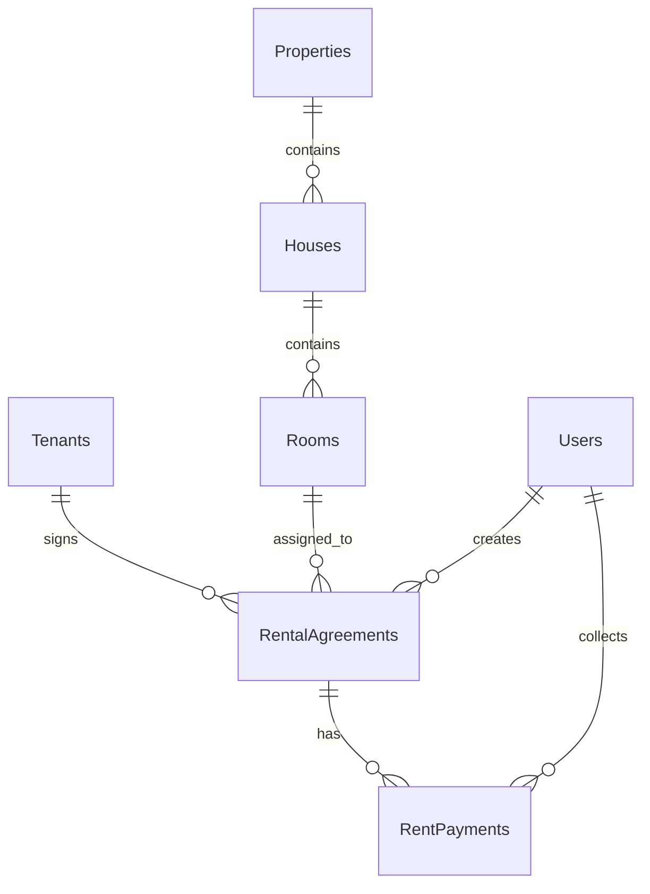

# Tenants Module Implementation Plan

## Document Control

| Item | Details |
| --- | --- |
| Project | House Rental Management System |
| Module | Tenant Management |
| Application Type | C# Windows Forms Desktop Application |
| Framework | .NET Framework 4.7.2 |
| Architecture | Single-project 3-layer architecture |
| Database | SQL Server Express, `HouseRentalDB` |
| Data Access | ADO.NET with parameterized SQL |
| Target Location | `Forms/Tenants`, `BLL/TenantService.cs`, `DAL/TenantRepository.cs`, `Models/Tenant.cs`, `Database` |
| Related Modules | Properties, Rental Agreements, Rent Payments, Dashboard, Reports, Audit Logs |

## 1. Purpose

The Tenants module will manage all people who rent or may rent rooms in the system. It must provide a professional workflow for storing tenant identity, contact information, emergency contacts, lifecycle status, agreement history, and payment history.

This module is a core dependency for:

- Rental agreement creation and renewal.
- Monthly rent collection and tenant balances.
- Dashboard tenant totals.
- Tenant reports and payment history reports.
- Audit tracking for important tenant data changes.

The final implementation should follow the current project style: Windows Forms `UserControl` loaded inside `FrmDashboard`, business rules in `BLL`, SQL access in `DAL`, and data stored in SQL Server through parameterized ADO.NET queries.

## 2. Current Project Analysis

### 2.1 Existing Project Structure

The project already uses an organized single-project 3-layer structure:

```text
housing_rental/
|-- App.config
|-- ApplicationSessionContext.cs
|-- Program.cs
|-- Housing rental.csproj
|-- Assets/
|-- BLL/
|-- DAL/
|-- Database/
|-- Forms/
|-- Models/
|-- Properties/
|-- Reports/
|-- docs/
```

| Layer | Existing Folder | Current Role |
| --- | --- | --- |
| UI | `Forms` | Login, dashboard, admin user management, property management, placeholders |
| BLL | `BLL` | Authentication, users, dashboard, property workflows, module validation |
| DAL | `DAL` | SQL Server repositories, helpers, audit logging |
| Models | `Models` | Entity classes and `ServiceResult` wrappers |
| Database | `Database` | Tables, views, stored procedures, seed data |
| Docs | `docs` | Architecture and module implementation plans |

### 2.2 Existing Tenant-Related Files

| File | Current Status | Tenant Relevance |
| --- | --- | --- |
| `Models/Tenant.cs` | Exists | Contains tenant entity fields matching the database table |
| `BLL/TenantService.cs` | Partial | Only validates required tenant name and phone |
| `DAL/TenantRepository.cs` | Missing | Required for tenant CRUD, lookup, history, and reporting data |
| `Forms/Tenants/*` | Missing | Required for the dashboard tenant screen |
| `Forms/Dashboard/FrmDashboard.cs` | Partial | Tenants button currently opens `ModulePlaceholderControl` |
| `Database/02_CreateTables.sql` | Exists | Defines `Tenants`, `RentalAgreements`, and `RentPayments` relationships |
| `Database/03_CreateViews.sql` | Exists | Defines `vw_TenantBalances` and tenant data in `vw_RoomOccupancy` |
| `Database/04_CreateStoredProcedures.sql` | Partial | Defines `sp_GetTenantPaymentHistory` |
| `DAL/AuditRepository.cs` | Exists | Should log tenant create, update, status, and sensitive changes |

### 2.3 Current Implementation Status

| Area | Current Status |
| --- | --- |
| Tenant model | Implemented |
| Tenant table | Implemented |
| Tenant status constraint | Implemented |
| Tenant BLL validation | Minimal |
| Tenant repository | Not implemented |
| Tenant UI | Not implemented |
| Dashboard navigation | Placeholder only |
| Agreement integration | Planned, not implemented |
| Payment history integration | Stored procedure exists, no DAL wrapper |
| Tenant report data | View exists, report UI not implemented |
| Audit integration | Available, not wired to tenants |

### 2.4 Current Architecture Pattern To Follow

The Properties module is the strongest existing pattern:

```text
FrmDashboard
    |
    v
PropertyManagementControl
    |
    v
PropertyService
    |
    v
PropertyRepository
    |
    v
SQL Server
```

The Tenants module should mirror this structure:

```text
FrmDashboard
    |
    v
TenantManagementControl
    |
    v
TenantService
    |
    v
TenantRepository
    |
    v
SQL Server: Tenants, RentalAgreements, RentPayments, Rooms, Houses, Properties
```

## 3. Tenant Domain Model

### 3.1 Existing Model

```csharp
public class Tenant
{
    public int TenantId { get; set; }
    public string FullName { get; set; }
    public string Phone { get; set; }
    public string Email { get; set; }
    public string NationalId { get; set; }
    public string Address { get; set; }
    public string EmergencyContactName { get; set; }
    public string EmergencyContactPhone { get; set; }
    public string Status { get; set; }
    public DateTime CreatedAt { get; set; }
}
```

### 3.2 Tenant Statuses

| Status | Meaning | Can Create New Agreement |
| --- | --- | --- |
| Active | Tenant is allowed to rent and has a normal account status | Yes |
| Inactive | Tenant is no longer active but history remains available | No |
| Blacklisted | Tenant is blocked from new agreements due to serious issue | No |

### 3.3 Required Business Rules

- Full name is required.
- Phone number is required.
- Email is optional, but must be valid when provided.
- National ID is optional, but should be unique when provided.
- Tenant status must be `Active`, `Inactive`, or `Blacklisted`.
- Inactive and blacklisted tenants must not appear in new agreement selection lists.
- A tenant with an active agreement should not be deactivated or blacklisted without a confirmation workflow and business justification.
- Tenant records should not be physically deleted because agreements, payments, audit logs, and reports need historical consistency.

## 4. Database Relationship Analysis

### 4.1 Existing Relationships



### 4.2 Tenant-Centered Data Flow

```text
Tenant
  -> RentalAgreements
      -> Room
          -> House
              -> Property
      -> RentPayments
```

This means the tenant details screen should not only show tenant fields. It should also provide operational context:

- Current active agreement.
- Current property, house, and room.
- Agreement start and end dates.
- Monthly rent and security deposit.
- Payment summary.
- Payment history.
- Past agreements.

### 4.3 Existing Tenant Table

```sql
CREATE TABLE dbo.Tenants
(
    TenantId INT IDENTITY(1,1) NOT NULL CONSTRAINT PK_Tenants PRIMARY KEY,
    FullName NVARCHAR(120) NOT NULL,
    Phone NVARCHAR(30) NOT NULL,
    Email NVARCHAR(100) NULL,
    NationalId NVARCHAR(80) NULL,
    Address NVARCHAR(250) NULL,
    EmergencyContactName NVARCHAR(100) NULL,
    EmergencyContactPhone NVARCHAR(30) NULL,
    Status NVARCHAR(30) NOT NULL CONSTRAINT DF_Tenants_Status DEFAULT ('Active'),
    CreatedAt DATETIME NOT NULL CONSTRAINT DF_Tenants_CreatedAt DEFAULT (GETDATE()),
    CONSTRAINT CK_Tenants_Status CHECK (Status IN ('Active', 'Inactive', 'Blacklisted'))
);
```

### 4.4 Recommended Database Improvements

Add these indexes after checking existing data:

```sql
CREATE UNIQUE INDEX UX_Tenants_NationalId
ON dbo.Tenants(NationalId)
WHERE NationalId IS NOT NULL AND NationalId <> '';

CREATE INDEX IX_Tenants_Status_FullName
ON dbo.Tenants(Status, FullName);

CREATE INDEX IX_Tenants_Phone
ON dbo.Tenants(Phone);
```

Recommended optional view:

```sql
CREATE OR ALTER VIEW dbo.vw_TenantDirectory
AS
SELECT
    t.TenantId,
    t.FullName,
    t.Phone,
    t.Email,
    t.NationalId,
    t.Status,
    a.AgreementNo,
    a.StartDate,
    a.EndDate,
    a.MonthlyRent,
    p.PropertyName,
    h.HouseName,
    r.RoomNo,
    ISNULL(b.TotalDue, 0) AS TotalDue,
    ISNULL(b.TotalPaid, 0) AS TotalPaid,
    ISNULL(b.TotalBalance, 0) AS TotalBalance
FROM dbo.Tenants t
LEFT JOIN dbo.RentalAgreements a ON a.TenantId = t.TenantId AND a.Status = 'Active'
LEFT JOIN dbo.Rooms r ON r.RoomId = a.RoomId
LEFT JOIN dbo.Houses h ON h.HouseId = r.HouseId
LEFT JOIN dbo.Properties p ON p.PropertyId = h.PropertyId
LEFT JOIN dbo.vw_TenantBalances b ON b.TenantId = t.TenantId;
```

This view is optional, but useful for a fast tenant directory grid. If it is not added, the repository can produce the same result with a query.

### 4.5 Important View Note

The current `vw_TenantBalances` uses inner joins through agreements and payments. Tenants with no payments will not appear in that view. For tenant directory and detail screens, use `LEFT JOIN` from `Tenants` so new tenants remain visible even before agreements or payments exist.

## 5. DAL Implementation Plan

Create:

```text
DAL/TenantRepository.cs
```

### 5.1 Repository Responsibilities

The repository should:

- Use `DbConnectionFactory.CreateConnection()`.
- Use `SqlCommand`, `SqlDataReader`, and `SqlHelper.ExecuteDataTable`.
- Use parameterized SQL only.
- Return typed `Tenant` objects for CRUD operations.
- Return `DataTable` for joined read-only grids such as agreement and payment history.
- Avoid UI decisions and business validation.

### 5.2 Required Methods

Tenant CRUD and lookup:

| Method | Purpose |
| --- | --- |
| `List<Tenant> SearchTenants(string searchText, string status, bool includeInactive)` | Load tenant grid |
| `List<Tenant> GetActiveTenants()` | Populate agreement form ComboBox |
| `Tenant GetTenantById(int tenantId)` | Load one tenant for edit/details |
| `bool NationalIdExists(string nationalId, int excludedTenantId)` | Prevent duplicate identity values |
| `bool PhoneExists(string phone, int excludedTenantId)` | Optional duplicate warning |
| `int CreateTenant(Tenant tenant)` | Insert and return new tenant ID |
| `void UpdateTenant(Tenant tenant)` | Update editable tenant fields |
| `void SetTenantStatus(int tenantId, string status)` | Change lifecycle status |
| `bool TenantHasActiveAgreement(int tenantId)` | Protect status changes |

Tenant operational data:

| Method | Purpose |
| --- | --- |
| `DataTable GetTenantAgreementHistory(int tenantId)` | Show all agreements for selected tenant |
| `DataTable GetTenantPaymentHistory(int tenantId)` | Use `sp_GetTenantPaymentHistory` or equivalent query |
| `DataTable GetTenantCurrentOccupancy(int tenantId)` | Show active property, house, room, rent, agreement |
| `DataTable GetTenantBalanceSummary(int tenantId)` | Show due, paid, and balance totals |
| `DataTable GetTenantDirectory(string searchText, string status)` | Joined grid for tenant overview |

### 5.3 Query Standards

Use explicit columns:

```sql
SELECT
    TenantId,
    FullName,
    Phone,
    Email,
    NationalId,
    Address,
    EmergencyContactName,
    EmergencyContactPhone,
    Status,
    CreatedAt
FROM dbo.Tenants
WHERE ...
ORDER BY
    CASE Status
        WHEN 'Active' THEN 1
        WHEN 'Inactive' THEN 2
        ELSE 3
    END,
    FullName ASC;
```

Avoid `SELECT *` so future database changes do not unexpectedly change grid behavior.

### 5.4 Mapping Standards

Follow the pattern used in `UserRepository` and `PropertyRepository`:

```csharp
private static Tenant MapTenant(SqlDataReader reader)
{
    return new Tenant
    {
        TenantId = Convert.ToInt32(reader["TenantId"]),
        FullName = Convert.ToString(reader["FullName"]),
        Phone = Convert.ToString(reader["Phone"]),
        Email = Convert.ToString(reader["Email"]),
        NationalId = Convert.ToString(reader["NationalId"]),
        Address = Convert.ToString(reader["Address"]),
        EmergencyContactName = Convert.ToString(reader["EmergencyContactName"]),
        EmergencyContactPhone = Convert.ToString(reader["EmergencyContactPhone"]),
        Status = Convert.ToString(reader["Status"]),
        CreatedAt = Convert.ToDateTime(reader["CreatedAt"])
    };
}
```

### 5.5 Suggested SQL Protection Queries

Check active agreement:

```sql
SELECT COUNT(1)
FROM dbo.RentalAgreements
WHERE TenantId = @TenantId
AND Status = 'Active';
```

Get agreement history:

```sql
SELECT
    a.AgreementNo,
    p.PropertyName,
    h.HouseName,
    r.RoomNo,
    a.StartDate,
    a.EndDate,
    a.MonthlyRent,
    a.SecurityDeposit,
    a.Status
FROM dbo.RentalAgreements a
INNER JOIN dbo.Rooms r ON r.RoomId = a.RoomId
INNER JOIN dbo.Houses h ON h.HouseId = r.HouseId
INNER JOIN dbo.Properties p ON p.PropertyId = h.PropertyId
WHERE a.TenantId = @TenantId
ORDER BY a.StartDate DESC;
```

## 6. BLL Implementation Plan

Update:

```text
BLL/TenantService.cs
```

### 6.1 Service Responsibilities

The service should:

- Validate tenant data.
- Normalize strings before persistence.
- Enforce tenant status rules.
- Protect deactivation and blacklisting workflows.
- Call `TenantRepository` for all tenant data access.
- Return `ServiceResult` and `ServiceResult<T>` consistently.
- Log important actions through `AuditRepository`.
- Hide raw SQL exceptions behind user-friendly messages.

### 6.2 Required Service Methods

Tenant workflows:

| Method | Purpose |
| --- | --- |
| `ServiceResult<List<Tenant>> SearchTenants(string searchText, string status, bool includeInactive)` | Load tenant list |
| `ServiceResult<List<Tenant>> GetActiveTenants()` | Provide active tenants for agreements |
| `ServiceResult<Tenant> GetTenantById(int tenantId)` | Load tenant details |
| `ServiceResult CreateTenant(Tenant tenant)` | Validate, duplicate check, save, audit |
| `ServiceResult UpdateTenant(Tenant tenant)` | Validate, duplicate check, save, audit |
| `ServiceResult SetTenantStatus(int tenantId, string status)` | Enforce lifecycle rules, save, audit |
| `ServiceResult<DataTable> GetTenantAgreementHistory(int tenantId)` | Load agreement history |
| `ServiceResult<DataTable> GetTenantPaymentHistory(int tenantId)` | Load payment history |
| `ServiceResult<DataTable> GetTenantCurrentOccupancy(int tenantId)` | Load active room context |
| `ServiceResult<DataTable> GetTenantBalanceSummary(int tenantId)` | Load balance totals |

### 6.3 Validation Rules

| Field | Rule |
| --- | --- |
| FullName | Required, maximum 120 characters |
| Phone | Required, maximum 30 characters |
| Email | Optional, maximum 100 characters, valid email format when provided |
| NationalId | Optional, maximum 80 characters, unique when provided |
| Address | Optional, maximum 250 characters |
| EmergencyContactName | Optional, maximum 100 characters |
| EmergencyContactPhone | Optional, maximum 30 characters |
| Status | Must be `Active`, `Inactive`, or `Blacklisted` |

### 6.4 Status Transition Rules

| From | To | Rule |
| --- | --- | --- |
| Active | Inactive | Block if active agreement exists, unless a future admin override is explicitly added |
| Active | Blacklisted | Block if active agreement exists; require agreement termination first |
| Inactive | Active | Allowed |
| Inactive | Blacklisted | Allowed with confirmation |
| Blacklisted | Active | Admin-only recommended |
| Blacklisted | Inactive | Admin-only recommended |

### 6.5 Normalization Standards

Before saving:

- Trim all text fields.
- Store optional blank strings as `null`.
- Normalize email to lowercase.
- Keep phone formatting user-entered unless a future phone formatter is added.
- Default empty status to `Active`.

### 6.6 Audit Logging

Use `AuditRepository.Add` for:

- `Create Tenant`
- `Update Tenant`
- `Activate Tenant`
- `Deactivate Tenant`
- `Blacklist Tenant`
- `View Tenant Details` only if the project later requires sensitive-data access logging

Recommended audit descriptions:

```text
Created tenant 'John Smith'.
Updated tenant 'John Smith'.
Changed tenant 'John Smith' status from Active to Inactive.
```

Audit logging should follow the current `PropertyService.TryAudit` style and must not block normal tenant operations if logging fails.

## 7. UI Implementation Plan

### 7.1 Recommended UI Type

Use a dashboard-loaded `UserControl`, matching `PropertyManagementControl` and `UserManagementControl`.

Create:

```text
Forms/Tenants/TenantManagementControl.cs
Forms/Tenants/TenantManagementControl.Designer.cs
```

Update:

```text
Forms/Dashboard/FrmDashboard.cs
Housing rental.csproj
```

Dashboard integration:

```csharp
private void BtnTenants_Click(object sender, EventArgs e)
{
    SetActiveButton(sender as Button);
    NavigateToControl("Tenant Management", new TenantManagementControl());
}
```

### 7.2 Main Screen Layout

```text
+------------------------------------------------------------------+
| Search [____________________] Status [All statuses v] [Refresh]  |
+------------------------------------------------------------------+
| Tabs: Tenants | Details | Agreement History | Payment History     |
+------------------------------------------------------------------+
| Tenant grid / history grid                 | Editor/detail panel  |
| DataGridView                               | Fields and actions   |
+------------------------------------------------------------------+
| Status message                                                   |
+------------------------------------------------------------------+
```

### 7.3 Tabs

| Tab | Purpose |
| --- | --- |
| Tenants | Search, create, edit, activate, deactivate, blacklist |
| Details | Current room, agreement, rent, balances, emergency contact |
| Agreement History | Read-only list of tenant agreements |
| Payment History | Read-only list of payment records |

### 7.4 Tenant Editor Fields

| Control | Field |
| --- | --- |
| TextBox | Full name |
| TextBox | Phone |
| TextBox | Email |
| TextBox | National ID |
| TextBox multiline | Address |
| TextBox | Emergency contact name |
| TextBox | Emergency contact phone |
| ComboBox | Status |

Actions:

- New Tenant
- Save Tenant
- Refresh
- Activate
- Deactivate
- Blacklist
- View Details

### 7.5 Tenant Grid Columns

| Column | Source |
| --- | --- |
| Name | `FullName` |
| Phone | `Phone` |
| Email | `Email` |
| National ID | `NationalId` |
| Status | `Status` |
| Created | `CreatedAt` |

Optional directory grid columns if using joined data:

| Column | Source |
| --- | --- |
| Current Property | `PropertyName` |
| Current Room | `RoomNo` |
| Agreement | `AgreementNo` |
| Balance | `TotalBalance` |

### 7.6 UI Behavior

| Behavior | Requirement |
| --- | --- |
| Grid selection | Loads selected tenant into editor panel |
| New button | Clears form and switches to create mode |
| Save button | Creates or updates based on selected tenant ID |
| Search | Filters tenants by name, phone, email, national ID, and address |
| Status filter | Filters by Active, Inactive, Blacklisted, or all |
| Details tab | Loads active room, agreement, and balance summary for selected tenant |
| History tabs | Load read-only agreement and payment history |
| Validation | Shows friendly message and does not save invalid data |
| Confirmation | Required before deactivation or blacklisting |
| Empty state | Shows clear status when no tenant is selected |

### 7.7 Visual Style

Match the current dashboard, user management, and property management modules:

- Font: Segoe UI.
- Neutral light background.
- White work surfaces.
- Blue primary action buttons.
- Green success status.
- Red validation or blocked-action status.
- Amber or red visual treatment for blacklisted tenants.
- Consistent `DataGridView` sizing and column headers.
- Use `SplitContainer` with responsive panel sizing like `PropertyManagementControl`.

## 8. Integration Plan

### 8.1 Dashboard Integration

The dashboard already includes `TotalTenants` from `sp_GetDashboardSummary`.

After tenant implementation:

- Creating an active tenant should increase dashboard total tenants.
- Deactivating or blacklisting a tenant should reduce active tenant count.
- Dashboard refresh should reflect tenant status changes.

Current dashboard count:

```sql
(SELECT COUNT(*) FROM dbo.Tenants WHERE Status = 'Active') AS TotalTenants
```

### 8.2 Rental Agreement Integration

The Agreement module should use:

```csharp
TenantService.GetActiveTenants()
```

Agreement creation rules:

- Only active tenants can be selected.
- Blacklisted tenants are never selectable.
- Inactive tenants are not selectable for new agreements.
- Agreement creation should verify the selected tenant is still active at save time.

### 8.3 Rent Payment Integration

Tenant detail and payment history should use:

```sql
dbo.sp_GetTenantPaymentHistory @TenantId
```

Payment history should display:

- Receipt number.
- Payment month and year.
- Due amount.
- Paid amount.
- Balance amount.
- Payment date.
- Payment method.
- Payment status.

### 8.4 Reports Integration

Tenant-related reports:

| Report | Data Source |
| --- | --- |
| Tenant List Report | `Tenants` or `vw_TenantDirectory` |
| Tenant Agreement Report | `RentalAgreements` joined to `Tenants`, `Rooms`, `Houses`, `Properties` |
| Tenant Payment History Report | `sp_GetTenantPaymentHistory` |
| Tenant Balance Report | `vw_TenantBalances` plus left join from `Tenants` |

### 8.5 Audit Integration

Tenant operations should use `CurrentSession.User.UserId` through the same pattern used in `PropertyService`. This keeps tenant changes attributable to the logged-in Admin or Staff user.

## 9. Security and Authorization Plan

### 9.1 Recommended Permissions

| Action | Admin | Staff |
| --- | --- | --- |
| View tenant list | Yes | Yes |
| Create tenant | Yes | Yes |
| Update normal tenant fields | Yes | Yes |
| Deactivate tenant | Yes | Limited or No |
| Blacklist tenant | Yes | No |
| Reactivate tenant | Yes | No |
| View payment history | Yes | Yes |
| View reports | Yes | View only |

### 9.2 Sensitive Data Handling

- Do not show National ID in message boxes unnecessarily.
- Avoid logging full National ID values in audit descriptions.
- Keep validation messages professional and non-technical.
- Do not expose database exception details directly in UI after final polish. During development, exception text can help debugging, but final user-facing messages should be cleaner.

## 10. Error Handling Plan

### 10.1 UI Layer

The UI should handle:

- Missing required fields.
- Invalid email format.
- No selected tenant for status/history operations.
- Confirmation before risky status changes.
- Friendly messages when grids are empty.

### 10.2 BLL Layer

The service should handle:

- Duplicate national ID.
- Invalid status.
- Active agreement protection.
- Invalid tenant ID.
- Database exception wrapping.

### 10.3 DAL Layer

The repository should handle:

- Parameterized SQL only.
- Connection disposal with `using`.
- Explicit column lists.
- `DBNull` conversion through `Convert.ToString` or null checks.

## 11. Implementation Phases

### Phase 1: Repository Foundation

Tasks:

- Create `DAL/TenantRepository.cs`.
- Add tenant search, lookup, create, update, and status methods.
- Add duplicate checks for national ID and optional phone warnings.
- Add active agreement check.
- Add agreement history, payment history, current occupancy, and balance summary queries.

Deliverable:

- Tenant data can be safely read and written without UI involvement.

### Phase 2: Service Layer

Tasks:

- Expand `BLL/TenantService.cs`.
- Add repository and audit dependencies.
- Add full validation and normalization.
- Add workflow methods returning `ServiceResult` and `ServiceResult<T>`.
- Add status transition protection.
- Add audit logging.

Deliverable:

- UI can call tenant workflows and receive friendly success or validation messages.

### Phase 3: Tenant UI Control

Tasks:

- Create `Forms/Tenants/TenantManagementControl.cs`.
- Create designer layout with search/filter area, tabs, grids, and editor panel.
- Add `BindingSource` objects for tenant list and history grids.
- Add save, new, refresh, status, and selection event handlers.
- Add friendly empty-state status messages.

Deliverable:

- Users can create, edit, search, and review tenant records from one professional screen.

### Phase 4: Dashboard Navigation

Tasks:

- Add `using Housing_rental.Forms.Tenants;`.
- Replace the tenant placeholder in `FrmDashboard.BtnTenants_Click`.
- Add new tenant form files to `Housing rental.csproj`.

Deliverable:

- Clicking the sidebar Tenants button opens the real Tenant Management module.

### Phase 5: Database Hardening

Tasks:

- Add optional indexes for national ID, status/name, and phone.
- Consider adding `vw_TenantDirectory`.
- Re-run database scripts on a clean database.
- Confirm `sp_GetTenantPaymentHistory` works for tenants with multiple agreements.

Deliverable:

- Database supports reliable search, uniqueness, and tenant operational views.

### Phase 6: Integration Testing and Polish

Tasks:

- Test tenant create/edit/status workflows.
- Test dashboard totals after status changes.
- Test tenant selection in agreement workflow when that module is implemented.
- Test agreement and payment history grids.
- Improve grid column formatting.
- Ensure visual style matches existing modules.

Deliverable:

- Tenant module is stable, consistent, and ready for demonstration.

## 12. Suggested Development Order

1. Implement `TenantRepository`.
2. Expand `TenantService`.
3. Build tenant list and editor UI.
4. Add details, agreement history, and payment history tabs.
5. Replace dashboard placeholder.
6. Add database indexes or `vw_TenantDirectory` if needed.
7. Add audit logging.
8. Run manual tests.
9. Polish UI messages and grid formatting.

This order keeps the module testable from the inside out and matches the existing project architecture.

## 13. Manual Test Plan

### 13.1 Tenant CRUD Tests

| Test | Expected Result |
| --- | --- |
| Create tenant with valid name and phone | Tenant is saved and appears in grid |
| Create tenant without name | Validation message appears |
| Create tenant without phone | Validation message appears |
| Create tenant with invalid email | Validation message appears |
| Create tenant with duplicate national ID | System blocks duplicate |
| Edit tenant phone | Updated phone appears after refresh |
| Search by name | Matching tenants appear |
| Search by phone | Matching tenants appear |
| Filter by Active | Only active tenants appear |

### 13.2 Status Tests

| Test | Expected Result |
| --- | --- |
| Deactivate tenant with no active agreement | Tenant status becomes Inactive |
| Blacklist tenant with no active agreement | Tenant status becomes Blacklisted |
| Reactivate inactive tenant | Tenant status becomes Active |
| Deactivate tenant with active agreement | System blocks the action |
| Blacklist tenant with active agreement | System blocks the action |

### 13.3 Integration Tests

| Test | Expected Result |
| --- | --- |
| Create active tenant | Dashboard active tenant count increases |
| Deactivate tenant | Dashboard active tenant count decreases |
| Open tenant details with active agreement | Current room and agreement data display |
| Open agreement history | Tenant agreements display newest first |
| Open payment history | Payment records display newest first |
| Agreement form loads tenants | Only active tenants are selectable |

### 13.4 Edge Cases

| Test | Expected Result |
| --- | --- |
| SQL Server unavailable | Friendly database connection message appears |
| Very long name | Validation prevents saving beyond database size |
| Blank optional fields | Saved as null without error |
| New tenant with no agreements | Tenant remains visible in grid and details show no active agreement |
| Tenant with agreements but no payments | Agreement history appears and payment history shows empty state |

## 14. Acceptance Criteria

The Tenants module is complete when:

- The dashboard Tenants button opens `TenantManagementControl`.
- Tenants can be created, edited, searched, and filtered.
- Tenant statuses can be changed through controlled workflows.
- Active agreement rules prevent unsafe deactivation or blacklisting.
- Tenant details show current occupancy and balance context.
- Agreement history and payment history are available from the tenant screen.
- All SQL uses parameters.
- All business validation lives in `TenantService`.
- The UI does not directly execute SQL.
- Audit logs are created for create, update, and status-change actions.
- Dashboard tenant counts remain consistent after tenant status changes.
- The implementation follows the existing `PropertyManagementControl`, `PropertyService`, and repository style.

## 15. Quality Checklist

Before marking the module complete:

- `TenantRepository.cs` follows the style of `UserRepository.cs` and `PropertyRepository.cs`.
- `TenantService.cs` returns `ServiceResult` and `ServiceResult<T>` consistently.
- `TenantManagementControl` uses `BindingSource` for grids.
- No tenant SQL is placed in the UI layer.
- No physical delete exists in normal tenant workflows.
- Tenant status values match the database check constraint exactly.
- ComboBoxes and filters use clear display values.
- Validation messages are understandable for non-technical users.
- Audit logging does not block tenant operations if it fails.
- The project file includes the new tenant files.
- The project builds in Visual Studio.

## 16. Risks and Mitigation

| Risk | Mitigation |
| --- | --- |
| Duplicate tenant identity data | Add `NationalIdExists` check and optional unique index |
| Deactivating a tenant with active rental obligations | Block status change while an active agreement exists |
| New tenants disappear from joined views | Use `LEFT JOIN` from `Tenants` for directory and details |
| UI grows too crowded | Use tabs and a split editor/list layout |
| Business rules leak into UI | Keep validation and status rules inside `TenantService` |
| Report queries miss tenants without payments | Build reports from `Tenants` and left join payment summaries |

## 17. Future Enhancements

After the core module is stable, consider:

- Tenant document attachments.
- Tenant photo support.
- Tenant guarantor information.
- Import tenants from Excel.
- Advanced tenant ledger report.
- Tenant move-out workflow.
- Tenant rating or risk notes.
- Reminder notifications for expiring agreements or overdue payments.

## 18. Final Recommendation

Implement the Tenants module as a dashboard-loaded `TenantManagementControl` backed by `TenantService` and `TenantRepository`. Keep tenant records permanent, use status changes instead of deletes, protect active agreement relationships, and expose agreement and payment history directly from the tenant screen.

This approach fits the current project architecture, follows the already implemented Properties module style, and creates a strong foundation for agreement creation, rent collection, reporting, and final project demonstration.
